# About this Course {-}

Reproducibility of data analyses can be enhanced through the use of tools designed to manage the complexity involved in any data analysis designed to address an important scientific question. We focus on a few software tools that aid in project organization, collaboration, auditability of analyses, and maintaining the integrity of data and code. In this course, we view a data analysis as a complex system with many integrated parts that together produce analytic results. The tools we focus on here allow data analysts to diagnose unexpected results, quickly identify problems with data and code, and provide a basis for managing the dynamic nature of data analysis.

This initiative is funded by the following grant: R25GM141505 from the National Institute of General Medical Sciences (NIGMS). Except where otherwise indicated, the contents of this course are available for use under the Creative Commons Attribution 4.0 license. You are free to adapt and share the work, but you must give appropriate credit, provide a link to the license, and indicate if changes were made. Sample attribution: Tools for Reproducible Workflows in R by [Fred Hutchinson Data Science Lab](https://hutchdatascience.org/) and [University of Texas, Austin]( https://stat.utexas.edu/) (CC-BY 4.0). You can download the illustrations by clicking [here](https://docs.google.com/presentation/d/1MNHf8JpolaEP_vQ_kB-1xRBF9wo3haCArRu117hBoHA/edit?usp=sharing).


## Available course formats

<!-- This course is available in multiple formats which allows you to take it in the way that best suites your needs. You can take it for certificate which can be for free or fee. -->

- The material for this course can be viewed without login requirement on this [Bookdown website](https://hutchdatascience.org/Tools_for_Reproducible_Workflows_in_R/). This format might be most appropriate for you if you rely on screen-reader technology.
<!-- - This course can be taken for [free certification through Leanpub](LINK HERE).-->
<!-- - This course can be taken on [Coursera for certification here](LINK HERE) (but it is not available for free on Coursera).-->
- Our courses are open source, you can find the [source material for this course on GitHub](https://github.com/fhdsl/Tools_for_Reproducible_Workflows_in_R).

<!--chapter:end:index.Rmd-->


# Introduction

In this course, we will explore a variety of tools that can assist with reproducible data analysis from a broad range of fields. The tools we will cover may take some time to get used to, but the payoff will be immeasurable. Not only are these skills valuable for career advancement, they will also make your work-life easier. The tools will enhance your ability to reproduce your work across similar projects, stay organized, collaborate with others effectively, and more. This course was funded as part of a series of courses in the [Training Module for Reproducible Data Science Research project](https://reporter.nih.gov/search/k_pXzn8wfUeEvaWpnzIToA/project-details/10663171).

  
## Motivation

Many researchers are self-taught when it comes to computer science. However, data analysis has become a requirement for most researchers. The ability to smoothly work in a reproducible manner not only makes for easier more maintainable workflows, it also improves scientific rigor and transparency. 

This course will help learners to use tools that will make their data analytic workflows more organized, more understandable to collaborators (and your future self!), and ultimately more efficient.


## Target Audience  

This course is intended for people conducting data analyses at the level of a graduate student or higher. The course is designed so that the majority of the material is presented in a high-level manner that should be applicable to researchers working in a broad range of areas. The course is centered around the R programming language, a widely used statistical analysis software package. 


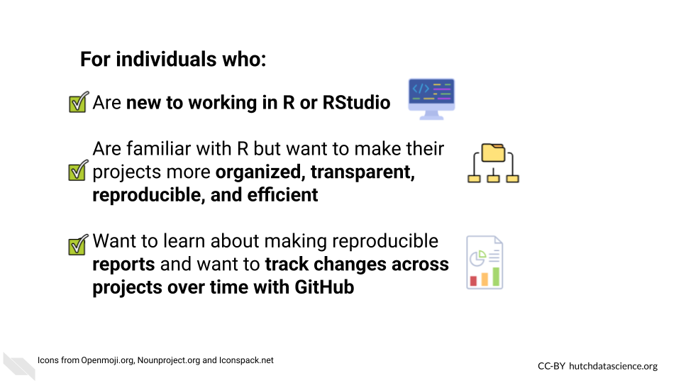

## Topics covered: 

This course will cover organization practices, coding practices, tools, and concepts for making your data analyzes more reproducible in R. 

We will cover important topics such as version control to track changes in documents over time, coding practices to make your code more transparent and to test your code, and methods for sharing your code and data in efficient and clear ways. 


## Curriculum

The course will cover the basics for getting started with configuring your projects for use of tools and practices to make your analyses more reproducible. 

We will also point to more advanced topics in other resources.


  
References will include @gillespie_efficient_2021, @riederer_column_2020, @timbers_data_nodate.

Code review references will include @hutchdatascience_code_review, @radigan_what_nodate, @parker_opinionated_2017, @bodner_10_2018.

<!--chapter:end:01-intro.Rmd-->


# R for Reproducibility


## Learning Objectives

Before we begin to jump into additional tools that R can help us with to be work more efficiently and in a more reproducible manner, it is helpful to first discuss why we should consider R in the first place. After completing this section you will be able to:

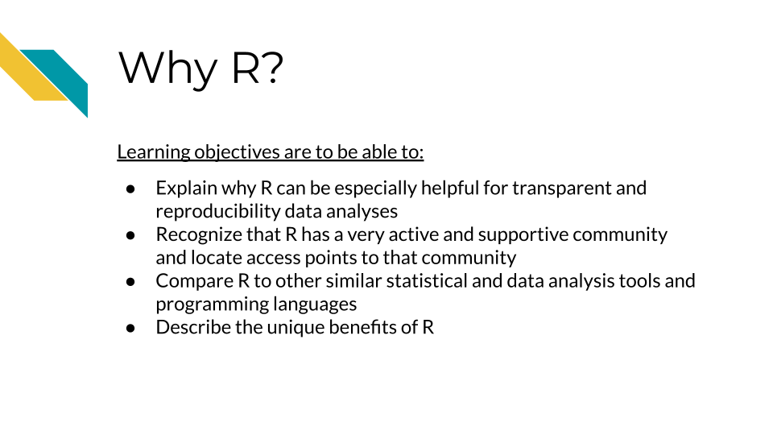


## Why R


[R](https://www.r-project.org/) is a [programming language](https://en.wikipedia.org/wiki/Programming_language) for working with data, performing statistical analyses, and for creating plots and graphics that was developed in 1991 by Ross Ihaka and Robert Gentleman at the University of Auckland, New Zealand [@r_2023; @r_project]. Countless contributors have made R what it is today.

There are some especially useful aspects about R that make it a great option for creating reproducible data analyses.

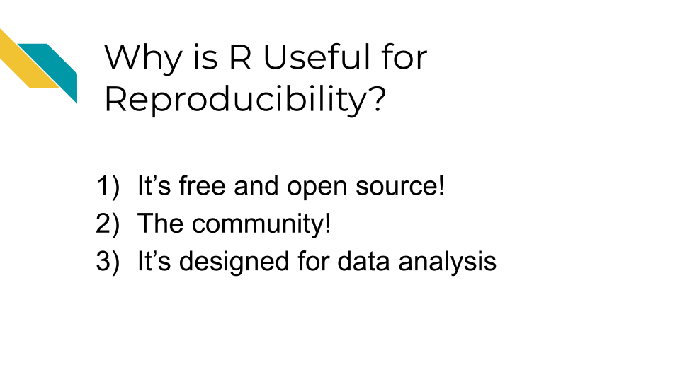

## It is free and open source

The first is that R is free and [open source](https://opensource.com/resources/what-open-source).

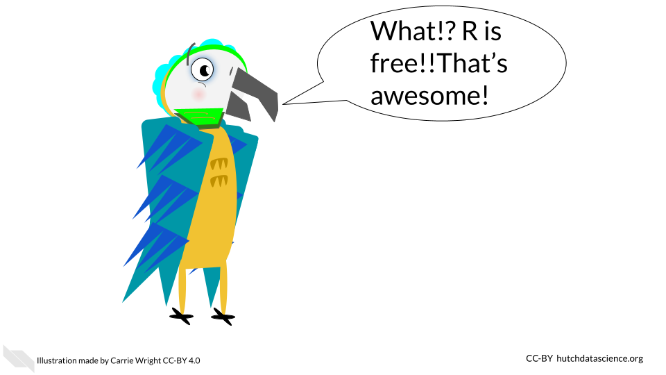


The term **open source** means that the code is publicly available.
Thus all of the code involved in creating R is actually publicly available! This enables users to check what code is used in a particular **package** (a set of code that allows you to do various things) so that they can modify or build upon the code if they would like to.

In fact, many users create their own R **packages** to share their code with others.  There are places such as the Comprehensive R Archive Network ([CRAN](https://cran.r-project.org/)) and elsewhere that allow users to publish their own packages for others to use.

<div class = "dictionary">
- **programming language** - A specified set of notations to tell a computer what to do
- **R** - Programming language for working with data to perform statistical analyses and for creating plots and other graphics
- **open source** -  Code is publicly available
- **R package** - A set of code that can be shared between users

</div>

Why are these aspects good for reproducibility?

- Since R is free, it is accessible to anyone. Therefore, anyone could run your code if you shared it with them, without them needing to buy software.
- Since R is open source, if you use packages from others, people can determine what underlying code your code used (if you tell them what version you used - more on that later!)

## The community

R has a very rich and active community!

This makes it easier to reach out to others for help, find support, find tutorials, and more.

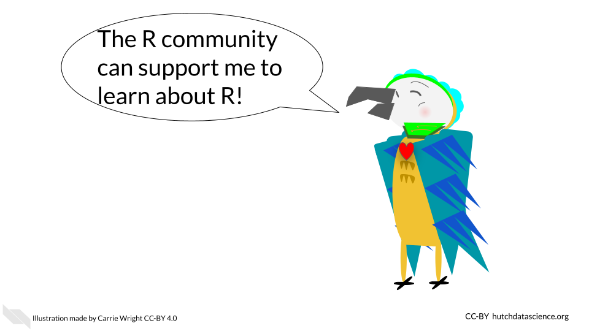


There are several R community groups that are especially helpful:

- [R Ladies](https://rladies.org/) - a support group that is not just for ladies, but is open to anyone who wants to improve their R skills! There are local chapters in many large cities that often have in-person meetings.
- There are lots of useful resources, such as the [R for Data Science book](https://r4ds.had.co.nz/) (written by two developers at Posit (formally called RStudio) which develops lots of core R packages), resources and online courses from the [Johns Hopkins Data Science Lab](https://jhudatascience.org/courses.html) including [Open Case Studies](https://www.opencasestudies.org/), resources and workshops from [Data Carpentry](https://datacarpentry.org/),  [Dataquest](https://www.dataquest.io/v2/), [DataTrail](https://datatrail-jhu.github.io/DataTrail/) and more!

See this [link](https://jhudatascience.org/intro_to_r/resources.html) for more R resources.

Why is this rich community good for reproducibility?

- Overall your code has a better chance of being more accessible than if it were written in a language that is not open source or that has limited support.
- You can also find support to make sure your code does what you want it to, as well as support to make your code as reproducible as possible.

## Designed for data

R is a statistical programming language, meaning it was designed to help you analyze data. It is the main focus of the language. This is one of the major advantages of using R over other programming languages that have more general purposes.

Because of this many people have designed useful packages that are especially relevant to:

1) Dealing with messy data in a systematic and reproducible way to get it into a state that is useful for data analysis
2) Producing statistical analysis of data
3) Creating effective plots of data

Although other options like [SPSS](https://www.ibm.com/products/spss-statistics) and [SAS](https://www.sas.com/) (which are not free!) can also be helpful for statistical analysis, R is especially powerful at getting messy data ready to analyze and for creating useful plots to represent patterns in data.  Conveniently, R can do all of these steps in a data project and does not require users to switch between different programs to perform these tasks. R also helps create reports that can demonstrate to collaborators and others exactly how analysis was performed, aiding in the transparency of how the data was used from start to finish.

R can also import data from many different sources that other statistical software can't handle (including scraping data from websites or [PDFs](https://www.adobe.com/acrobat/about-adobe-pdf.html). This allows users much more flexibility to use data as close to the source as possible. This can enable users to stop copy and pasting data and reduce the risk of human error. If you are interested, see [Open Case Studies](https://www.opencasestudies.org/) for more guidance on importing many different kinds of data.

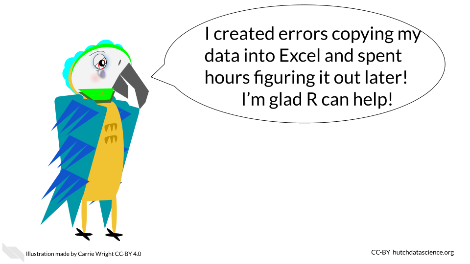


Why are these design features especially helpful for creating reproducible analyses?

1. It enables users to work with messy data and get it ready for analysis, as opposed to requiring users to use other programs. The `tidyverse` a suite of very helpful packages has many data wrangling packages that are especially intuitive for others to read and understand your code.
1. Users can create effective plots using the same program as for data prep and analysis. The `ggplot2` package is famous for making really effective and customizable plots.
1. It helps create reports that can show the entire data analysis process from importing the data to making plots. `R Markdown` reports are very helpful for this.
1. It is easier to import data closer to the original source, rather than converting files or copy and pasting data, which can result in accidental modifications of the data.


## Conclusion

In summary, R can be especially useful if you want to make your data analyses more transparent and reproducible for the following reasons:

1. It is free and open source, meaning that code that you might incorporate in your analyses is accessible to anyone. Secondly, others can use your code without needing to buy software.
2. There is a rich R community that can help you make the most out of your code and learn how to write your code in a more reproducible manner.
3. R is particularly powerful for preparing data for analysis and for creating visual representations of data. Beyond being free, these unique benefits make R a particularly good statistical tool.
4. R is especially designed to analyze data and for the entirety of the process, which makes it great for creating transparent information about how you actually worked with data from start to finish.

<!--chapter:end:02-why-R.Rmd-->


# Components of a reproducible analysis


In this chapter, we will discuss what components of an analysis make it reproducible.

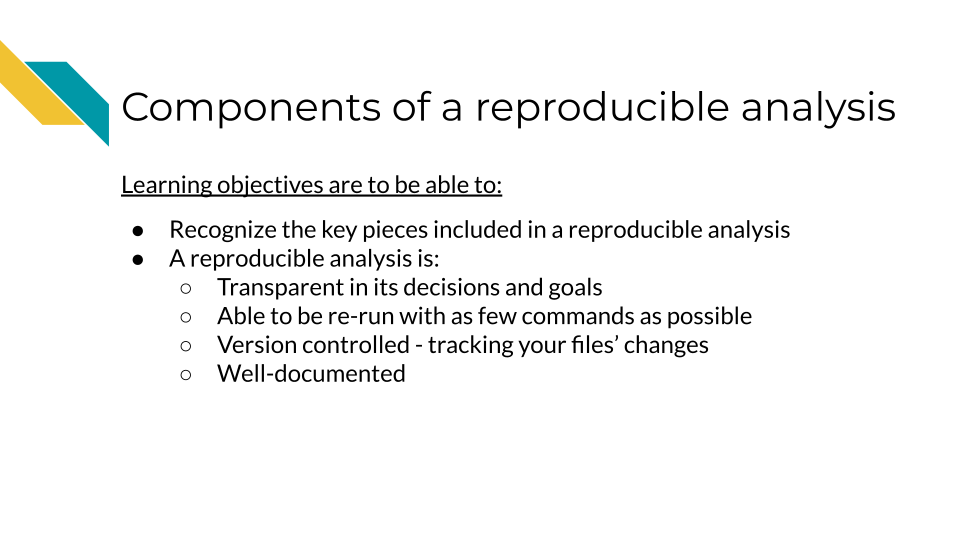

## Reproducibility is iterative work

Making an analysis isn't something that happens on the first try. Working on a project iteratively and continuing to improve the reproducibility of it is the best approach. In this manner, we can view reproducibility on a continuum. Some projects are just run once but aren't really needed anymore, and don't become very polished or reproducible. But as we continue to work on a project and polish its reproducible components, it continues to be more perfected. However, because of the moving nature of some reproducibility components, no project is really perfectly reproducible in every context throughout time.


## Components of reproducibility

A reproducible analysis is transparent, consistent, and accessible.

- **Transparency** refers to the idea that it is well communicated and everything is displayed: data, code, goals, methods, and decisions. There are no secrets in a reproducible analysis/
- **Consistency** refers to the idea that the code can be consistently run, but also everything follows a particular system, conventions and design.
- **Accessibility** refers to the idea that anyone anywhere should be able to run and/or examine the analysis. No pay walls or expensive software should be required.

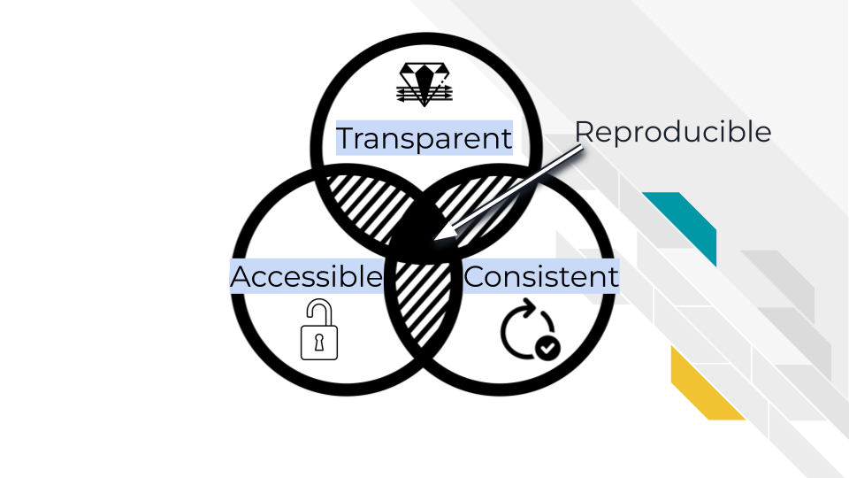

## Transparent

One essential piece of a reproducible analysis is that the code runs reliably. However, to really make an analysis reproducible, the decisions made in the analysis should also be clearly communicated. A transparent analysis is not only well communicated, but also shared publicly in a way that others can comment and contribute ideas and suggestions to or borrow methods and strategies for their own analyses.

### Open source

Open source means not only making code and data publicly available, but also enabling others to modify or comment on the code. This doesn't mean that any and all modifying contributions need to be accepted, because some level of standards and quality checks need to be maintained by the owners of the analysis, but just that anyone online could propose a contribution if they wanted to.

For an analysis to be truly open source, it needs to be easily accessed by others and stored online. Code that can be emailed, for example, is not considered open source.

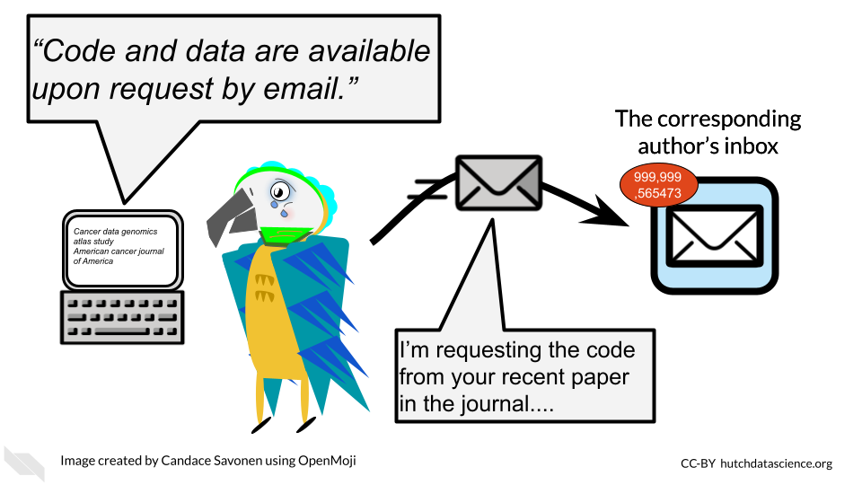

For reproducibility, keeping your code on [GitHub](https://github.com/) is a great open source solution. GitHub is a code hosting platform that allows people to access code and sometimes data. It is commonly used, and has a built in system that allows others to contribute changes in a way that can be methodically reviewed by you (this is called the pull request system and we will talk about it more).

<div class = "dictionary">
**GitHub** - An online platform for sharing and managing code and files in an open source manner
</div>

### Data is publicly available

A transparent analysis has data that is publicly shared so that others can re-run the analysis as you have. Data should be provided in a way that it can be programmatically accessed (downloaded by a script). Data also need to be well-documented in the form of metadata.

<div class = "warning">
Data sharing is a critical piece for promoting the open sourceness of your analysis, however this often needs to be balanced with privacy if you work with human data or samples. These data will likely contain personal identifiable information (PII) and protected health information (PHI). For more details on this, we encourage you to see this [course about data management](https://jhudatascience.org/Ethical_Data_Handling_for_Cancer_Research/data-privacy.html).
</div>

While it's imperative that you protect human data, that doesn't mean that your analysis cannot be publicly shared! These are not mutually exclusive goals, but will take a bit of thoughtful planning. In the upcoming chapters we will provide additional ideas and information for how you can conduct an open source analysis while appropriately protecting sensitive data.

### Readable code

Readable code is much more important than clever code. If you are the only one who knows what your code is doing, it will not only be difficult for others to contribute or vet your analysis, but in the future, you will probably not understand what your code is doing either.

[Read this course chapter from the ITCR training network about how to write durable code ](https://jhudatascience.org/Reproducibility_in_Cancer_Informatics/writing-durable-code.html).

### Well-documented

A well-documented analysis is a reproducible analysis. If analyses didn't require a lot of decisions and human comprehension than documentation wouldn't be necessary -- but also a lot of data analysts would be out of a job because robots would be able to do it! Analysts and developers often think of documentation as an after-thought, but good documentation should be actively developed along with the code. Arguably, it is more important to have clear documentation than even working code, because if broken code is well-documented, others may be able to help make suggestions for how it can be fixed.

Good documentation not only describes what happened in an analysis, but why it happened -- why did the analyst choose this method or parameter as opposed to others? Was there an additional analysis, literature, or other resource that led us to this conclusion? Documentation should describe not only what is happening, but the thought process that led us here.

### Version controlled

A reproducible analysis is a version controlled analysis. Analyses go through many iterations, side quests, and occasional dead ends -- and this is okay, it is how data science works! -- but if not done properly with version control, this can lead to an unruly code base and a lot of confused team members.
Version control is a method for tracking changes to files in a systematic manner. One such method of version control is called git and we will talk about how to use git and its online website GitHub, in a future chapter.

Version control helps maintain the history of your project in a way that will allow you to recover old versions if necessary, or otherwise have documentation on what has happened. It can also be useful for rectifying different versions of a code base between team members.

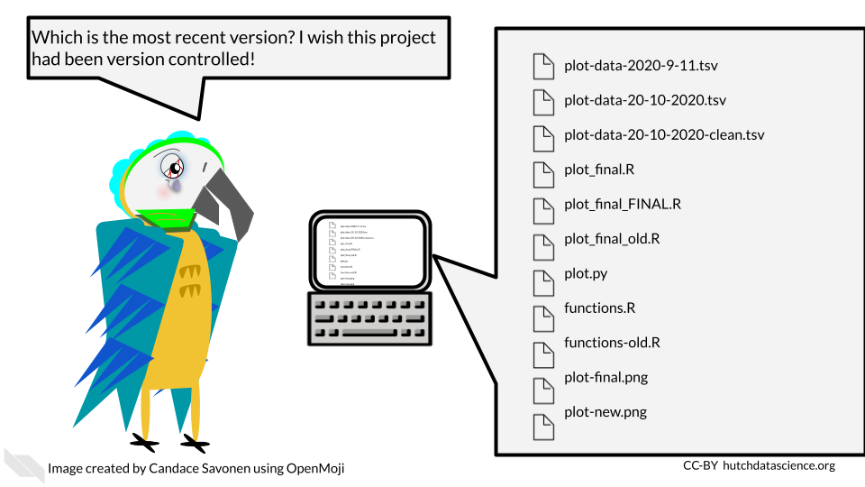

<div class = "dictionary">
**version control** - A method of tracking and handling files as they are changed over the course of a project
</div>

## Consistent

A reproducible analysis is consistent. It should consistently run and consistently produce the same results. It should also be written in a manner that follows a consistent style and project organization scheme.

### Re-runs consistently and easily

Ideally, a reproducible analysis should be able to re-run with one command that is explicitly stated in a README file. This is a file that explains what all the rest of the files are and the point of the project. If an individual has a copy of the analysis project, it should include everything that is needed to re-run that analysis and the number of steps needed to re-run the analysis should be the lowest number possible. The more steps that are needed, the less likely it will be that someone will be able to reproduce the analysis.

This also generally means that analyses that can be performed through programmatic scripts are more reproducible than those performed by GUI's (graphic user interfaces).
GUIs are programs on computers that are used by pointing and clicking buttons whereas command line programs are used by typing in commands. Command line programs generally take scripts that allow you to have each step written in the script which can be easily recalled to re-run the entire analysis.
Most GUI's, although sometimes more intuitive to use, are unfortunately less reproducible because they require more manual steps by clicking various buttons.

<div class = "dictionary">
**GUI (graphic user interface)** - A type of program on a computer that you use by pointing and clicking with a mouse
**Command line** - A type of program on a computer that you use by typing in commands or writing scripts that can be run
</div>

### Follows a code style

Code style is important because it not only makes code more readable, but it also lends a certain confidence to the reader of the code, that this code has been thought through and perhaps polished more than code that is less consistent in its style.

### Have an organizational scheme

Project organization is a major component of reproducibility. If you are not able to find your files, then chances are individuals who are attempting to reproduce your analysis also will not be able to understand where to find things. We will discuss in a later chapter strategies for keeping projects organized, while realizing that project organization is an ongoing, dynamic task.

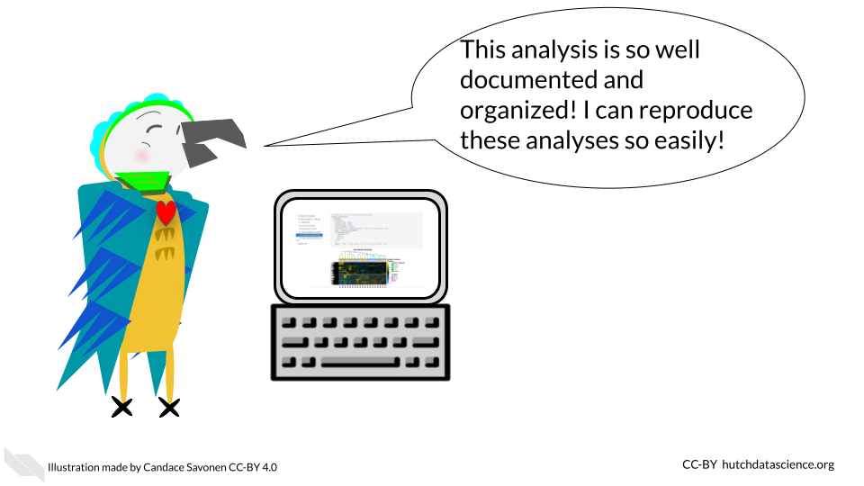

## Accessible

We discussed that we use R because it is open source and free. This makes it conducive for making reproducible analyses. Accessibility is important for reproducibility. This means minimizing the number of hoops others have to jump through to re-run your analysis.

Accessibility also involves prioritizing democratizing science and enabling as many people as possible to understand what you did for your analyses.  We encourage you to realize that science does best when everyone has access to it and that includes code and data analyses! Making your data and code accessible, allows everyone to contribute and learn from your analysis. Note that if you are concerned about being scooped, you can make your code private on GitHub while you are working on it and then make it public once you release a preprint of your results. We will talk more about this later.

Accessibility means that anyone should be able to access it -- whether or not their funding is in ample supply. So be sure to publish in  code repositories that do not require membership fees or any other kinds of paywalls. Make an effort to publish in journals that are freely available as well.


Sometimes even if something is accessible in that it is "free" monetarily it doesn't mean that it is free in the sense of the amount of time it takes to access it. If your code and data does need some sort of controlled access features for privacy and ethical concerns of protecting data, make sure that the paperwork hoops that are put in place are truly there in the spirit of protecting the data and not instead to keep data and code hidden from others.

## Conclusion

In this chapter, we gave a high level overview of reproducible analyses. We discussed that reproducible analyses are transparent, consistent, and accessible. This means in practical terms, reproducible analyses:

- Are open source
- Have data that is publicly available (when appropriate)
- Have readable code
- Are well-documented
- Re-run easily
- Have an organizational scheme
- Follow a code style
- Do not have paywalls or other barriers (except for ethical or data privacy reasons)

<!--chapter:end:03-components.Rmd-->


# A Tour of RStudio

In this chapter we will talk about a very useful R-related tool called RStudio. RStudio is an environment for using R that can be extremely helpful for writing code and making your analyses reproducible.


## Why use RStudio?

RStudio is what is called an **integrated development environment (IDE)** for writing code in R (although it also has compatibility for other languages).

It is designed to make working in R easier in a variety of ways by helping you:

- write code by using suggestions to complete what you have written - currently this is mostly for suggesting package names or functions (which are specific pieces of code that accomplish a particular task, often packages have several functions)
- view the output of your code, this is especially true for creating reports or viewing plots
- find errors in your code
- keep track of any objects that you have assigned in R
- orient yourself in terms of the files on your computer
- track changes in your code and other files over time


<div class = "dictionary">

- **IDE** - Integrated Development Environment - a computing environment for writing code, debugging code, and looking at the output of your code
- **RStudio** - an IDE designed especially for writing R code
- **function** - a specific piece of code that performs a task - packages in R often have several functions
- **objects** - objects in R could be anything that you can refer to with some name to recall again such as a data tables, vectors, functions, plots and more.

</div>

We will dive deeper into these benefits later once we get started with RStudio, but first we will discuss how to make sure you have it downloaded and installed on your computer.

## Installing RStudio

In case you don't yet have RStudio on your computer, we will walk you through the process of getting started.

### Installing and Updating R

You first need to make sure that you have R. R is not the same as RStudio. R is instead the libraries needed to use R code on your computer and it is needed so that you can use RStudio. It is also a good idea to update the version of R that you are using periodically.

<details> <summary> Click here for directions if you have never installed R before on your computer. </summary>

You can install the latest version of R from the R project site located here: https://www.r-project.org/

From here you can click on the menu option that says CRAN on the far left to start. Recall that CRAN stands for the **Comprehensive R Archive Network**.


This will take you to a website with a list of what are called [mirrors](https://cran.r-project.org/mirrors.html), which are locations that have the same exact copy of R but are dispersed geographically mostly to improve download speeds for users. Nothing bad will happen if you click on a mirror that isn't closest to you, but it can improve download speeds for everyone overall if people use appropriate mirrors.


Once you click on one of the mirror links you will be taken to a new page to download R. For example, you could click on the Iowa state University mirror if you are located in the US somewhere.


You would want to click on the appropriate link for your computer. For example, if you have a Windows machine, click the link for Windows.

This will take you to a new page to select the appropriate link to download R. For Mac users this might be the most recent version of R which will look like R and several numbers afterwards.

</details>

<details><summary>Click here for instructions on how to update R.</summary>

To update R, if you are using a Mac or Linux computer, you can follow the directions of installing R the first time.

If you have a Windows computer, you can use the following code to update your version of R within an R session. You can start an R session by typing `R` into Command Prompt window. If you have not used the Command Prompt window, [read instructions here](https://www.makeuseof.com/tag/a-beginners-guide-to-the-windows-command-line/) about how to find it. After opening your Command Prompt window, copy and paste this code and press enter.


``` r
# Check for the install r package and install if needed
if(!require(installr)) {
  install.packages("installr");
  require(installr) #load installr pakage
}

updateR()#update your version of R
```

</details>

### Installing RStudio

Next we want to download and install RStudio. You can do so by going to the Posit website at this link: https://posit.co/. Note that you can likely accomplish all you need with the completely free option.

<div class = "notice">

Posit is a software company that used to be called RStudio that develops open-source data science tools and packages. It is a Public Benefit Corporation (PBC) and a Certified B Corporation®, so it is committed to creating software that benefits the public. See [here](https://posit.co/about/pbc-report/) for more information.

</div>

<details><summary> Click here for instructions on how to download and install RStudio. </summary>


Note that the website may look slightly different when you visit it.

There should be a download button on the upper right corner. This will take you to another page to choose if you want the free or paid version of RStudio. The free version should be enough for most users.


Then you need to scroll down to select the appropriate download for your computer based on what kind of computer you have.


Note that by the time you read this the versions will likely have changed and there may be slight variations in how the website appears.

You should then be directed by your computer on how to install RStudio once the download is complete. You may need to go to your downloads first and click on the RStudio file that was downloaded to start this process.

For Mac users, note that you will need to move the RStudio icon into the icon that looks like the Applications folder.


Drag and drop RStudio into the Applications folder to install on a Mac


See[here](https://jhudatascience.org/intro_to_r/modules/RStudio/RStudio.html#1) for more information on the process of installing RStudio.

If you run into trouble, check the following:

- Did you install the correct version of software for your operating system?
   - Check that you installed the version right for your type of system, (`macOS` vs `Windows` for example)
   - Check if maybe you need a different version for the age of your system. First check that your version of R was right - there are multiple versions for different `macOS` systems for example. You can check the apple icon (top left corner) and "About This Mac" to learn more about the age of your operating system.

If your operating system is older (and you can't update it), try installing progressively older versions found [here](https://www.rstudio.com/products/rstudio/older-versions/) until it works. You will know if it worked if you try to open RStudio and you see an interface without a message about things going poorly. Here you can see an [example](https://community.rstudio.com/t/rstudio-desktop-crashes-on-startup-with-library-not-loaded/130296) of this.

</details>

### Updating RStudio

It is also a good idea to keep RStudio up-to-date. New features become available as the Posit team works on developing RStudio. So if you already have RStudio, you might want to check to see if your version is up-to-date.

To check for updates you can go to the `Help` menu at the top of RStudio and then click on `Check for Updates`.


If you don’t need to update RStudio, when you check with this method RStudio will let you know that you are using the newest version.


With recent versions RStudio will also give you a popup to let you know that you could update.


## Navigating RStudio

Now that you hopefully have RStudio running on your machine, we will walk you through some of the major features that can really help you with your data analyses.

### Default Layout

First it is important to be familiar with the layout. When you first open RStudio, you will see 3 panes.


<details><summary>If your RStudio looks different click here.</summary>

Click on the top menu of your RStudio - click where it says `Edit` --> `Preferences` --> `Pane Layout`.


The Pane Layout menu enables you to change the layout. The image below shows the default settings. Note that VCS may not appear if you are not using a version control system. More on that to come in later chapters!


</details>


The pane on the left (labeled "Pane 1" in the image) is where we can work on code interactively. There are two tabs here. The Terminal tab and the Console tab. The Terminal tab is for interacting with the computer outside of R. Whereas the Console tab is for interacting with R. We'll focus on the Console tab for now.

The Console tab is where we can 'talk' to R and interactively work on our code. The code we write here will **not be saved** to a script or file, but instead the code will immediately be performed when we click `enter` and any resulting output that can be printed will be shown.


The pane on the top right (labeled "Pane 2" in the image) is where we can see what objects we have created and are actively in memory (meaning they can be used at that time) in what is called the "Environment".


The pane on the bottom right (labeled "Pane 3" in the image) is where we can find files on computer (the "Files" tab), see plots (the "Plots tab), and get coding help (the "Help tab).


While there are other tabs, don't worry about those for now. We will go deeper into RStudio as we continue.


Let's try some examples to get started.

As an example, we could type in the code `head(iris)` into Pane 1 in the Console and press the `enter` key to see the code execute and preview.


Now let's try another example where instead of just printing some data to the screen we assign a data object that will show up in the environment using the `<-` notation. This is useful in a situation if we want to modify the iris data somehow but want to keep the original version.


<div class = "dictionary">
- **Console** - The window that allows us to interactively give R code and press enter to run it but **not save** the code.
- **Environment** - R's working memory of objects you have assigned -- need to tell R to remember using `<-`
- **Assignment** - How we tell R to remember something using the `<-` characters.
</div>

### The Hidden Pane

There is a hidden fourth pane. This is only accessible when we start to make a script or a report with our code. This is where we recommend that you write your code - as this is where we will save our code! If you get used to writing most of your code in the Console, you might forget what code actually worked. Additionally, as we are trying to make our code reproducible, it's a good idea to start saving it as we write it!

To open this let's make what is called an R Markdown file by go to `File` --> `New File` -->`R Markdown` in the upper menu of RStudio.


Creating an R Markdown file starts with a pop-up and you can simply click the OK button.


The new pane will open on the upper left.


This pane is where we can write code that we keep in files like scripts or reports (in files like R Markdowns).

Thus the lower left pane is where we can test out code (although we don't recommend it), but the top pane is where we can write code that we wish to save (and also test it!). Since it can be easy to forget to save code, we suggest that instead you use a special file type that will allow you to test code that you save. We will discuss that in the next section.

In order to make our analysis truly reproducible we will need to have **every single step** written down. This is why using the Console is great for testing things, but not so great for actually performing your analysis.


The top pane where we save code is called the Editor. The lower pane for quick tests of code is called the Console.


The Editor pane (top left) will be the pane that we look at most of the time as we create reports that demonstrate exactly how we did our analyses. We will discuss more about R Markdown files in the next section.

R Markdown files allow you to have the code for your analysis, the output from the analysis (so plots and stats, etc) and your written thoughts and rationale for your analysis all in one place! This makes it a snap to share your analysis with others in a reproducible way!

<div class = "dictionary">

- **Console** - for quickly testing code, the code is not saved. This is by default the lower left pane when a file is open in RStudio. Testing of code here does not have some features that testing in an R Markdown file has so we don't generally recommend it.
- **Editor** - for writing code that you wish to save.
- **R Markdown files** - files that allow you to save your code that allow for more features than a simple script.

</div>

## Find Errors

Another nice thing about RStudio, is that it can help you troubleshoot your code.

It helps to identify common coding mistakes. It will indicate a potential problem by showing a red circle with an "x" in it on the far left of the Editor near the line of code that it thinks is problematic. Note that sometimes errors may occur earlier in your code than where RStudio starts to notice an issue.


Here is an example of such a case. Here we have an extra parentheses in our code.


Note that just because RStudio thinks your code is free of errors, it does not necessarily mean that your code is correct. RStudio can detect certain syntax issues, but it does not detect all types of errors. However, you can probably see how it could be very helpful!


## Keyboard Shortcuts

There are lots of useful keyboard shortcuts for RStudio that can save you time.

Check out this [link](https://support.posit.co/hc/en-us/articles/200711853-Keyboard-Shortcuts) if you are interested!

The most helpful shortcut, is for testing a selection of code in an R Markdown file using a keyboard shortcut of Ctrl+Enter on Windows & Linux computers or Cmd+Return on Mac computers.

## Conclusion

In summary...

- RStudio can help you write code in R and work with files on your computer.
- There are 3 main panes when you first open RStudio, to see a fourth you need to create a new file like an R Markdown file.
- When we open a file like an R Markdown file, the top left pane called the Editor is for writing code we wish to save.
- After opening a file, the lower left pane contains the Console which is where we test code.
- R Markdown files are files that create reports of an analysis that can demonstrate more about what you did than a simple script and test to make sure that your code works.

<!--chapter:end:04-rstudio-tour.Rmd-->


# Setting up your project


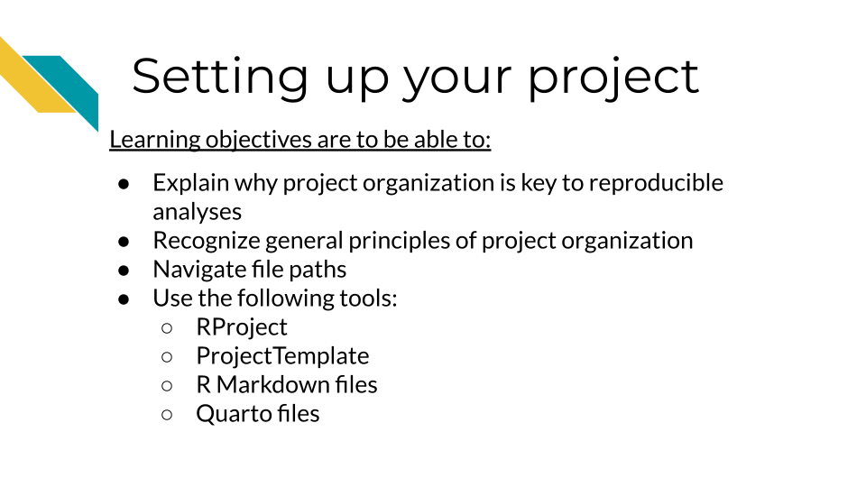

## Understand why project organization is key to reproducible analyses

Keeping your files organized is a skill that has a high long-term payoff. As you are in the thick of an analysis, you may underestimate how many files and terms you have floating around. But a short time later, you may return to your files and realize your organization was not as clear as you hoped.  

@Tayo2019 discusses four particular reasons why it is important to organize your project:

> 1. Organization **increases productivity**. If a project is well organized, with everything placed in one directory, it makes it easier to avoid wasting time searching for project files such as datasets, codes, output files, and so on.
> 2. A well-organized project helps you to keep and **maintain a record** of your ongoing and completed data science projects.
> 3. Completed data science projects could be used for **building future models**. If you have to solve a similar problem in the future, you can use the same code with slight modifications.
> 4. A well-organized project can **easily be understood** by other data science professionals when shared on platforms such as Github.

Organization is yet another aspect of reproducibility that saves you and your colleagues time!

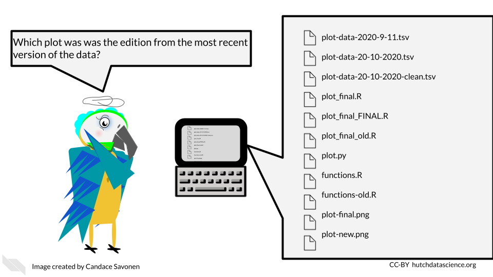

## General principles of project organization

Project organization should work for you and not the other way around. The goal should be organization that is maintainable long term.  As you might imagine, the optimal organizational scheme might differ from one individual to another or even one project to another.

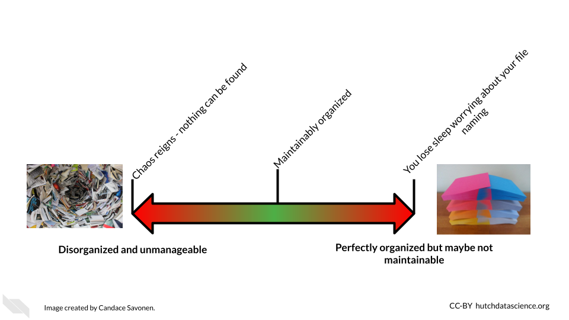

There's a lot of ways to keep your files organized, and there's not a "one size fits all" organizational solution [@Shapiro2021]. In this chapter, we will discuss some generalities; but for specifics, we will point you to others who have written about what works for them. We suggest that you use them as inspiration to figure out a strategy that works for you and your team.

The most important aspects of your project organization scheme is that it:  

- Is [project-oriented](https://www.tidyverse.org/blog/2017/12/workflow-vs-script/) [@Bryan2017].  
- Follows consistent patterns [@Shapiro2021].  
- Is easy for you and others to find the files you need quickly [@Shapiro2021].  
- Minimizes the likelihood for errors (like writing over files accidentally) [@Shapiro2021].  
- Is something maintainable [@Shapiro2021]!

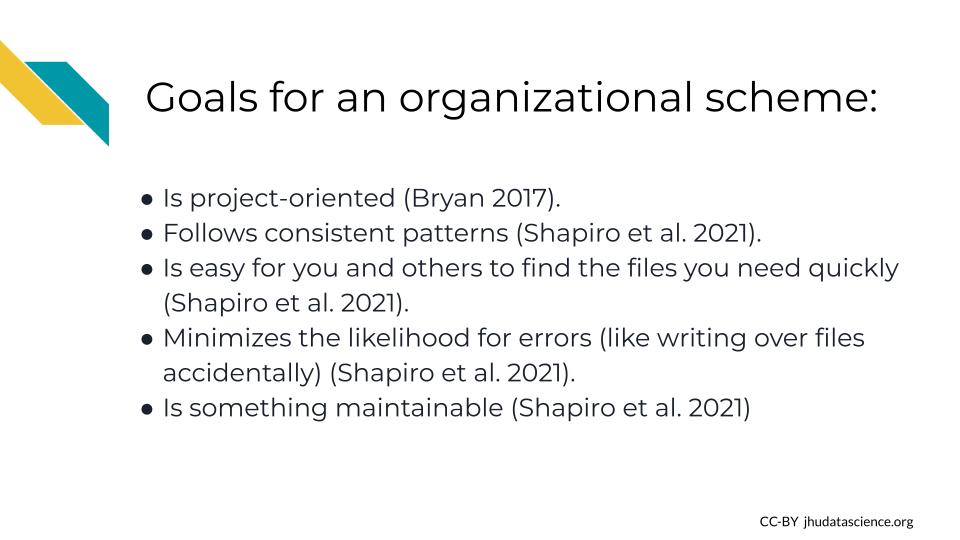

### READMEs!

READMEs are also a great way to help your collaborators get quickly acquainted with the project.

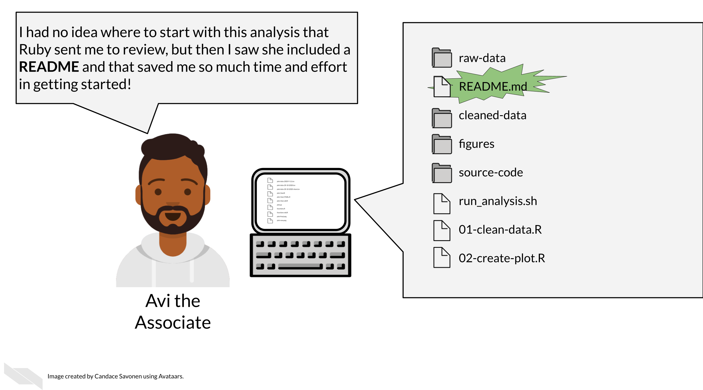

READMEs stick out in a project and are generally universal signal for new people to the project to start by READing them. GitHub automatically will preview your file called "README.md" when someone comes to the main page of your repository. This further encourages people looking at your project to read the information in your README.

**Information that should be included in a README:**

1) General purpose of the project
2) Instructions on how to re-run the project
3) Lists of any software required by the project
4) Input and output file descriptions
5) Descriptions of any additional tools included in the project
6) License for how your materials should be used
You can take a look at this [template README](https://raw.githubusercontent.com/jhudsl/Reproducibility_in_Cancer_Informatics/main/resources/README-template.md) to get your started.

#### More about writing READMEs:

- [How to write a good README file by Hillary Nyakundi](https://www.freecodecamp.org/news/how-to-write-a-good-readme-file/)
- [Make a README: because no one can read your mind yet by Danny Guo](https://www.makeareadme.com/)

#### Examples of good READMEs:

- https://github.com/stephaniehicks/qsmooth
- https://github.com/lcolladotor/derfinder
- https://github.com/tidyverse/dplyr

#### Licensing

Adding information about a license is not always required, but it can be a good idea. If you put your code on GitHub, then the default copyright laws apply.  According to GitHub:

> "You retain all rights to your source code and no one may reproduce, distribute, or create derivative works from your work. If you're creating an open source project, we strongly encourage you to include an open source license."

::: dictionary
Open source software or code means that it is distributed with a license that allows others to reuse or adapt your code for other purposes. This is very helpful to advance science and technology.
:::

Check out this great resource on [options for licenses](https://choosealicense.com/) to help you choose which license is right for your project.
### Example organization scheme

Getting more specific, here's some ideas of how to organize your project:  

- **Make file names informative** to those who don't have knowledge of the project -- but avoid using spaces, quotes, or unusual characters in your filenames and folders, as these can make reading in files a nightmare with some programs.
- **Number scripts** in the order that they are run.
- **Keep like-files together** in their own directory: results tables with other results tables, etc. _Including most importantly keeping raw data separate from processed data or other results!_
- **Put source scripts and functions in their own directory**. Things that should never need to be called directly by yourself or anyone else.
- **Put output in its own directories** like `results` and `plots`.
- **Have a central document (like a README)** that describes the basic information about the analysis and how to re-run it.
- Make it easy on yourself, **dates aren't necessary** to track for file updates.  The computer keeps track of when a file was updated.
- **Make a central script that re-runs everything** -- including the creation of the folders! (more on this in a later chapter)

Let's see what these principles might look in practice.

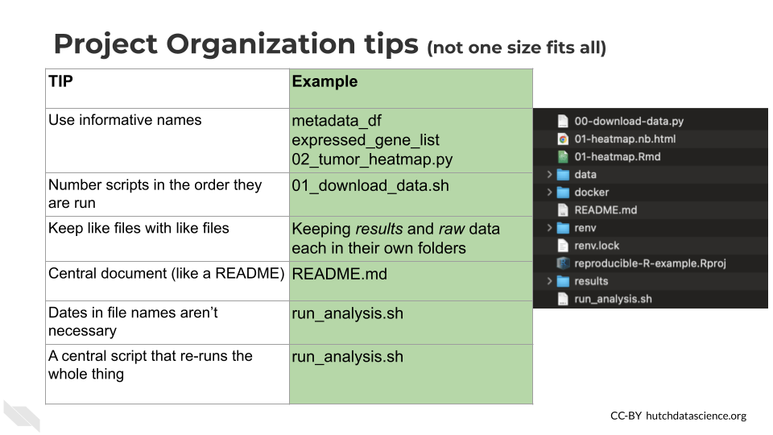

Here's an example of what this might look like:
```
project-name/
├── run_analysis.sh
├── 00-download-data.sh
├── 01-make-heatmap.Rmd
├── README.md
├── plots/
│   └── project-name-heatmap.png
├── results/
│   └── top_gene_results.tsv
├── raw-data/
│   ├── project-name-raw.tsv
│   └── project-name-metadata.tsv
├── processed-data/
│   ├── project-name-quantile-normalized.tsv
└── util/
    ├── plotting-functions.R
    └── data-wrangling-functions.R
```

**What these hypothetical files and folders contain:**

- `run_analysis.sh` - A central script that runs everything
- `00-download-data.sh` - The script that needs to be run first and is called by run_analysis.sh
- `01-make-heatmap.Rmd` - The script that needs to be run second and is also called by run_analysis.sh
- `README.md` - The document that has the information that will orient someone to this project
- `plots` - A folder of plots and resulting images
- `results` - A folder of results
- `raw-data` - Data files as they first arrive and **nothing** has been done to them yet
- `processed-data` - Data that has been modified from the raw in some way
- `util` - A folder of utilities that never needs to be called or touched directly unless troubleshooting something

There are lots of ideas out there for organizational strategies. The key is finding one that fits your team and your project. You can read through some of these articles to think about what kind of organizational strategy might work for you and your team:   

- [Reproducible R example](https://github.com/jhudsl/reproducible-r-example)
- [Jenny Bryan's organizational strategies](https://www.stat.ubc.ca/~jenny/STAT545A/block19_codeFormattingOrganization.html) [@Bryan2021].
- [Danielle Navarro's organizational strategies](https://www.youtube.com/playlist?list=PLRPB0ZzEYegPiBteC2dRn95TX9YefYFyy) @Navarro2021
- [Data Carpentry mini-course about organizing projects](https://datacarpentry.org/organization-genomics/) [@DataCarpentry2021].
- [Andrew Severin's strategy for organization](https://bioinformaticsworkbook.org/projectManagement/Intro_projectManagement.html#gsc.tab=0) [@Severin2021].
- [A BioStars thread where many individuals share their own organizational strategies](https://www.biostars.org/p/821/) [@Biostars2021].
- [Data Carpentry course chapter about getting organized](https://bioinformatics-core-shared-training.github.io/shell-genomics/07-organization/index.html) [@DataCarpentry2019].

## Navigate file paths

In point and click apps (called [Graphical User Interfaces (or GUI pronounced like the word gooey)](https://en.wikipedia.org/wiki/Graphical_user_interface) you navigate to files by clicking on folders. But for R programming and other command line interfaces, we navigate and use files by using `file paths`. `File paths` are the series of folders that it takes to get to a file, not unlike a street address.

To make an analogy, if someone asked you directions to a particular building, the directions you would give would be tailored based on where the person asking is located. In other words your directions would be relative to their location.

But file paths can be *relative* or *absolute*.

Your computer can be given directions relative to where you are calling the command in the computer or they can be absolute directions to a file - basically the full directions to that file, regardless of where you might be already on your computer.  

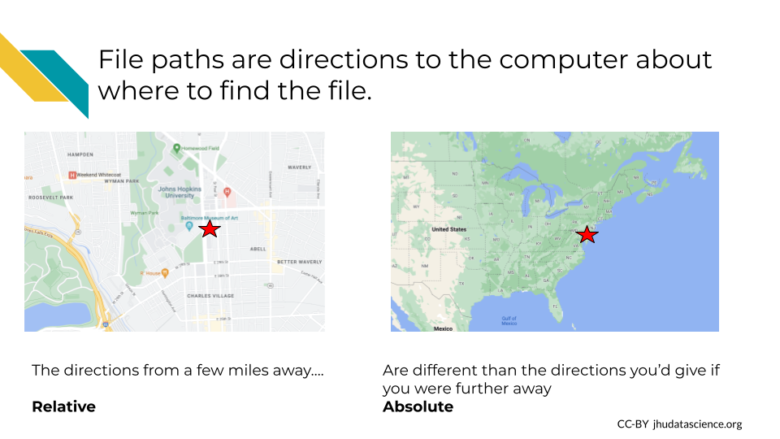
So in our above analogy, if you are trying to direct someone to somewhere on the Johns Hopkins campus with a file path:

An absolute file path would be:
`/Earth/North America/United States/Maryland/Baltimore/Johns Hopkins University/Street Name/Building number`

Whereas if the person was already in Baltimore, a relative file path would be:
`Johns Hopkins University/Street Name/Building number`

The end of a path string may be a file name if you are creating a path to a file. If you are creating a path to a folder, the path string will end with the destination folder.

To know your location within a file system is to know exactly what folder you are in right now. The folder that you are in right now is called the `working directory` aka your "Current Location".  In the above analogy a person being located in Baltimore would be their working directory. In a path, folder names are separated by forward slashes `/`.

Note that a relative directory may be different between different apps: RStudio versus Terminal versus something else. So you if you switch between the `Console` and `Terminal` tabs, you will have to pay attention to what your `working directory` is. This is also different from the `Files` pane which has no bearing on your working directory either. The terminal tab is located in the Console pane in RStudio, which is usually the lower left pane (with default settings).  You can use the terminal to work with files using the command line.

Returning to computer files, we can have relative or absolute paths based on where we are on the computer. If we are looking for a file in a directory that is on the desktop, then we can have a path from the desktop that is shorter than the absolute path which would identify where the file is overall.

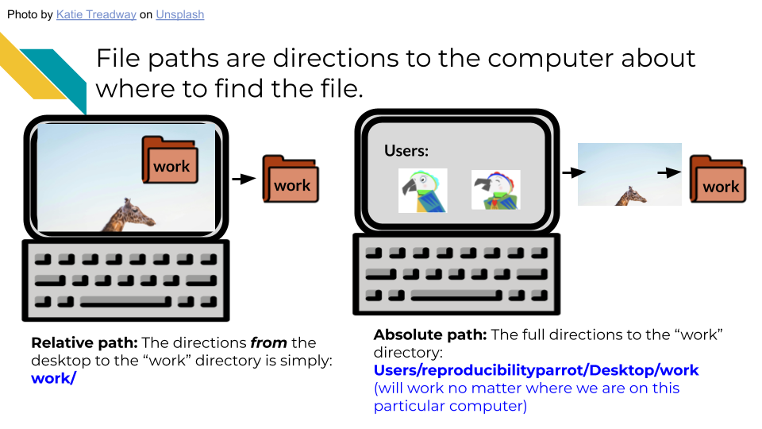


In your Terminal you can see your working directory at the top of the Terminal window or at the beginning of the terminal prompt. Knowing this, this can tell you how you need to change the command you are entering. Let’s say you want to list, using the `ls` command, a file called `file.txt`.


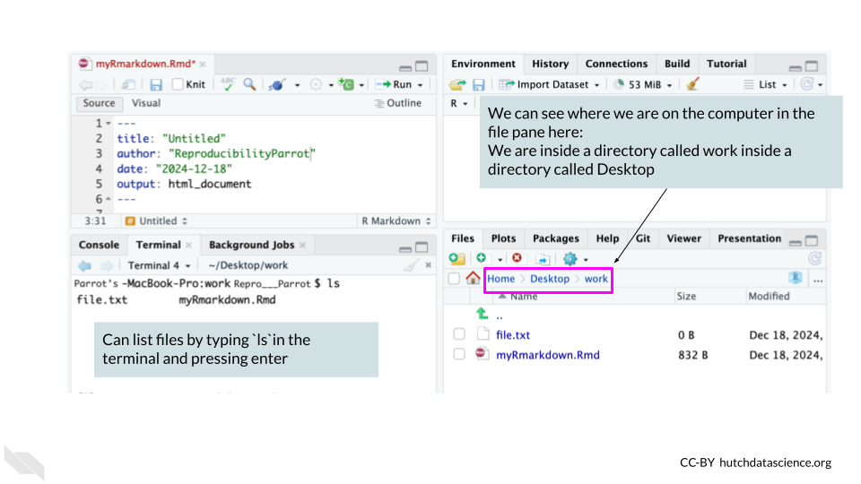


An absolute path starts at the root directory of a file system. The root directory does not have a name like other folders do. It is specified with a single forward slash `/` and is special in that it cannot be contained within other folders.

## Handy R Tools

### R Project files

RStudio comes with a nifty feature for organizing your files and making file paths easier for collaborating (more on that in the next section), called R projects. 

When you create an [R project](https://support.posit.co/hc/en-us/articles/200526207-Using-RStudio-Projects), which can be made by clicking on the button in the upper left corner of R Studio that looks like a blue cube with the R logo inside of it, you add a `.Rproj` file to your working directory.

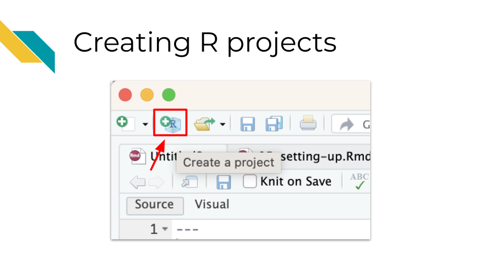
 
 This .`Rproj` file not only helps us later with file paths, but it also saves settings so that our work can be more efficient. Each time we open the project, (by clicking on the project file or using RStudio file tab, "Open project..." option), a few things will happen:
 
 1) We will load the files we were last working on in the editor pane
 2) Our current directory will shift to the directory containing the `.Rproj` file
 3) Settings for how we have set up RStudio will be restored

This can also make it really nice to switch from working on one project to another. You can click on the upper right button that has the R project icon in RStudio to switch to other recent projects. 

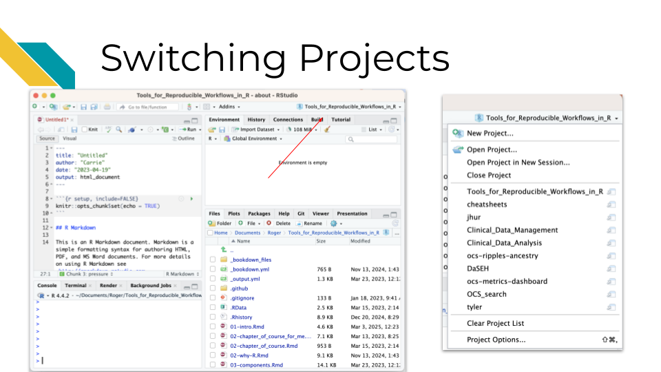


It also makes it much easier to navigate your files more efficiently. There is a project directory button in the file pane that allows you to quickly return to the directory with the `.Rproj` file for the project that you currently have open, if you happen to navigate away from that directory. 

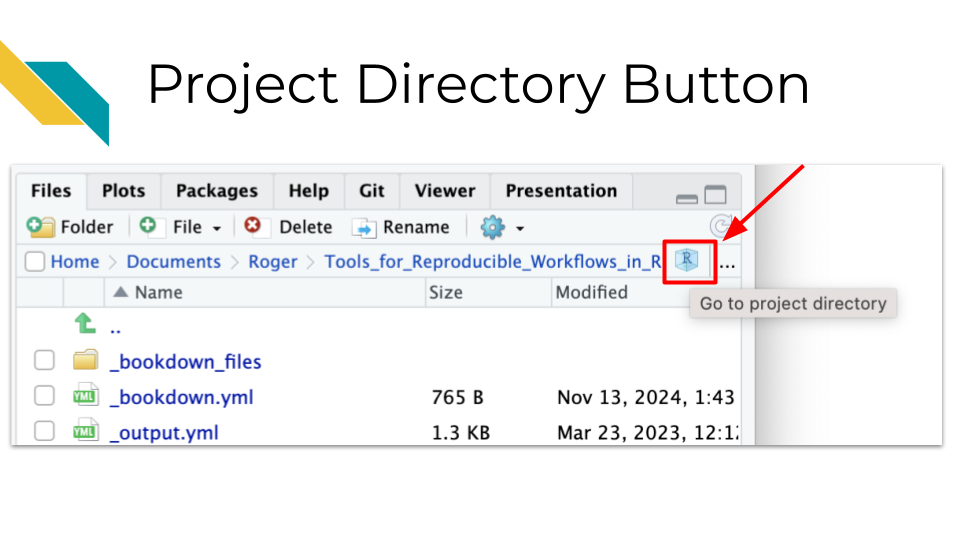


### The `here` package

The `here` package is very useful for helping you set up file paths in a way that can make it easier for others to use your code.

[Jenny Bryan](https://jennybryan.org/about/) who works for RStudio is famous in the R community for having strong feelings about this:

<blockquote class="twitter-tweet"><p lang="en" dir="ltr">The only two things that make <a href="https://twitter.com/JennyBryan?ref_src=twsrc%5Etfw">@JennyBryan</a> 😤😠🤯. Instead use projects + here::here() <a href="https://twitter.com/hashtag/rstats?src=hash&amp;ref_src=twsrc%5Etfw">#rstats</a> <a href="https://t.co/GwxnHePL4n">pic.twitter.com/GwxnHePL4n</a></p>&mdash; Hadley Wickham (@hadleywickham) <a href="https://twitter.com/hadleywickham/status/940021008764846080?ref_src=twsrc%5Etfw">December 11, 2017</a></blockquote> <script async src="https://platform.twitter.com/widgets.js" charset="utf-8"></script>

The reason for Jenny's anger is that if you write file that starts with your own personal path on your computer, that requires that anyone else who receives the file to adjust the path for their computer.

The [`here` package](https://here.r-lib.org/) fixes this problem. Instead you can write a path relative to the `.Rproj` file. Then if you send your project files to someone, the paths will work for them too! (This is as long as they don't move the files around without updating the code.)

One can do then use the `here` package to load data with just the relative path from the .`Rproj` file. 

For example, let's say we had our files organized like we did before, but now we have a `.Rproj` file called `myproj.Rproj`.

```
project-name/
├── run_analysis.sh
├── 00-download-data.sh
├── 01-make-heatmap.Rmd
├── myproj.Rproj
├── README.md
├── plots/
│   └── project-name-heatmap.png
├── results/
│   └── top_gene_results.tsv
├── raw-data/
│   ├── project-name-raw.tsv
│   └── project-name-metadata.tsv
├── processed-data/
│   ├── project-name-quantile-normalized.tsv
└── util/
    ├── plotting-functions.R
    └── data-wrangling-functions.R
```

If we wanted to use data from the `project-name-quantile-normalized.tsv` file in our `processed-data` directory to make a plot, then we could use the following code:


``` r
library(here)
library(tidyverse)
my_data <- read_delim(here("processed-data/project-name-quantile-normalized.tsv"))
```

In this code we are loading the `here` package and the `tidyverse` package (assuming that we have already installed these packages using the  `install.packages()` command). 

We then import data from the file called `project-name-quantile-normalized.tsv` inside of the `processed-data` directory using the path of this data file relative to the `.Rproj` file. This is because the `here` function tells RStudio to start looking in the directory with the `.Rproj` file.

Now if someone were to send all the project files to someone else, they could run this code without any adjustments! 


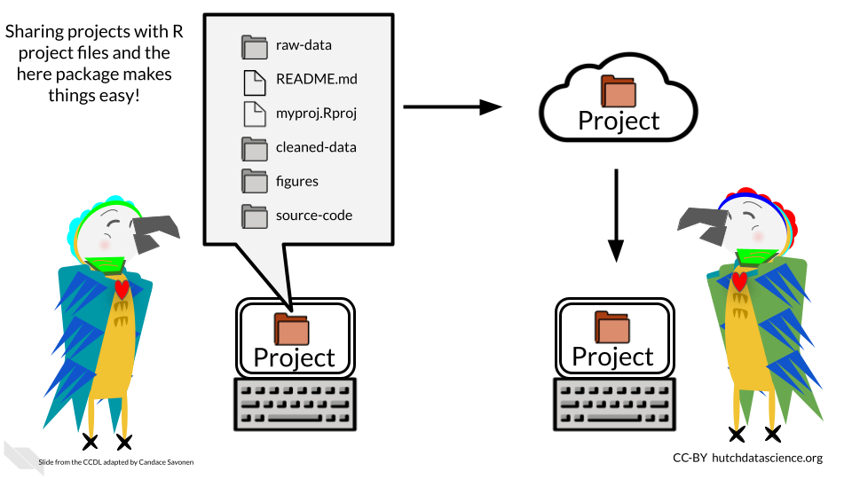

Checkout more of [Jenny's thoughts on organizing files, paths, and projects in R](https://www.tidyverse.org/blog/2017/12/workflow-vs-script/)[@Bryan2017].

Also checkout this [course which talks about RStudio projects and the `here` package](https://jhudatascience.org/tidyversecourse/intro.html#rstudio-projects)[@jhu_rstudio_projects].

### ProjectTemplate

If you are interested in doing more **advanced** project organization and automatic running of code and testing, you could consider using the [`ProjectTemplate` package](http://projecttemplate.net/). 

This is not to be confused with R projects, you would still need to create an R project using this package, or you can specify using commands with this package to also create an R project.

However, using `ProjectTemplate` will create a directory structure to help you stay organized.

Running the `create.project()` command in the console of RStudio will create a new directory called `new_project` with many subdirectories such as `data` and `graphs`, and it will create a README file. You can read more about [the file structure that it creates](http://projecttemplate.net/architecture.html).


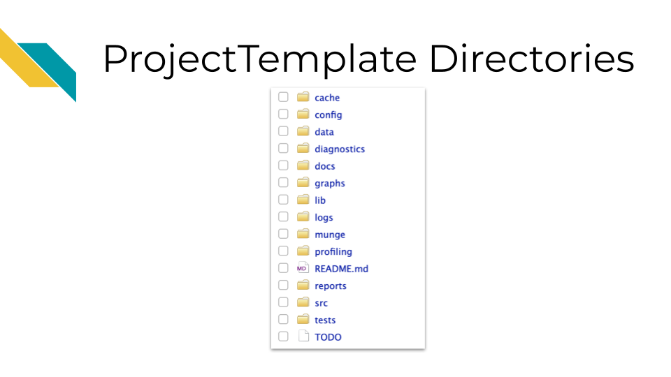

If you also add a `rstudio.project = TRUE`, this will create a new RStudio project as well.


``` r
library(ProjectTemplate)
create.project(rstudio.project = TRUE)
```


You can use this package to help you create consistent directory structures across projects and to help you not forget to make README files. 

You can also customize this structure as well using the [`create.template` function](http://projecttemplate.net/custom_templates.html).


### Scientific notebooks (Rmd or qmd)

Using notebooks can be a very helpful tool for documenting the development of an analysis.

Data analyses can lead one on a winding trail of decisions and side investigations, but notebooks allow you to narrate your thought process as you travel along these analyses explorations!

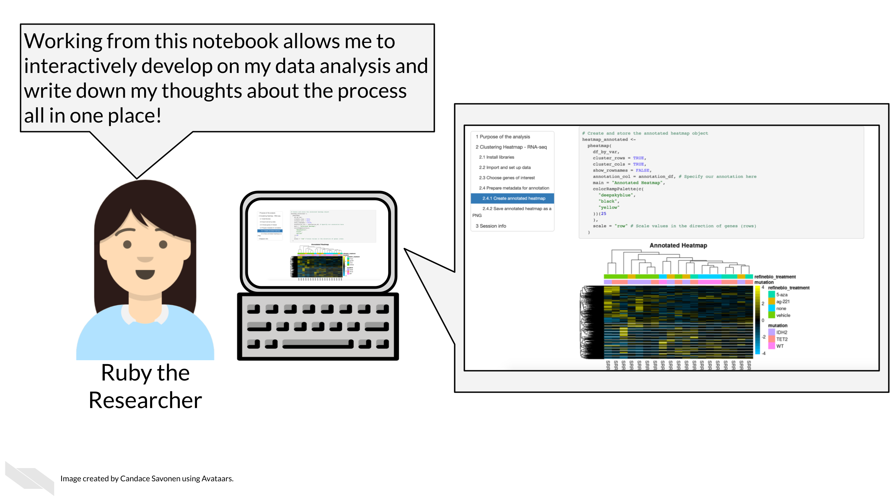

**Your scientific notebook should include descriptions that describe:**   

#### The purposes of the notebook

It can be helpful to others and your future self to describe:

- The scientific question are you trying to answer
- The dataset you are using to try to answer this question
- An explanation for the choice of the dataset to help answer this question

#### The rationales behind your decisions

Describe  major code decisions. For example, why you chose to use specific packages or why you took certain steps in that specific order. This can be very general to very specific, such as why a particular code chunk is doing a particular thing. The  more possible options there were for choices or the more unusual a process that you might have taken, the greater the need to describe why you made certain decisions.

Describe any particular filters or cutoffs you are using and how did you decided on those.

For data wrangling steps, describe why you are wrangling the data in such a way. Is this because a certain package you are using requires it?

#### Your observations of the results

In this section it is helpful to include:

- What do you currently think about the results?
- What do you think about the plots and tables you show in the notebook -- how do they inform your original questions?

There are two major types of notebooks folks use in the R programming language: R Markdown files and Quarto files. In the next section we will discuss these notebooks, the similarities and differences between these two options, and how to use them.

<!--chapter:end:05-setting-up.Rmd-->

# Reproducible Reports


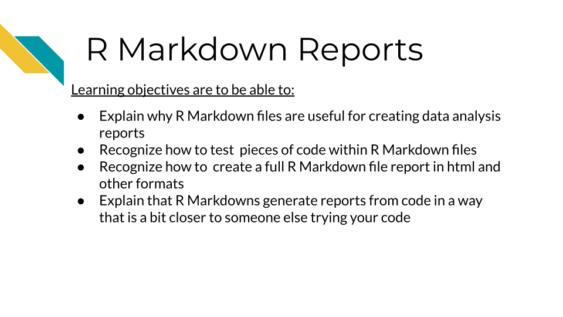

## Notebook reports support reproducibility

Using notebooks can help you more transparently show what you did for your analysis.  They can also help you to test that your code works as expected. Scripts allow you to save code, but they do not allow you to have the following additional benefits.

The following are reasons why notebooks help reproducibility:

- They allow you to show and share your code and the output of your code in one place! (This can be done in several ways depending on what you want.)
- They allow you to test if your code works outside of what is active in your environment
- They allow you to test sections and all previous sections of your code, which can help with troubleshooting
- They help you understand what might be wrong with your code in smaller sections of code if you have an issue

## R Markdown or Quarto?

Both R Markdown and Quarto are types of notebooks that have similar functions. R Markdown files end with the suffix `.Rmd` while quarto files end with `.qmd`.

Both Qmd and Rmd files are both notebooks that have the benefits we've described above. They allow you to document using the markdown language. Plus, because they are so similar you can often just change the suffix of your file and convert between these file types (results may vary depending on the content of the file).

R Markdown was the first R programming notebook on the scene, and has a lot of tools devoted to it because it has been around awhile. In 2022, [Posit released the Quarto notebook](https://posit.co/blog/announcing-quarto-a-new-scientific-and-technical-publishing-system/). So Quarto has a lot of great new features but is still relatively new.

Posit created Quarto with the idea of streamlining document making by allowing for more compatibility with languages beyond R. While R Markdown documents also somewhat allow for other languages, their ability to do this successfully is limited.

### R Markdown Pros:
- Time tested, a lot of packages and resources built for it.
- Fundamentally an R notebook and is built around that.

### R Markdown Cons:
- Does not always do well running other languages (like Python).
- Does require a lot of extra packages to be installed to do more things with it: `bookdown`, `distill`, etc.

### Quarto Pros:
- Built with more compatibility for other languages
- Appears to be more streamlined/centralized and less need for a lot of extra packages to create other types of documents.

### Quarto Cons:
- It is still quite new, and the community is still catching up to it, although it appears to be built with backwards compatibility in mind.
- Because it so new, there are still some features that are being developed for Quarto that R Markdown already supports. At this point, these are mostly features that would allow for customization.

## Getting Started with notebooks

<details><summary> Click here for a review on how to create R Markdown files in RStudio. </summary>

To open a new R Markdown file by go to `File` --> `New File` -->`R Markdown` in the upper menu of RStudio.

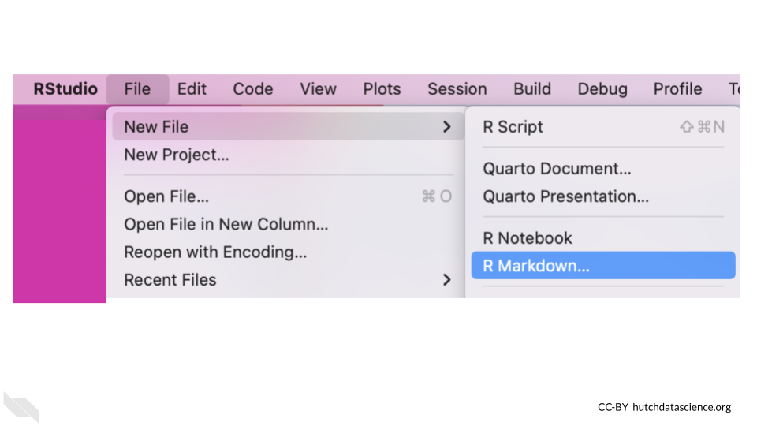

Creating an R Markdown file starts with a pop-up and you can simply click the OK button.

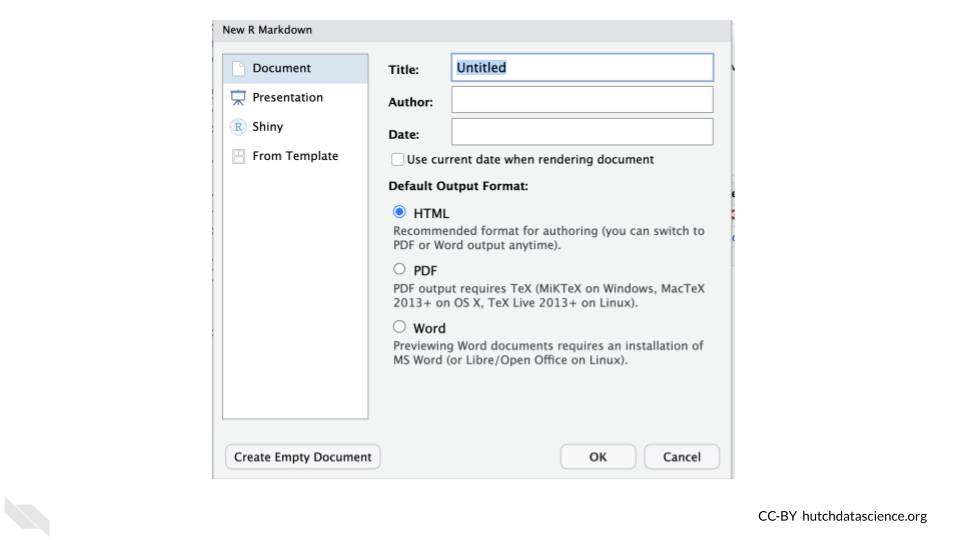

The new pane will open on the upper left.


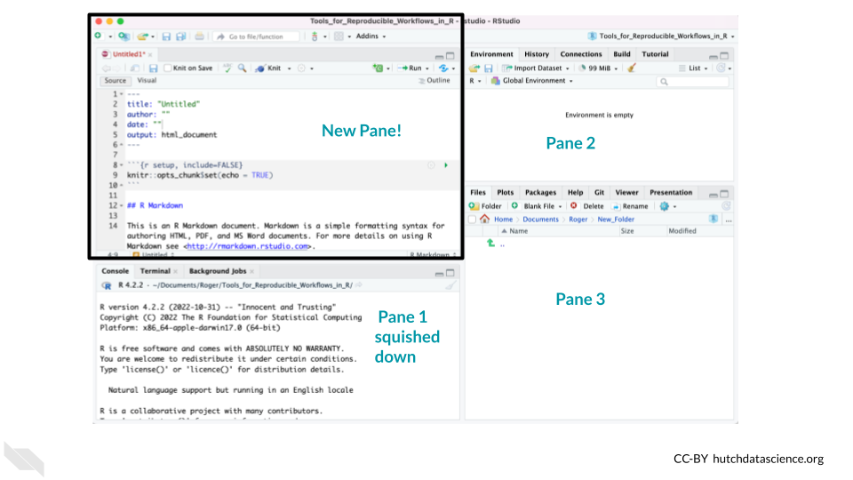

This pane is where we can write code to save in our R Markdown report.

Thus the lower left pane is where we can test out code (although we do not generally recommend it), but the top pane is where we can write code that we wish to save.

Note that you can also test selected code (or a current line) in an R Markdown file using a keyboard shortcut of Ctrl+Enter on Windows & Linux computers or Cmd+Return on Mac computers.

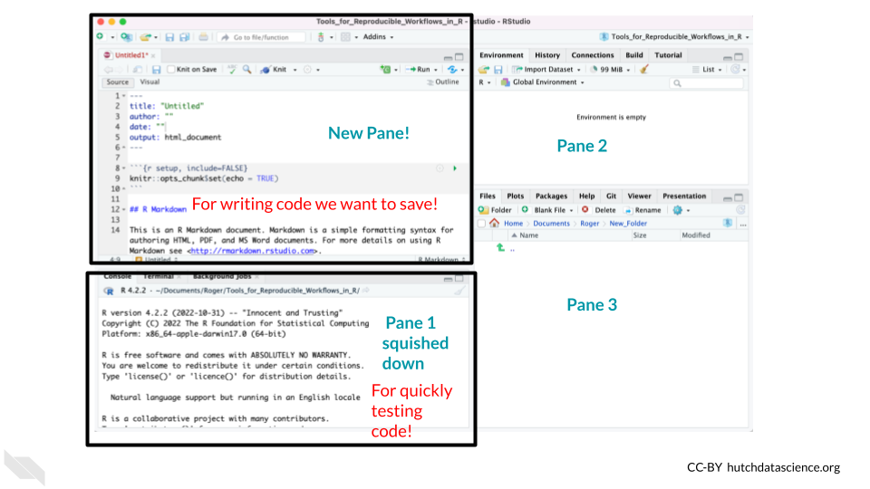

The top pane where we save code is called the editor. The lower pane where we test code is called the console.

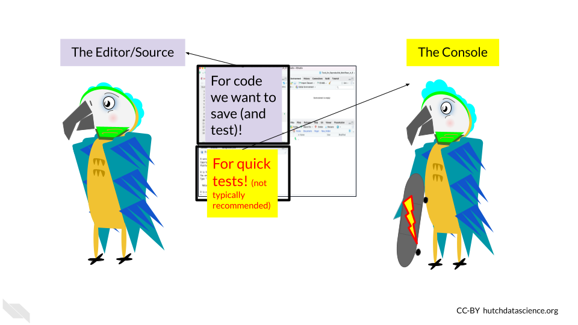

</details>

Once open the file your RStudio should look something like this:


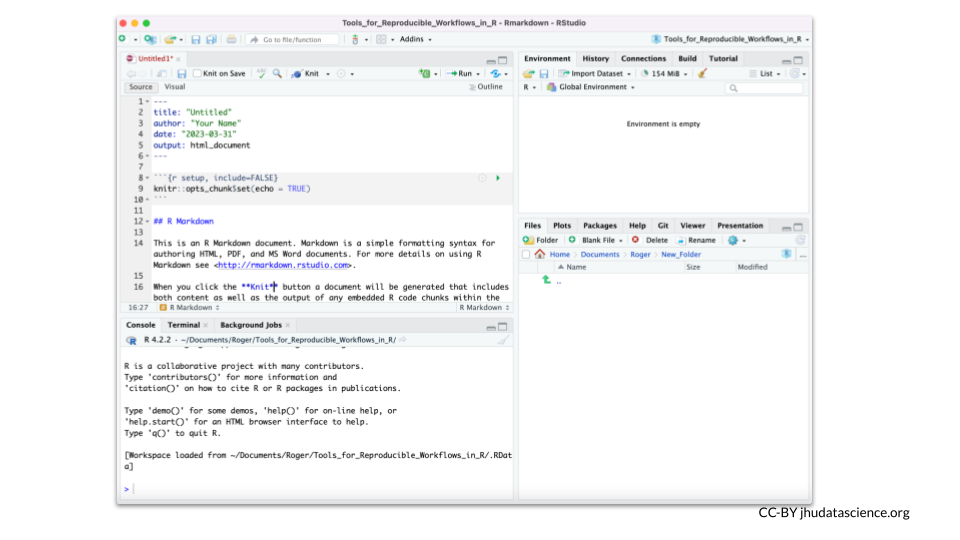

## Rendering R Markdown

For this first chapter we will introduce you to R Markdown files, but note there are many [great and continually new emerging tutorials to introduce to Quarto notebooks](https://quarto.org/docs/guide/). Most of what we discuss about R Markdown files is also applicable to Quarto and you can often just switch the suffix of your file and have *most* of your features and code still work.

There is a special `Knit` button that looks like a ball of yarn with a knitting needle at the top of the R Markdown files that helps you create your report. Since R Markdown files by default have some code, we can press this to see what a rendered report might look like before we start writing our own code.


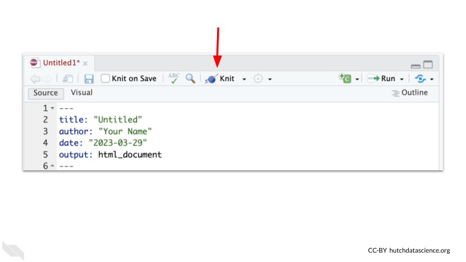

You will likely be prompted to give the file a name after you press the Knit button and to confirm where you want to save the rendered version.

You will then see in a second or two (after some information is printed on the Render tab in the lower left pane) a screen pop up with the rendered version of the report.

This will look something like this:

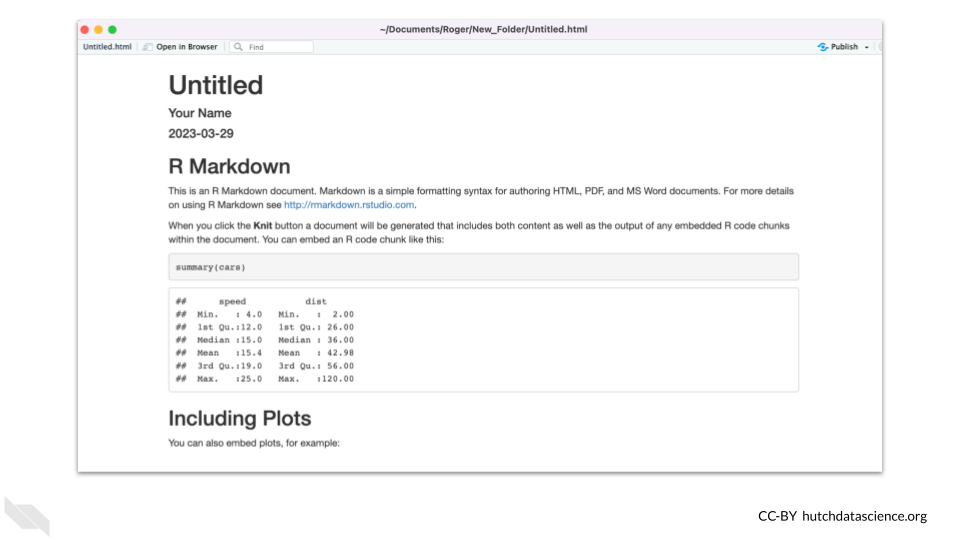

Here we can see that there are some headers and text information, as well as some code shown in the gray box. We also see that this code is followed by the output of the code, where we see a summary of the `cars` dataset.

If you scroll down you will see an example of what a plot looks like in such a report.

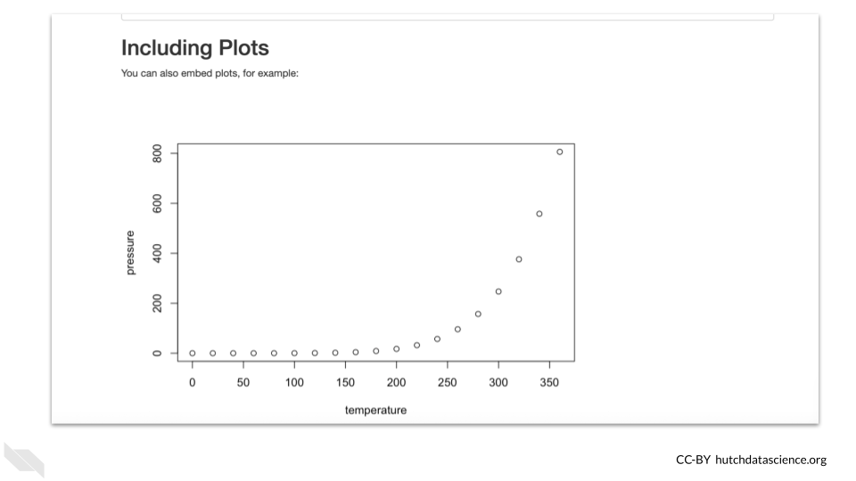

Hopefully you can already start to appreciate how useful it can be to send people a report of your code with the output of your code and plots, as opposed to just a simple script, which can't show the output of our code!

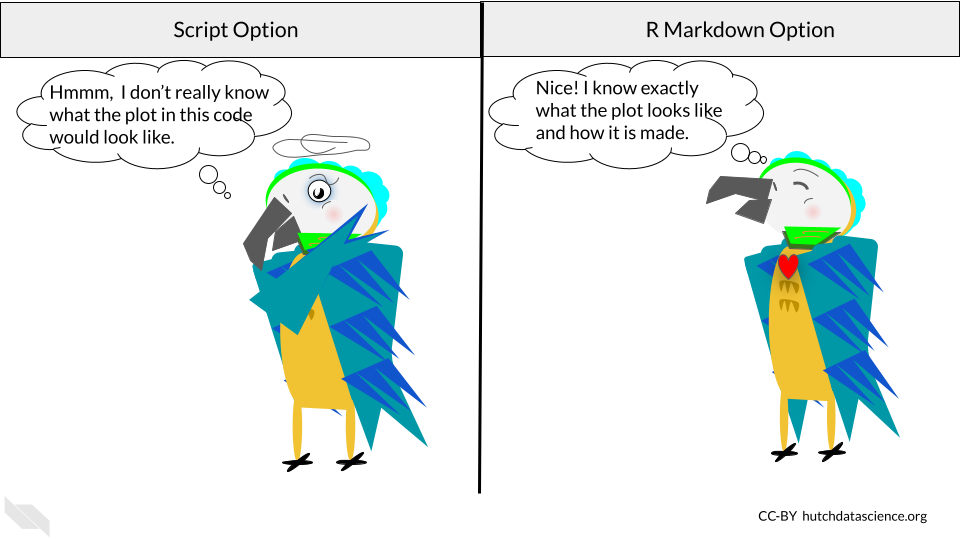

It's important to note that when we knit an R Markdown file, it will test our code as if we have an empty environment and it will rely on **only the code written in the R Markdown file**. It can't use code that was tested in the Console or run interactively in the R Markdown file (more on that soon).

This process really helps with reproducibility because it helps us make sure that all the instructions needed (loading packages, assigning objects, etc) are within the code that we saved in the R Markdown file.

If anything is missing, the file will either not knit and you will get an error, or you may see that the output of the code is different than you expected.

Now let's discuss how to start writing code in such a file.

## Writing code in R Markdown files

### The YAML

At the top of an R Markdown file you will see some special code that is called [YAML](https://en.wikipedia.org/wiki/YAML) code. It is commonly used to configure programming projects. It does the same for our R Markdown reports. A major difference between R and YAML is that spacing really matters for YAML.

What do we mean by configure? Configuration in programming generally refers to setting things up.

<div class = "dictionary">

- **Knit** - Knitting an R Markdown file executes all the code and then converts the file into a rendered report of a different file type  
- **YAML** - A language that helps set things up and shows up by default when you open an R Markdown file. It is written between the two `---`.
- **Configuration** - A setup for a programming project.

</div>

Here we can see what the top of an R Markdown file looks like after we first open one.

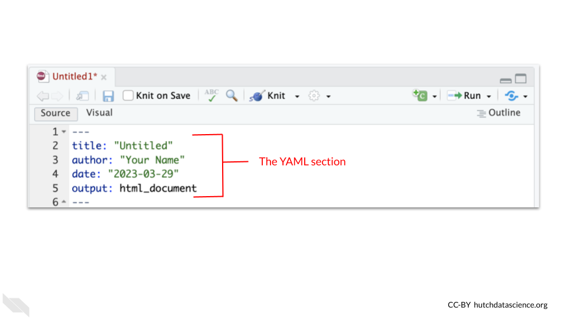


You can modify the `"Untitled"` text after `title:` to specify the title of your report. If you want to you can also change the author section  where it says `"your name"` in the example.

### Code chunks

Next as we scroll down, we will see gray section with some notation which is called a code "chunk".

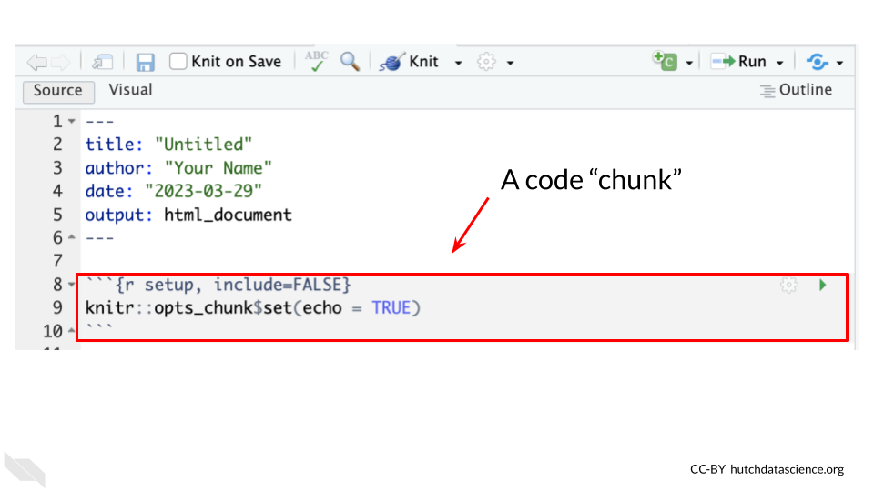

The notation here means the following:

- The three back ticks `"```"` mark the boundaries of where code should be placed. This is what we call a code chunk.
- The `{r}` indicates that we are going to write the code using R code.
- Extra information can be added inside the curly bracket `{}` notation to give the chunk a name, in this case it is called `setup`.
- The `include = FALSE` means that it will not show up in the rendered report.


This first chunk tells the document how additional chunks should show up in the rendered report by default. Here it says that code should show up with `echo = TRUE` in the report. You don't need to worry too much about any of this now, just recognize that this is a chunk of code.

As we scroll past some text within the R Markdown file, we will see another chunk.


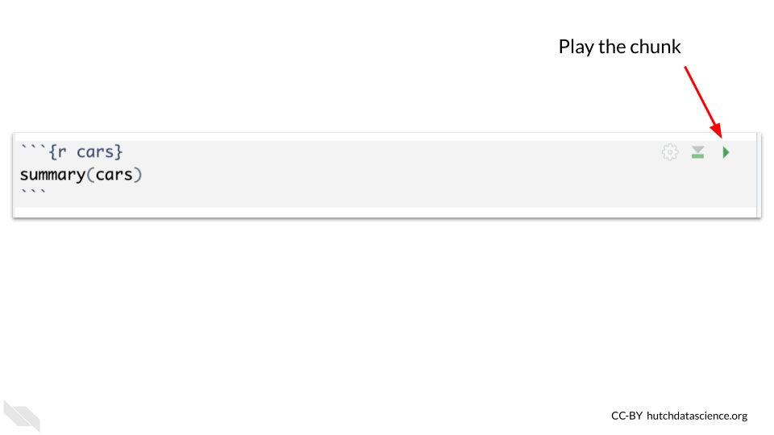

This chunk also has a name, "cars". It is not necessary to name chunks, but it can help you to navigate to a particular chunk later, if you do name them.


### Running chunks

Here we will see a green triangular button with its point facing to the right. This is the play button. If you try pressing this button inside of RStudio, you will see a preview of what the code does. It should show the summary of the `cars` data.


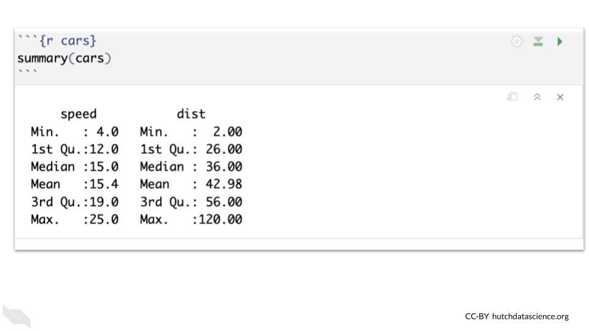

Pretty nifty!

This is similar to testing our code in the console, in that if we assign an object it will show up in the environment.

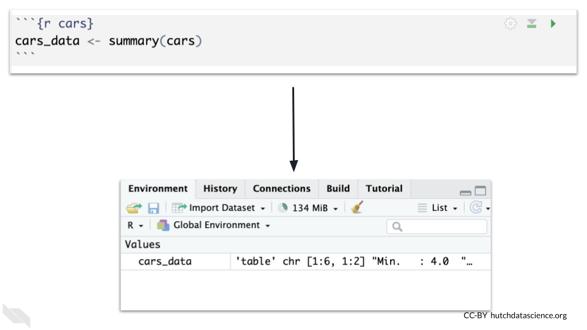

<div class = "dictionary">

- **Code chunk** - A piece of code in an R Markdown file. The code can be previewed pressing the play button for the chunk, which is equivalent to running the code in the console.

</div>


Writing our code in chunks (as opposed to one long script) can help with reproducibility, as we can better determine where possible changes may have occurred and how that influenced the results in a step-wise fashion, instead of just one final output.


### Running previous chunks

You may also notice that there is another button to the left of the play button. This button allows you to play all previous chunks before this chunk.

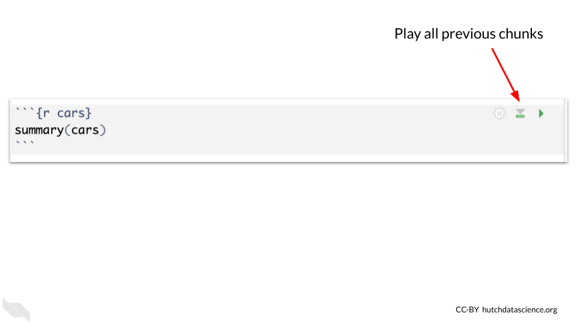

This is super helpful for reproducibility in terms of making sure that your code is working properly with all the necessary pieces. Sometimes code just works during an R session  (and not after) simply because it is relying on an object or code currently in our environment that is not saved in our notebook. For example, code that was tested in the console but not saved will not be run the next time we try to knit our R Markdown file.

Issues can happen if you run a code chunk out of order or change the code in a chunk after running it previously. This can make you think that you have all the code that you need saved to obtain the result that you found, when in fact you do not.

Therefore we recommend cleaning the environment (which we will describe in the next section) and testing out that your chunks work well together by knitting the document. If you get an error you can run subsets of your code chunks together using the play previous button, until you identify where the issue occurred.

## Cleaning the environment

We suggest cleaning out your environment somewhat regularly when you are interactively testing your R Markdown file using chunks. To do so, you can press the button that looks like a broom in the upper right pane.

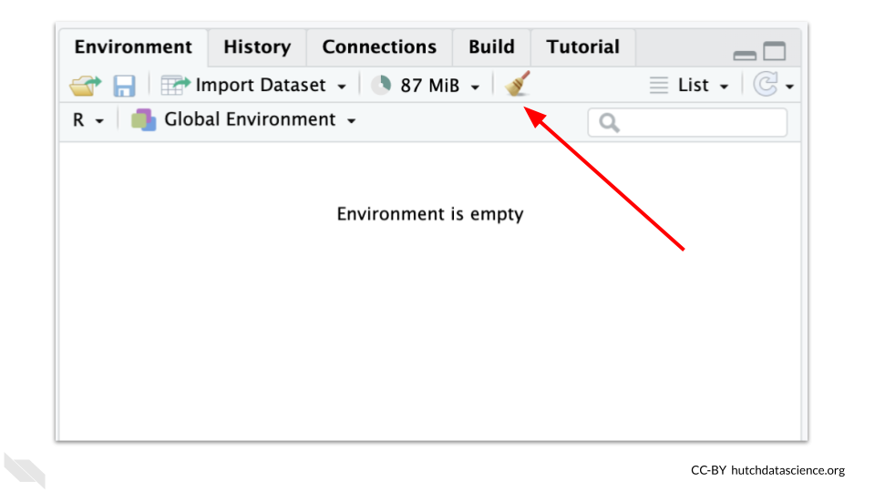

The ultimate test though is to press the `Knit` button and make sure you have all the code necessary to allow the report to render.

## Restarting R Session

To really test your code, every once in a while, we suggest restarting your R Session and trying to Knit your R Markdown file to make sure that anything you loaded during your previous session (but didn't save in your code) wasn't allowing your code to run successfully.

To do so, you can click on the `Session` tab of the upper menu of RStudio and click `Restart R`.


## Chunk setup

You may find that sometimes you want to hide the code in a report, or hide the output. This can be for a variety of reasons. For example, the first chunk that is in every new R Markdown file (when you first open one) is hidden. This is because it sets up how all the other chunks work (by default) and it isn't really important for the analysis. Recall that we hide the code and any output, using `include = FALSE`. If we just want to hide one or the other we can use different specifications.

The easiest way to do this is to click on the little gear symbol for the R chunk you wish to modify.

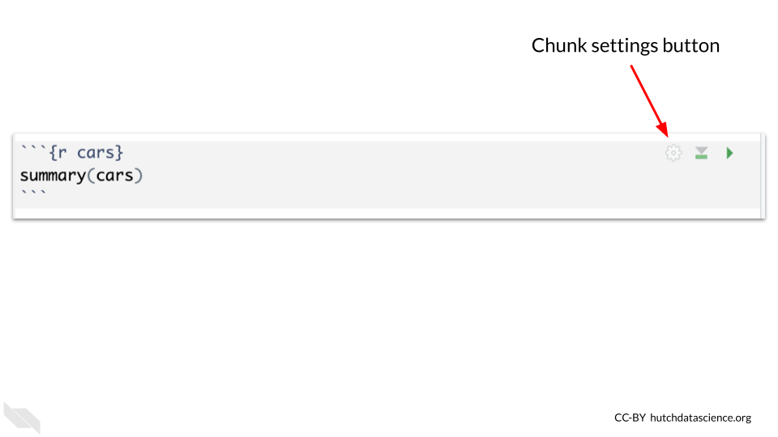


This will open a menu about how that chunk should be set up. The dropdown menu can be used to select if you want the code to be hidden, the output to be hidden, both, or none to be hidden (the default).


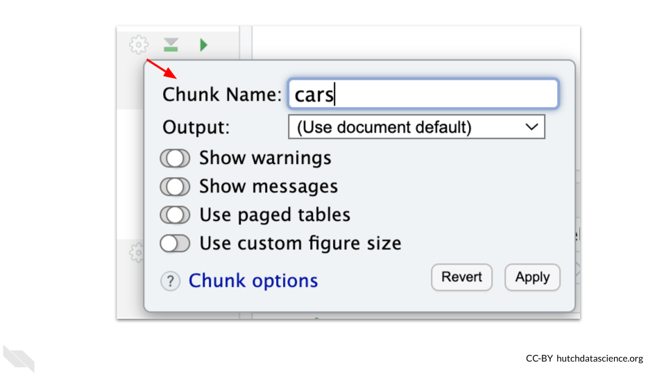


For reproducibility purposes, we generally suggest that you share the code, however, sometimes reports can get very difficult to read if you have all the code shown. So there are times where you might focus on a particular part of an analysis. We will also describe a nifty trick to allow readers of your report to see the code if they want to, but have it hidden most of the time.

## Finding chunks

If your R Markdown file gets really long, it can be difficult to scroll to find the chunk you want to modify. If you name your chunks, or even if you don't, you can more easily move around from one chunk to another using a special menu button created just for this!

There is a very small menu at the bottom of the R Markdown file editor that helps you move around. It will look slightly different depending on what your chunks are named, but will have a gold hashtag button.

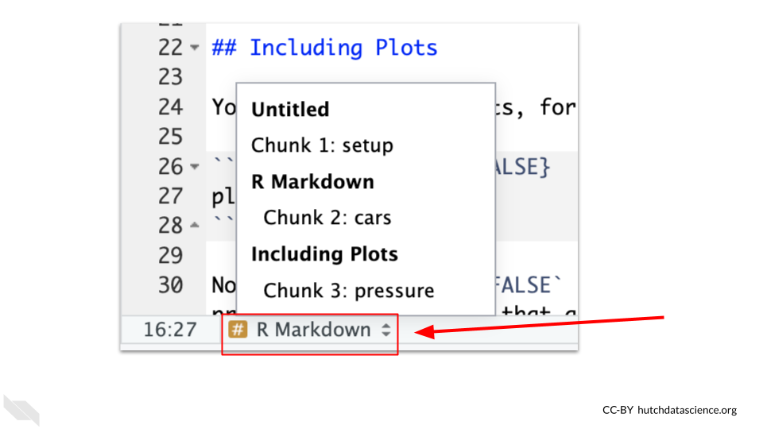


## Add chunks

To add new chunks you can either click on the chunk button on the top right of the R Markdown editor, which looks like a green square with a "C" in it and a plus sign on the corner.

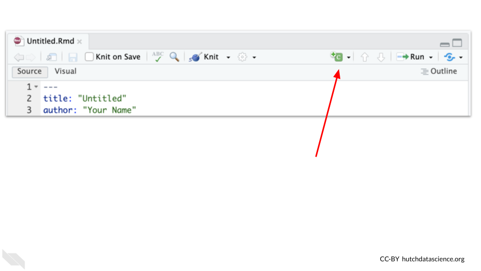

## More on running chunks

If you want to do anything fancier than running the current or previous chunks there is also a Run menu right next to the new chunk button. If you click on the arrow next to it, it will show you the advanced options. Otherwise it will just run all the chunks (which is similar to knitting but it will not render the report and may use objects that are in the environment).

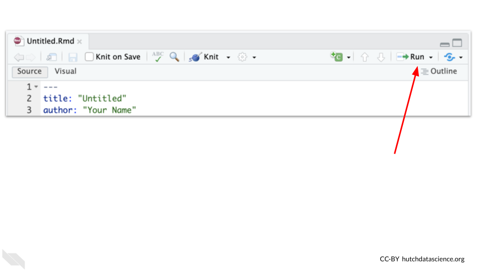

The menu allows you to run all chunks below a specific chunk or run selected lines of code and more.

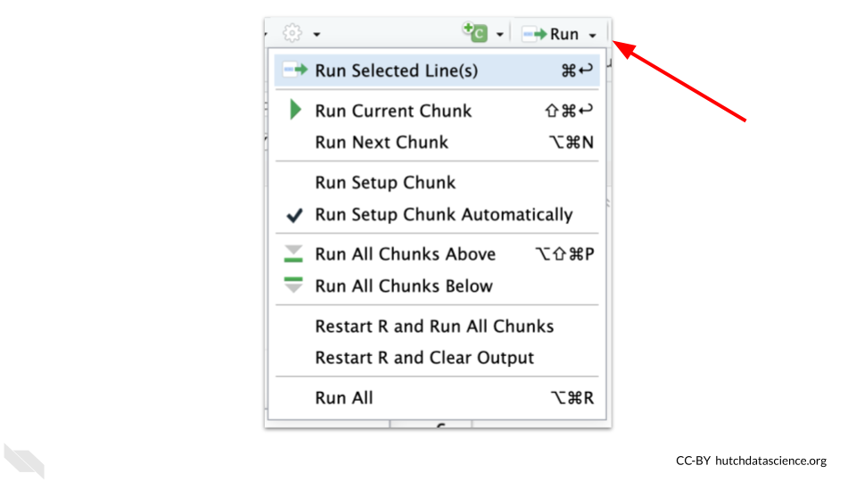

The arrow next to the add chunk button, will allow you to specify if you want to use a different supported language besides R.

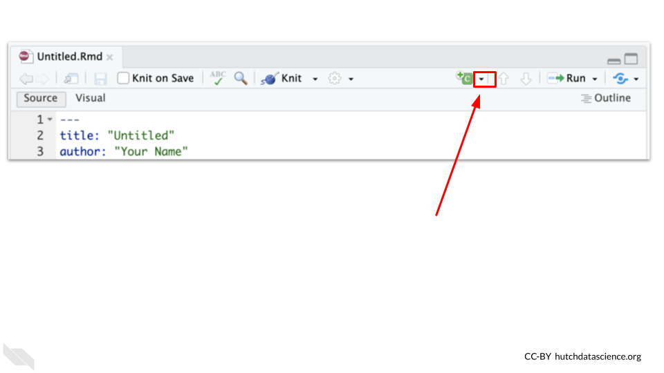


## Text and headers

You will notice that there is text written around the code chunks that you can use to describe what you did in your analysis and why.

There are a couple of formatting options that can be very useful to know.

If you want to know more, you can check out this [guide](https://www.markdownguide.org/) about Markdown in general. The syntax will be the same for R Markdown files too.

### Headers

Using hashtags creates headers. One hashtag creates to highest level header, adding more hashtags add subsequent smaller headers. For example text with two `##` will be smaller than text with one `#`. The hashtags need to be on the far right of the line and you need a space in between the hashtags and the text to create the header.


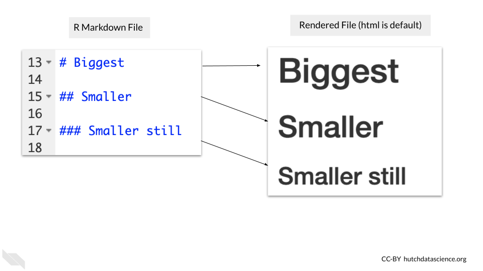

### Bold and Italics

Bold text can be created using `**` around the text.

Italic text can be created using `*` around the text.

To do both you can use `***` around the text.

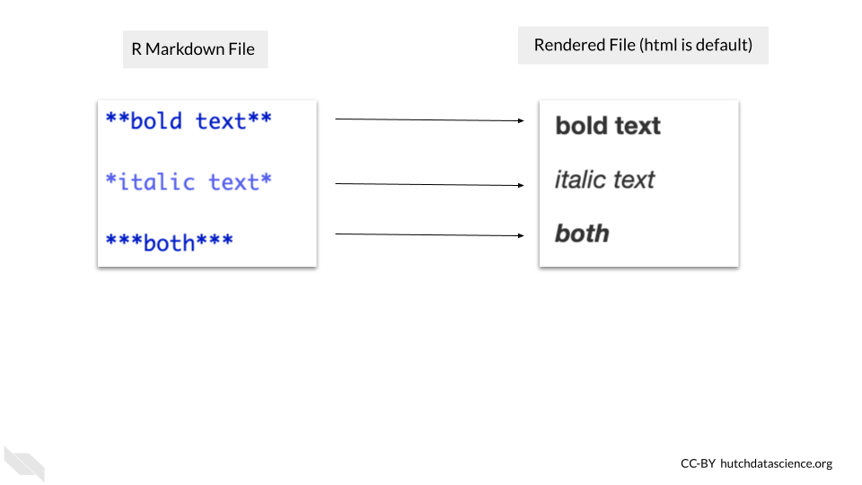


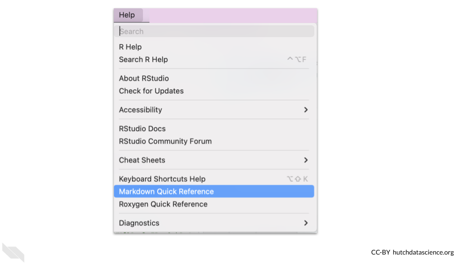


The text surrounding our code and the output of our code can be extremely helpful in explaining to others what steps we took in our analysis, why we made certain decisions, the sources for our data and more. All of this information is extremely helpful for reproducibility!

## Additional Features

We will cover a several additional features that we have found to be especially useful.

We also recommend checking out the [R Markdown cookbook](https://bookdown.org/yihui/rmarkdown-cookbook/) for even more tricks and tips.

### Aesthetics

Sometimes we might want to make our reports look a little nicer, perhaps we want to add branding that matches that of our institute or at least makes the report look really polished.

You can make changes to the aesthetics of the report in very few steps.

First locate the settings button for the R Markdown editor, which looks like a gear an is located next to the `Knit` button.

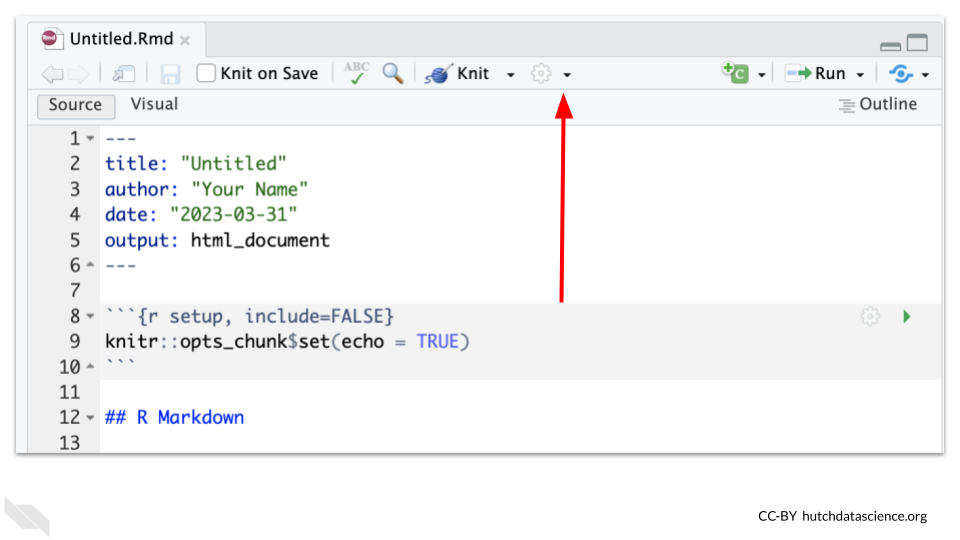

Then scroll down and select "Output Options". This menu also has nice features if you don't like the default ways that the chunks preview output. For example, many people prefer to preview code in the console instead.

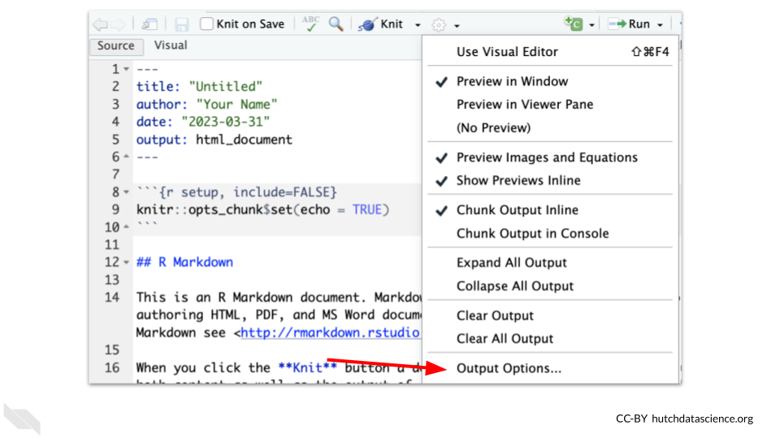

This will open a new window that has a dropdown that you can use to apply a theme to the report.

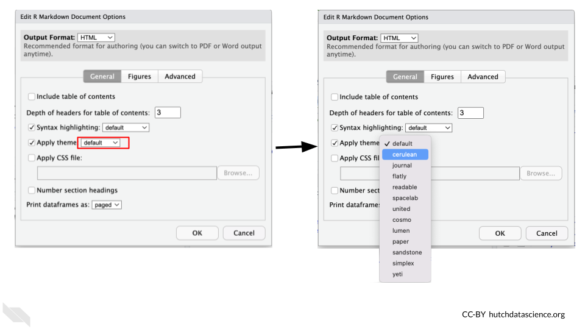

This will modify the YAML code in your R Markdown file to add a line about the theme.

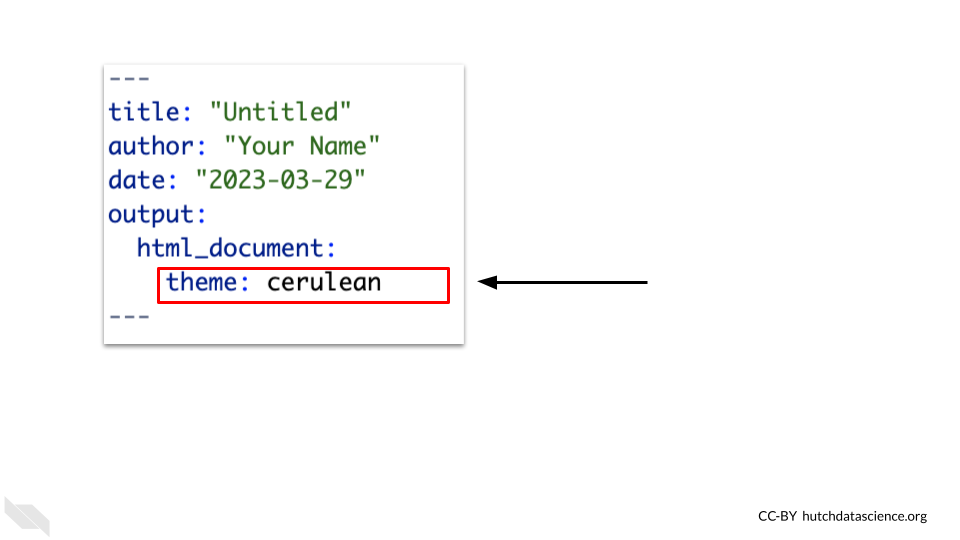

When the report is rendered it will have a different look.


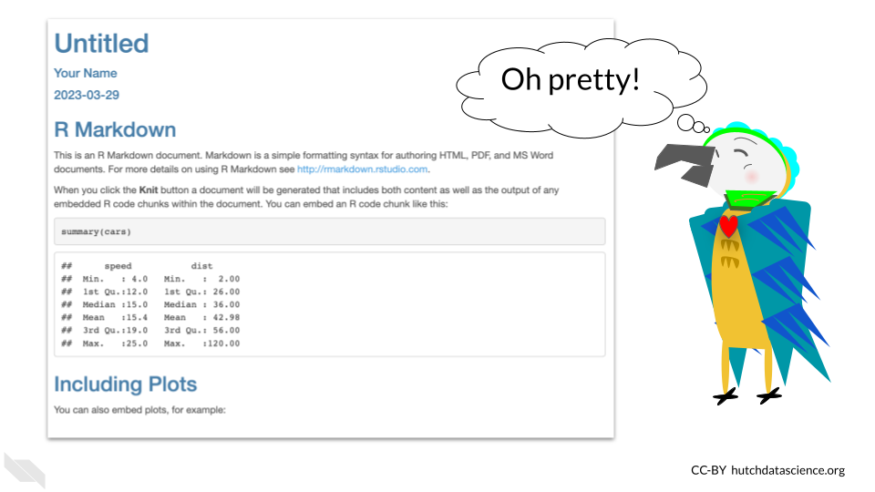


### Report File Types

You can render your report as other file types besides html. This might be useful if a collaborator wants a PDF of your report. To do so click on the arrow next to knit button and select a different type. Here you can see that PDF and Word are other options. This will change the YAML code and may add more output information.

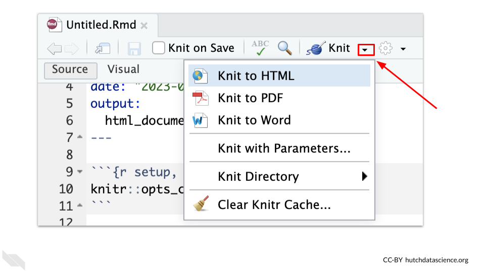


## Keyboard Shortcuts

If you like to work with keyboard shortcuts instead of pointing and clicking, you might also want to check out this [link](https://support.posit.co/hc/en-us/articles/200711853-Keyboard-Shortcuts).


### Table of Contents

Sometimes if your report is very long, it can help to add a table of contents.

This can be done by adding `toc: true` and `toc_float: true` to the YAML underneath the `html_document:` code. The spacing is very important with this! The `toc_float: true` makes the table of contents on the side as opposed to just the top.

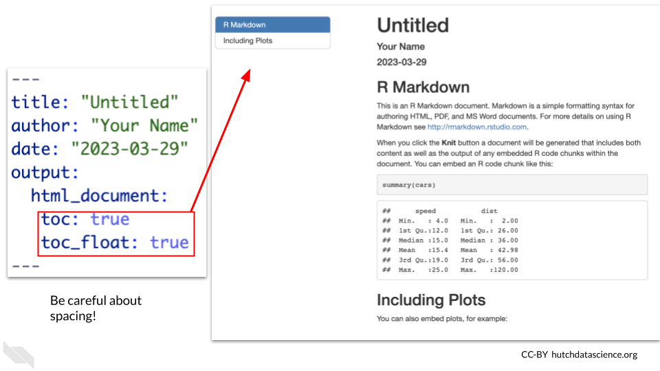


### Code Folding

Earlier we talked about hiding code but discussed that usually you want to share the code if possible. Code folding is really great option for this issue! It allows you to create a clean report with a button for people to click to see the code within the code chunk that resulted in the various outputs of the report.

To do this you can add  `code_folding: 'hide'` to cause your code to be "folded".

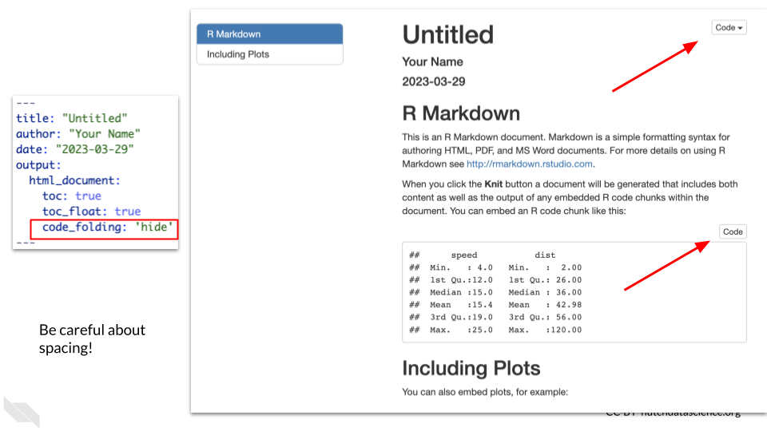

This means that there will be a button that people can click on to see the code (or hide it afterwards).


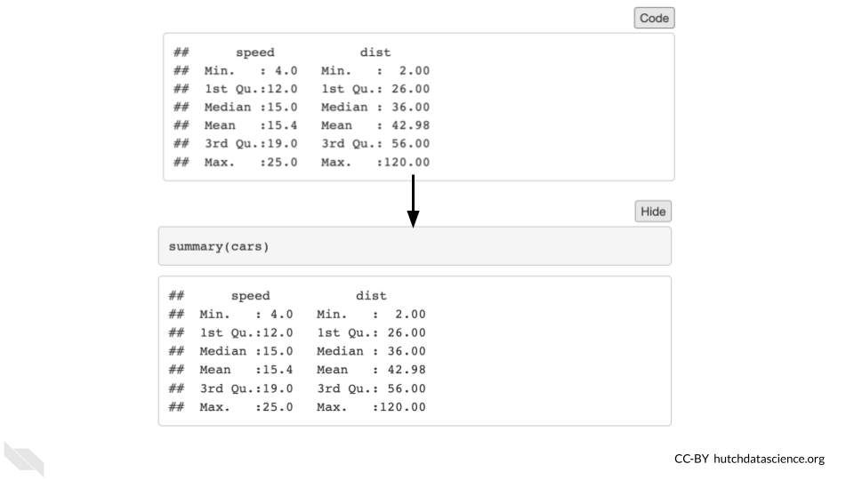


Cold Folding is a great option for reproducibility, because it makes your report easy to read, but also shares your code!

### Code Download

You can allow others to download your code by adding `code_download: true`. The code button the top right will allow them to download the R Markdown file.


<div class = "warning">

Be careful about allowing this if you use code that works with data with PHI. Just make sure that no PHI would be described in the R Markdown file itself as opposed to the rendered report.

</div>

### Automatic Date

Using `date: "2025-06-06"` in the YAML will keep the date up-to-date as you write more code. It will display the date that the report was last rendered.

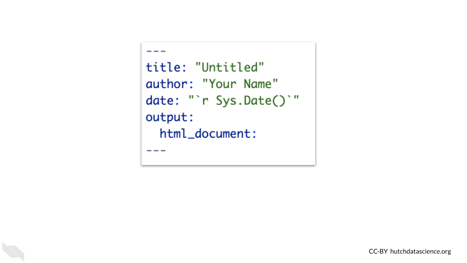


This trick is great for reproducibility because it ensures that the date on the report is correct for when the report was last rendered. This helps those who read the report to get a sense of how active development is on the project.

## Conclusion

In summary, R Markdown files can help you to create nice looking reports that help others to understand not only what code you used, but also what the results of your code were.

 - Code is written in gray sections called chunks that have play buttons that allow you to preview the code
 - The Knit button allows you to render the full report and test that all of the needed code is in the file
 - Using the Knit button does not rely on anything in the environment, all objects needed or any data that needs to be imported must be done within the R Markdown file code
 - New chunks can be added using the new code chunk button which looks like a green square with a "C" in it at the top of the R Markdown editor
 - Chunks can be set up to hide the code, or the output, or hide both, or hide neither (the default)
 - The gear button on each chunk can be used to set the output for a given chunk
 - The play previous button to the left of the play button will run the code for all previous chunks
 - To make sure that you are not relying on code that was just run in the console or run by playing a chunk, it is advisable to clean the environment with the broom button from time to time
 - hashtags are used to create headers, the fewer the hashtags the larger the header
 - Asterisk around text creates bold or italic font
 - There are additional features to make your R Markdown report showcase your code and the output of your code in more readable ways, including adding a table of contents or folding code, so that readers can click to see the code that created a particular output. This is a really great option for reproducibility because it creates easy to read reports but also shares your code!

<!--chapter:end:06-rmarkdown.Rmd-->


# Reproducible Code


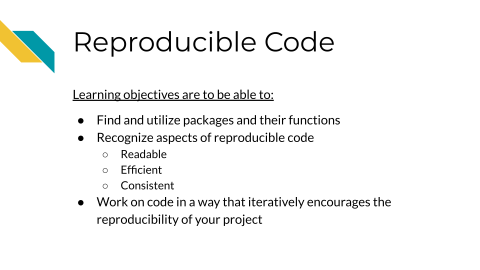

## Reproducibility means we don't need to reinvent the wheel!

When you realize something that you need done, you should first use Google and look on GitHub and StackOverflow to see if someone else has written something that works really well. Where at all possible, borrow good code and attribute the author -- no need to reinvent the wheel. As we said previously, R has a great community of users who are constantly creating new and great code, often in the form of packages that are ready for you to install and use.

_This is the beauty of reproducibility, if you or someone else makes great code, it can not only be re-run but it can be repurposed!_

### Tips for choosing packages to use:

- Does the package have easy to use documentation to help guide you on how to use it properly? If the package has underdeveloped documentation it may be difficult for you or others to understand and use properly.
- Is the code actively being developed or maintained? Packages that are no longer being maintained will likely deprecate more quickly rendering them unusable in the future.
- Is it a package that is commonly recognized by the community? Well recognized packages will be easier for others to comment on and help you with.

## The importance of iterative work

We've mentioned previously that reproducibility is iterative work. This way of working refers to code work as much as anything else. You won't ever write perfect code on the first try, instead aim for each chunk to work one step at a time. Once it is working, take a break (perhaps until the next day), then return to it and look for ways to polish it and make it more efficient.

[For more tips on how to work read this blog](https://www.ccdatalab.org/blog/not-so-secret-sauce-for-efficient-workflows).

## Aspects of Reproducible code

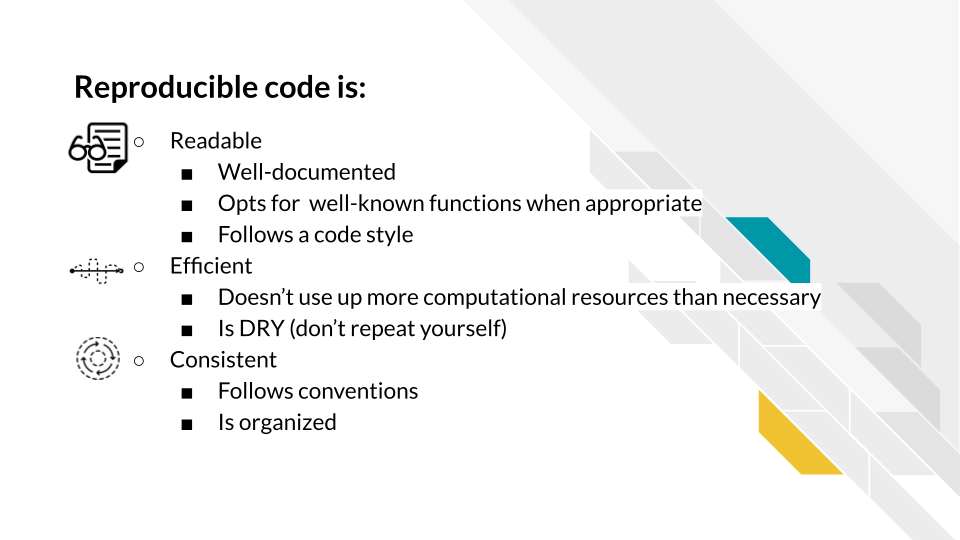

## Readable

Reproducible code is readable code. In order for other people to use your code, they will need to be able to understand it. Because of that, code being readable is more important than code being innovative or clever.

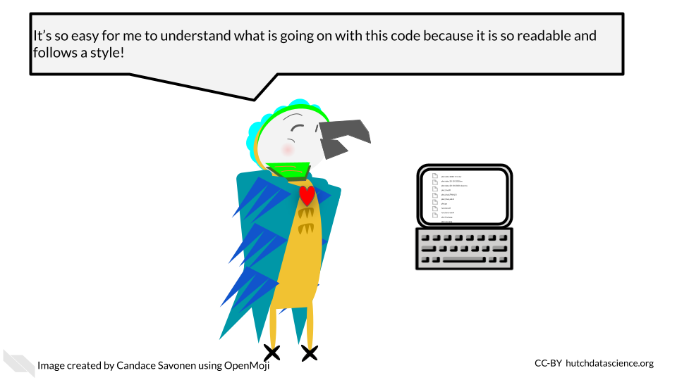

### Well-documented

Reproducible code is well documented code! This includes (but isn't limited to):

- A README that can get individuals up to speed on the project quickly
- Code and notebooks that have a healthy amount of comments

These bits of documentation are not only helpful for others reading your project but for you! As time passes, future you will forget what you of today was thinking when you wrote this code. Helpful code comments can help jog your memory of what the code is doing and perhaps what the next steps in the project need to be.

#### READMEs

READMEs are a universal signal to people looking at the project that they should READ this file to get a rundown on the project.

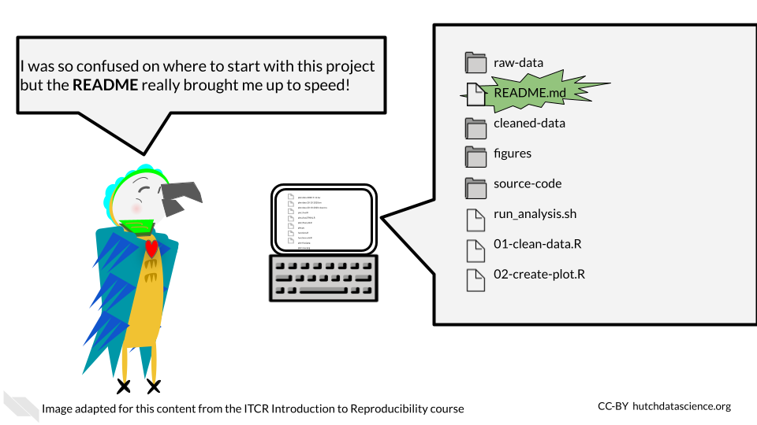

READMEs should include:

1. A summary of the goals and intentions of the project.
2. Usage instructions that explain exactly what commands and packages need to be used to re-run analyses.
3. Explanation of what software dependencies are needed for your project.
4. A basic summary of what files are there; which are input and output files.
5. Any other information that would be relevant to someone trying to understand the project.

Here's a [template README](https://raw.githubusercontent.com/jhudsl/Reproducibility_in_Cancer_Informatics/main/resources/README-template.md) that you can use an example.

<div class = "dictionary">
- **README** - A file in a project that has the start up summary information that could get someone acclimated to the project.
</div>

#### Code comments

A healthy amount of code comments doesn't mean that every line needs a comment (though perhaps at sections that need future explanation they might). Helpful code comments don't just echo what the code is doing but are explanatory. [StackOverflow has a great article](https://stackoverflow.blog/2021/12/23/best-practices-for-writing-code-comments/) about rules for writing helpful code comments. we'll echo the rules here:

> Rule 1: Comments should not duplicate the code.

> Rule 2: Good comments do not excuse unclear code.

> Rule 3: If you can’t write a clear comment, there may be a problem with the code.

> Rule 4: Comments should dispel confusion, not cause it.

> Rule 5: Explain unidiomatic code in comments.

> Rule 6: Provide links to the original source of copied code.

> Rule 7: Include links to external references where they will be most helpful.

> Rule 8: Add comments when fixing bugs.

> Rule 9: Use comments to mark incomplete implementations.

### Follows a code style

Code style helps make code readable. Appropriate spacing, punctuation, and grammar are not always essential for getting a message across, but it can certainly b3 dis-tRaCTIng to readers if conventions aren't followed.

**Basic Example:**

``` r
# Bad: Should use <- and have a variable name that is informative
x = c(1, 4, 5, 10)

# Bad: Irregular spacing is distracting
numbers<-  c(1, 4,5,10)

# Good!
numbers <- c(1, 4, 5, 10)
```

Here's some style guides you can use:

- [Google's R Style Guide](https://google.github.io/styleguide/Rguide.html)
- [Tidyverse Style Guide](https://style.tidyverse.org/index.html)

[R packages like styler](https://www.tidyverse.org/blog/2017/12/styler-1.0.0/) can automatically style code for you.


## Efficient

Reproducible code is efficient code. Efficiency helps reproducibility in that code that takes up less resources and is not redundant can be re-run and debugged more easily.

### Doesn’t use up more computational resources than necessary

R is not meant to be a fast language. R code can be computationally costly if it's written in the wrong way.

You can identify what parts of your R code are the slowest or otherwise computationally costly by using the [`profvis`](https://github.com/r-lib/profvis) and [`bench`](https://bench.r-lib.org/) packages.

One popular example is R loops which can be particularly slow in R. Note that this doesn't mean you shouldn't ever use loops or other items in R, just that you should be aware that some items in R are particularly slower than others.

**R 'for loop' alternatives:**

- [Using `apply` functions (an older option that comes with the basic installation of R)](https://statisticsglobe.com/avoid-for-loop-in-r)
- [Advanced R discusses alternative strategies](https://adv-r.hadley.nz/perf-improve.html?q=perfor#avoid-copies)
- [The across function](https://dplyr.tidyverse.org/reference/across.html)
- [Using the `purrr` package](https://purrr.tidyverse.org/)
- [A nice summary of these functions](https://jhudatascience.org/intro_to_r/modules/Functions/Functions.html#18)

**Further reading:**

- Hadley Wickham has a [great chapter in Advanced R](https://adv-r.hadley.nz/perf-improve.html?q=perfor#perf-improve) that covers these concepts in more detail.

### Is DRY (don’t repeat yourself)

DRY is an acronym for "don't repeat yourself". Non-redundant code is more reproducible because it is easier to maintain and to read.

Let's take a look at an example from [this Reproducibility in Cancer Informatics course](https://jhudatascience.org/Reproducibility_in_Cancer_Informatics/writing-durable-code.html#dry-up-your-code) about what DRY vs non-DRY code might look like:

Non-DRY or WET (write everything twice) code might look like this:
```
paste('Hello','John', 'welcome to this course')
paste('Hello','Susan', 'welcome to this course')
paste('Hello','Matt', 'welcome to this course')
paste('Hello','Anne', 'welcome to this course')
paste('Hello','Joe', 'welcome to this course')
paste('Hello','Tyson', 'welcome to this course')
paste('Hello','Julia', 'welcome to this course')
paste('Hello','Cathy', 'welcome to this course')
```

Note that if you want to change something in eight of these messages you would have to change all eight lines.

To DRY up this code, we could functionalize it:
```
GreetStudent <- function(name) {
 greeting <- paste('Hello', name, 'welcome to this course')
 return(greeting)
}

class_names <- c('John', 'Susan', 'Matt' ,'Anne', 'Joe', 'Tyson', 'Julia', 'Cathy')

lapply(class_names, GreetStudent)
```

Now, if we wanted to edit the greeting pasted, we'd only have to change it once.

<div class = "dictionary">
- **DRY code** - Code that doesn't repeat itself and because of that is more efficient
</div>

## Consistent

Consistency is key for reproducibility. Not only do we want code to run consistently, but it will be more understandable to our future selves and to others if it follows a pattern.

### Follows conventions

Although there's always a time to break conventions, often times conventions lend to readability. For example, in R using `<-` for assignments is less likely to be distracting than using `=`. This is related to following a style guide. In general we recommend using the tidyverse conventions and style.

However, this advice, like a lot of the advice in this chapter is highly dependent on the context and goals of the project and code being written. There are times that the conventional way to write something might not suit the project because it is inefficient or otherwise clashes with other goals of reproducibility.

### Is organized

In the previous chapter, we discussed how projects should be organized in order to be reproducible, but this also applies to code. Sometimes as you have been working on code, you may realize that as it has been developing it doesn't flow in an organized manner.

Just as with regular writing that is disorganized, code that is disorganized can be hard to follow and hard to bug. For example, if you have hard coded a multiple variables or have loaded multiple packages, it makes sense to group these items together so they are easier to find and fix.

A code outline for an analysis notebook for example might look like:

- Describe the goals
- Load in the libraries and any source code
- Declare any hard coded variables
- Read in the data  
- Clean the data
- Make plots and gather statistics
- Summarize results
- Print out the [session info]() we'll discuss more about this in a future chapter.

## Conclusion

The best way to find out if your code meets these concepts or how it can better become more reproducible is through code review. We will briefly discuss code review in future chapters.

In summary, reproducible code is:

- Readable
  - Well-documented
  - Follows a code style
- Efficient
  - Computationally non wasteful
  - DRY
- Consistent
 - Follows convention (when appropriate)
 - Organized

<!--chapter:end:07-code.Rmd-->


# Using GitHub in a workflow


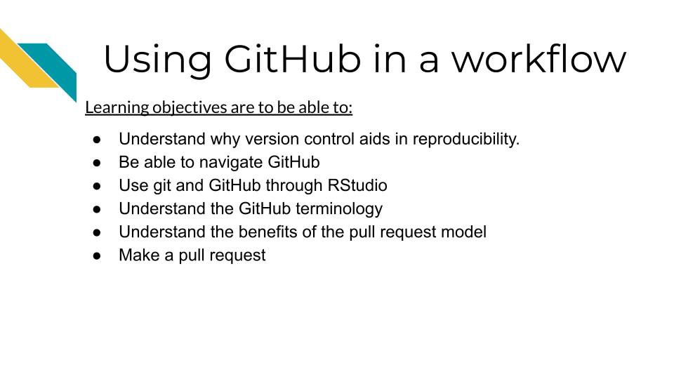

## What is version control

Version control is system that allows you to track your files over time as you work on them.
Whether you've written a lot of code or written other documents, you've likely encountered the need for version control. As this comic from Piled Higher and Deeper describes, files can go through a lot of edits and revisions (this is true of code too)! And it doesn't take long for it to be difficult or even impossible to track the various revisions of even one file, let alone the dozens or hundreds of files that may be a part of a data science project.

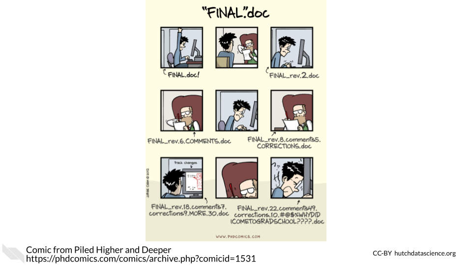

This problem is what Git, a version control system, can address. It is a system that allows you to track your files, keep a history of them, and otherwise handle changes through the history of your project.

## What's GitHub?

Git is most commonly used is in conjunction with an online platform called GitHub.
[GitHub](https://github.com/) is an online platform for sharing code.

<div class = "dictionary">
- **version control** a method of tracking files as they are changed throughout a project.
- **GitHub** an online platform for sharing code in a version controlled manner.
</div>

GitHub aids reproducibility by being online in a way that easily makes code shareable to others in a version controlled way. GitHub allows anyone at anytime to take a look at and obtain your code.

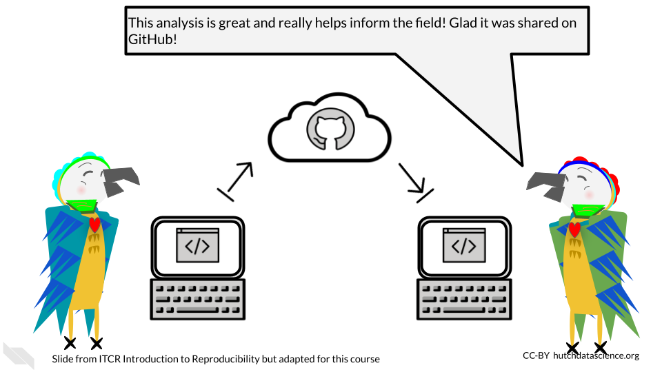

Because code on GitHub is version controlled, it allows you to track your code and project files as you and others continue to work on them. This can be really useful for documenting not only the changes to your analysis, but the rationale and communications that led to those changes.

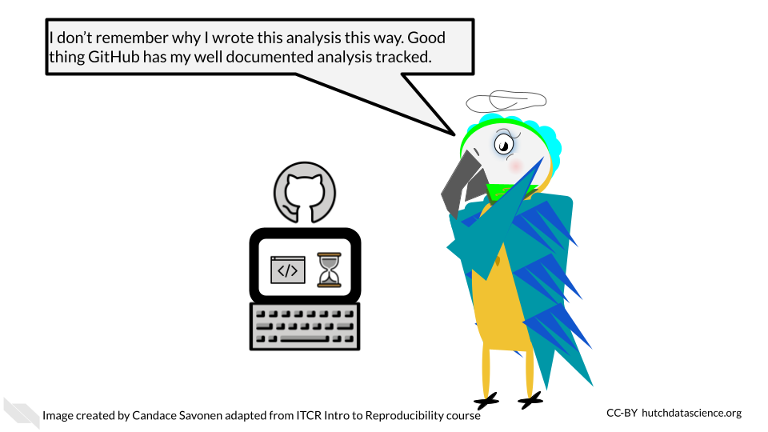

GitHub and Git also allow you to take the side journeys that often pop up with data science projects, but in a way that allows you to ensure that the main files stay safe as you experiment.


GitHub is also handy for collaborating with others on your code, not only because it is online, but the version controlled nature of it allows you and any team members to work on the same files simultaneously without fear that the changes will be impossible to merge together. Git and GitHub have systems to do just this.

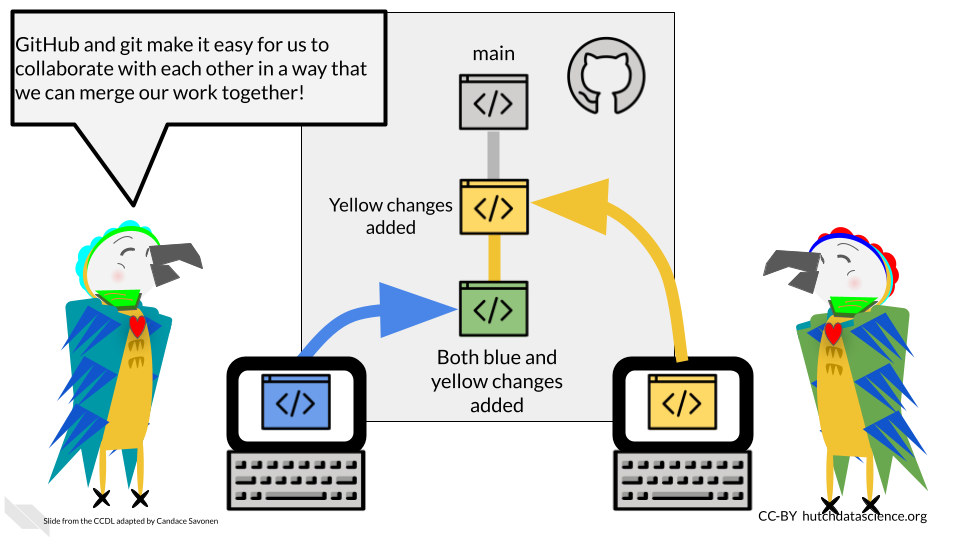

## GitHub Workflow

Git can feel overwhelming to a lot of folks and it has a really deep and complicated system. However, truthfully for most instances you will only need the same few commands in the same series of steps which we will cover here.


One reason that Git and GitHub can feel overwhelming to folks is that there are a number of terms that are used to describe the different commands. We will walk through the typical workflow steps, and define these terms as we use them.

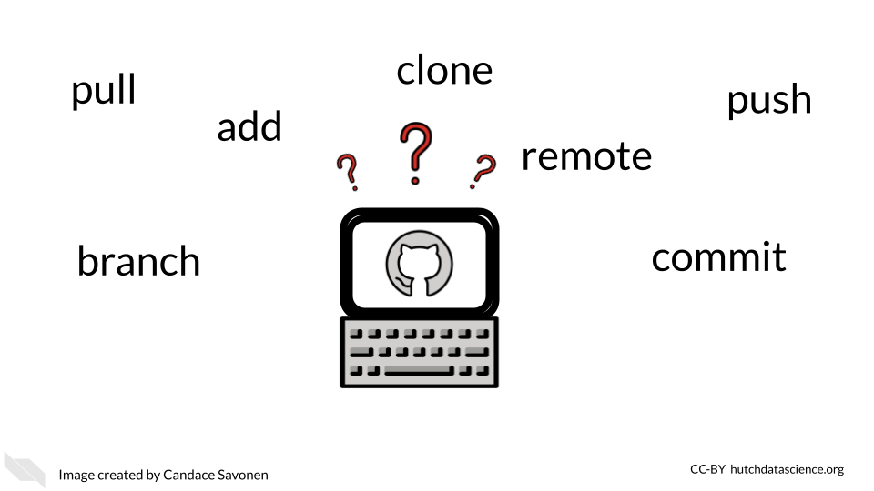

### Create your GitHub account

Before we get started with GitHub, if you do not have a GitHub account, [go here to make one.](https://github.com/)

### Creating a new repository

Whenever you are starting a new project you will want to start by creating a new repository on GitHub. You can generally do this by going to GitHub and [choosing "New repository" from the menu](https://github.com/new).

<div class = "dictionary">
- **repository** - a group of project files
</div>

On this new repository page, you will want to create a description that summarizes what this project will be (you can always change this later).

Also choose the "Add a README file" option because every project should have a README.

For the `Add .gitignore` option, it would be handy to choose the `R` gitignore template. These [gitignore files are handy](https://git-scm.com/docs/gitignore#:~:text=A%20gitignore%20file%20specifies%20intentionally,gitignore%20file%20specifies%20a%20pattern.). They are a way to tell GitHub that you don't want a particular file tracked. It's just important for us to track the important files as it is for us to declutter our project by not adding unnecessary files.  

You may want to choose a license. We recommend choosing something that allows others to freely use your code but with attribution like a Creative Commons license.

Then you are ready to click "Create repository". Keep in mind what the location and name of this repository is. In GitHub repositories are named like this: `username/repository_name`.

### Setting up your repository locally

\*This section is adapted from the [DataTrail course](https://datatrail-jhu.github.io/DataTrail/cloning-a-repository.html#step-3-set-up-github-credentials).

In order to be able to access everything in your GitHub repository from RStudio cloud, you will need to set up GitHub credentials. You should only need to do this once per project.

1. In your RStudio interface, make sure that you are in the `Console` tab.

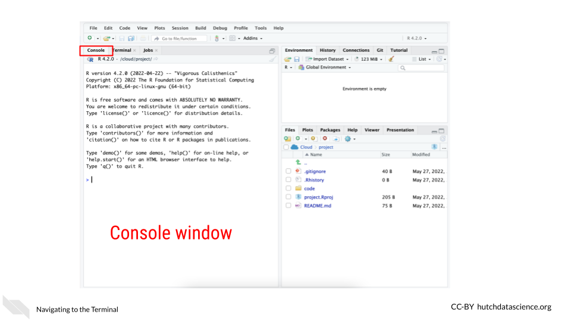

2. Now use the command below to install the package `usethis`. Copy and paste it in the Console window and click Enter on your keyboard. This package will help us manage our GitHub credentials from RStudio more easily.

```
install.packages("usethis")
```
This will take a minute or so to install. Remember that red text doesn't mean an error necessarily.

3. Now to use this package, we need to attach its library using the following command:

```
library("usethis")
```

4. RStudio and GitHub require you make a special fancy password to use as credentials called a **GitHub Personal Access Token** (sometimes abbreviated as a "PAT").

To create a 'PAT' from RStudio we can run this handy command:

```
usethis::create_github_token()
```
Running this command will open up a window in your GitHub that will ask you for your password. Login to GitHub as you normally would.

This will open up a page in GitHub for creating a `New personal access token`.

Underneath the `Note` put something that reminds you what this PAT is for. Something like `RStudioCloud Access`. (Note that each PAT you make needs its own unique `Note` though).

Underneath the `Select scopes` section **you don't need to do anything**. The `usethis` package already chose the permissions we need.

Scroll all the way down on this page and click `Generate Token`. You've created your first PAT! **Do not close this window**, keep it handy for now. Note that in the image below we blocked out our PAT, but yours will show a jumble of letters and numbers

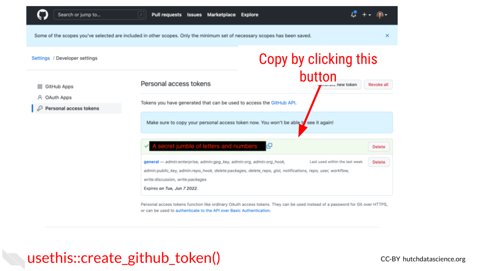

5. Return back to your RStudio while keeping your PAT handy.
In the `Console` window, run this command:

```r
gitcreds::gitcreds_set()
```

It will ask you to `? Enter password or token`. Copy your PAT and paste it into the command window and press Enter.


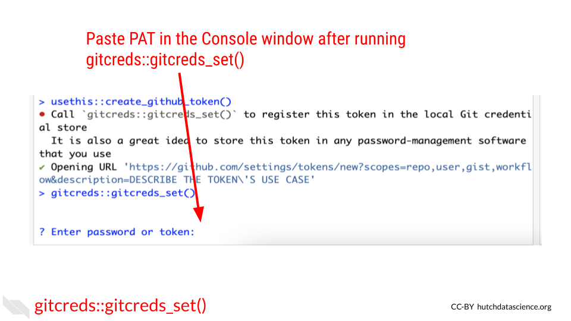

After you enter your PAT here you should get a message like:
```
-> Adding new credentials...
-> Removing credetials from cache...
-> Done.
```

You are now free to close that GitHub PAT window. Note that you will want to be very careful with your PAT. **Do not share it or put it anywhere that others could see it or access it!**

7. Now we also need to add your username and email to the RStudio GitHub credentials by running a command like below.
Be sure to replace the example **username** and **email** with what corresponds to your GitHub account.

```
use_git_config(user.name = "Jane", user.email = "jane@example.org")
```

Run this in the `Console` tab as well and click Enter.

8. Now to double check that everything is set, we can run this command to have the `usethis` package echo back our credentials:

```
git_sitrep()
```
It will give you output that looks similar to this: (but note it will have your own user name, and repository name and etc.)

```
Git config (global)
• Name: 'Jane'
• Email: 'jane@example.org'
• Global (user-level) gitignore file: <unset>
• Vaccinated: FALSE
ℹ See `?git_vaccinate` to learn more
• Default Git protocol: 'https'
• Default initial branch name: <unset>
GitHub
• Default GitHub host: 'https://github.com'
• Personal access token for 'https://github.com': '<discovered>'
• GitHub user: 'Jane'
• Token scopes: 'gist, repo, user, workflow'
• Email(s): 'jane@example.org (primary)'
✖ Local Git user's email ('jane@example.org') doesn't appear to be registered with GitHub.
Git repo for current project
• Active usethis project: '/cloud/project'
• Default branch: 'master'
• Current local branch -> remote tracking branch:
  'master' -> 'origin/master'
GitHub remote configuration
• Type = 'theirs'
• Host = 'https://github.com'
• Config supports a pull request = FALSE
• origin = 'JaneEverydayDoe/first_project' (can not push)
• upstream = <not configured>
• Desc = The only configured GitHub remote is 'origin', which
  you cannot push to.
  If your goal is to make a pull request, you must fork-and-clone.
  `usethis::create_from_github()` can do this.

  Read more about the GitHub remote configurations that usethis supports at:
  'https://happygitwithr.com/common-remote-setups.html'

```

You should see that `Name`, `email` have your credentials set as well as a `Personal access token for 'https://github.com': '<discovered>'`

You can run `git_sitrep()` at anytime to see what your credentials and settings are.

Yay! Now you should be able to use GitHub from RStudio!

### Cloning your repository

In Git, to `clone` something means to get a copy of your project onto your computer to work on.

<div class = "dictionary">
- **clone** - making a copy of a code base on your computer.
</div>

In RStudio we can do this using the `usethis` package again. In GitHub repositories are named like this: `username/repository_name`. Sometimes instead of a `username` it may be a github organization.

```
create_from_github("username/repository_name")
```

If this happens successfully, you should see this kind of message:

```
ℹ Defaulting to 'https' Git protocol
✔ Setting `fork = FALSE`
✔ Creating 'some-file-path-on-your-computer/repository_name'
✔ Cloning repo from 'https://github.com/username/repository_name.git' into  'some-file-path-on-your-computer/repository_name'
✔ Setting active project to 'some-file-path-on-your-computer/repository_name'
ℹ Default branch is 'main'
✔ Opening 'some-file-path-on-your-computer/repository_name' in new RStudio session
✔ Setting active project to '<no active project>'
```

This will also open up a new RStudio window. Now you are ready to get to work!

### Opening a PR

A pull request (sometimes abbreviated PR) is a way of being able to review changes before you incorporate them into your main, more polished product. It is a highly effective system for doing code review and otherwise communicating about your data analysis to increase its reproducibility.


Pull requests are based on copies of the project repository that are called `branches`.
When we do work on a project we will want to do it somewhere that is separate from our main set of code. Branches are yet another copy of the code that is used for developing purposes.

<div class = "dictionary">
- **pull request** - a method of working on and incorporating file changes in a way that allow things to be reviewed and discussed on GitHub.
- **branch** - another copy and version of your project that you can work from and create a pull request.
</div>

#### Creating a new branch

A `main` branch is where you will keep your best, most vetted version of the project. Your `main` branch will already exist on your project when you create it. When others come to look at your project, they will see the `main` branch first.

Other branches are generally made with the purpose of eventually having them reviewed and polished to the point that they are to add their changes to the `main` branch.

```
pr_init(branch = "new_branch_name")
```

This branch will be called "new_branch_name" but you should call your branch whatever would be representative of the work you will be doing on this. For example, if you are adding documentation, you could call your branch "adding-docs".

This brings us to another point. For keeping yourself organized as well as making it easier for others to follow, it's best to keep a branch and subsequent pull request focused on one task. If one pull request tries to do too many things, it will be more difficult for it to be communicated and reviewed properly.

Now that you have created a branch, you are ready to make changes to your files.

Now make any change to a file for the purposes of this tutorial. For example, you could add a sentence to your README file to explain what this project will be. Then save the file change.

In RStudio, if we go to the `Git` tab (typically located in the lower right pane) we should see that the file we changed has an `M` next to it to signify it has been modified. In order to officially add these changes that we've made to our branch, we need to `commit` them.  

<div class = "dictionary">
- **commit** - the action of officially adding a file change to a branch.
</div>

To do this, we first need to check the box(es) next to the files we'd like to commit then we click the commit button.

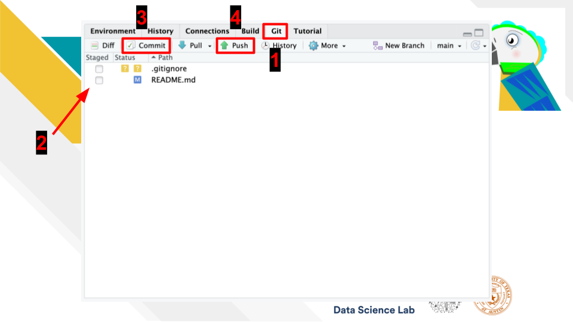

After clicking the commit button, a new window will pop up that shows us the changes we are committing. Sections in green are new additions or modifications. Sections in red are the old sections that got changed or removed. In this window, we will need to add a commit message. Again, we should try to write something informative about what we were doing to these files we are committing. Then after we've written this commit message, we need to click `Commit` in this window.


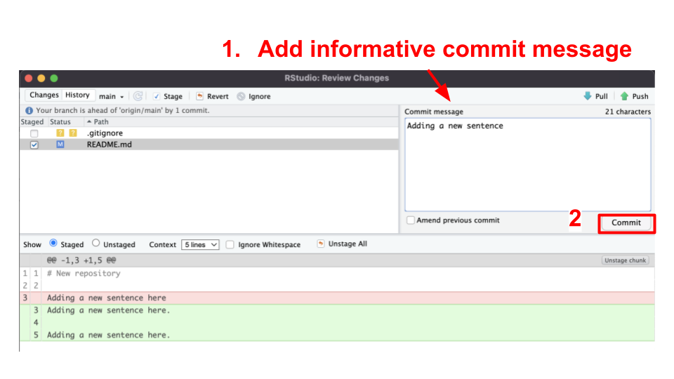

Now our files are on our branch!

When we'd like these changes to be online on GitHub for others to see, we can `push` these changes. To push changes means to send them online to GitHub.

<div class = "dictionary">
- **push** - the action of sending a branch and its file changes to GitHub so it is online where others can see it.  
</div>

With the `usethis` package, we can use the `pr_push()` function.

```
pr_push()
```

This should open a new window on GitHub that will look like this:

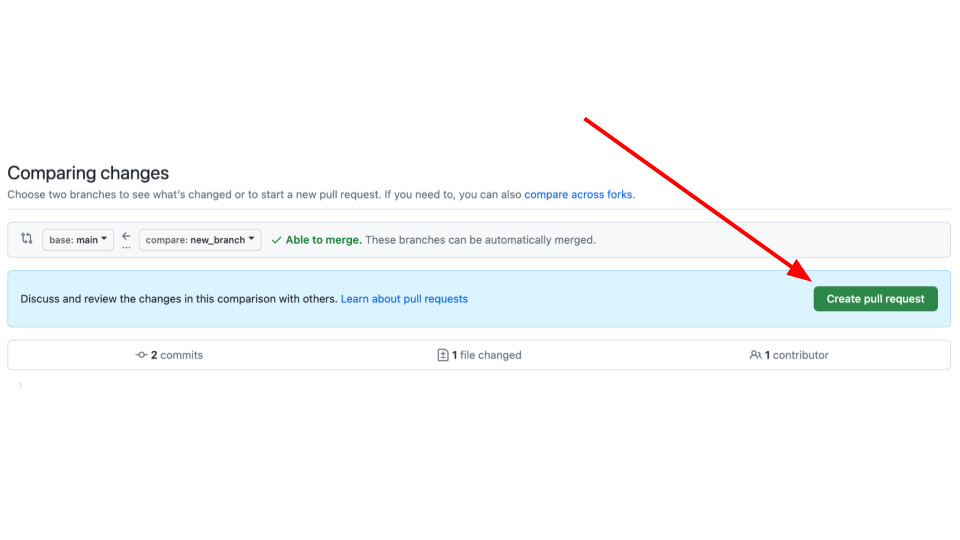

It will also print out some messages like this:
```
✔ Pushing local 'branch_name' branch to 'origin' remote.
• Create PR at link given below
✔ Opening URL 'https://github.com/username/repository_name/compare/branch_name'
```

On this window, click create pull request. This will bring you to another page on GitHub where you can create your pull request. On this page you will want to describe the changes you are making with this pull request.

You should include information like:

1) The background behind the changes you are making. What is the problem you are solving? Link to any relevant conversations.
2) What changes are you making specifically and how do these address the problem?
3) What work is left to be done?
4) What help could you use from others? Is there something in particular you would like to be looked at? Is there something not yet added that should be added?

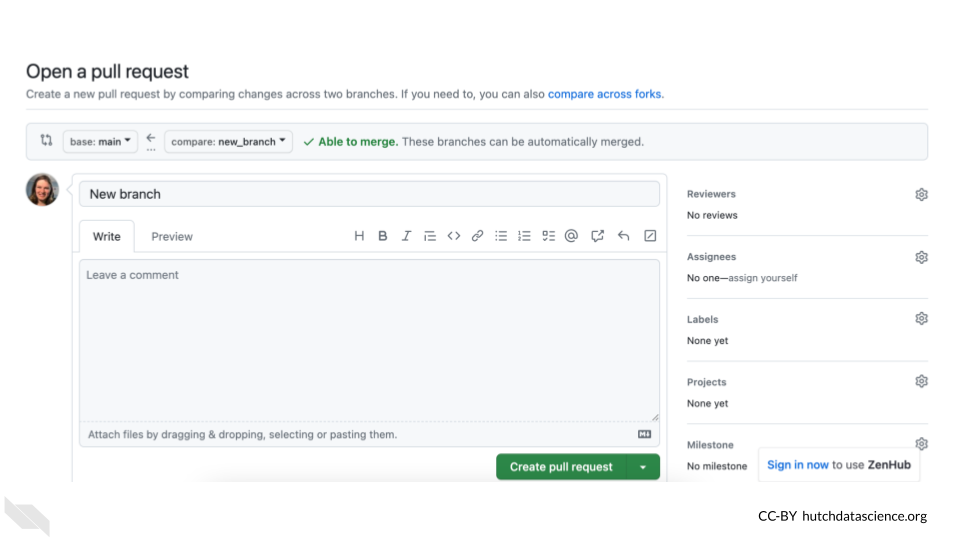

Now if you continue to work with your files, you can go through the same steps of:

1) Making a file change
2) Check the box(es) next to the file changes you'd like to add
3) Commit the file
4) Add a commit message
5) Commit the changes
6) Push the changes by running `pr_push()` (You can also click the green arrow to push if you prefer).


You can repeat these steps as many times as you need until you feel the file changes on your PR page are ready for someone else to review. If you don't have someone else on your team to review the changes, you can alternatively let them sit for a day or two and let "future You" review your file changes. Future you or others on your project might have a fresh take on these files. We will talk more about code review in a later chapter.

Code review is perhaps the most powerful tool for making reproducible analyses. And now that you know how to make pull requests on GitHub, you have an excellent platform and system for version controlling and tracking, and reviewing your files! Congrats!

### Merging a pull request

In the `Files changed` tab, you or others can leave comments about your file changes. This is an excellent way to document the rationale of these file changes as well as discuss any alternatives.

After some back and forth discussion (whether this discussion be between you and yourself or someone else) you may decide that the code on this pull request is ready for primetime! In other words, it is ready to be incorporated into the `main` branch.

Recall that we said the `main` branch is the most polished and readily viewable version of your project. To bring the changes in your pull request into the main branch, we will need to perform an action called a `merge`.

 This step of incorporating changes into a branch and combining two branches together is called `merging`. The goal of a merge is to combine two branches in such a way that keeps your desired changes from both copies.

<div class = "dictionary">
- **main** - the branch name that is typically used for the main, most polished and live version of your project that others will be brought to first.
- **merge** - combining the files from two branches into one.
</div>

On your pull request page, scroll to the bottom to the big green button where it says `Merge pull request`. Be careful to not press this button before you are sure that everyone on your team is ready.

After you've clicked it, hooray! You've completed your first merge of a pull request.

It may feel like we've described a lot of steps, but getting into the GitHub workflow and utilizing its benefits is all about habits! We promise it will increase the reproducibility of your analyses if you are able to stick with this process!

## Conclusion

We also discussed in this chapter how version control and GitHub are great tools for reproducibility and we walked through the GitHub workflow process as completed in RStudio.

To summarize, the Github workflow process looks like this:

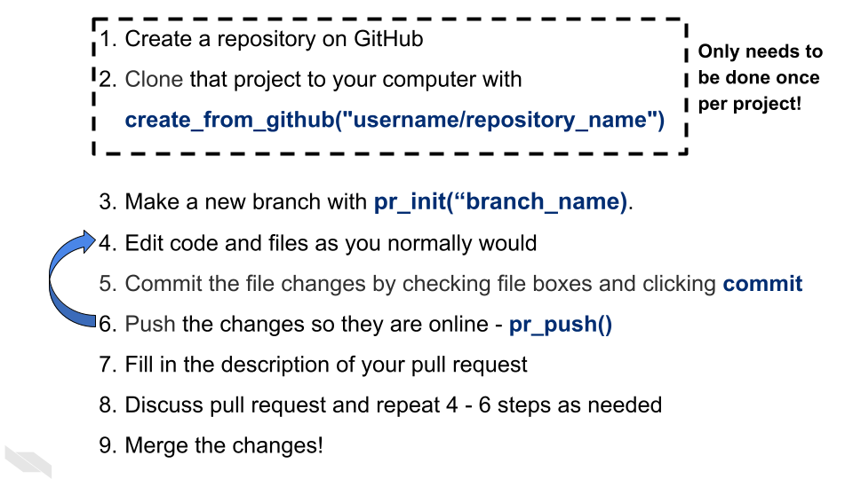

<!--chapter:end:08-github-workflow.Rmd-->


# Software versions


## Learning Objectives

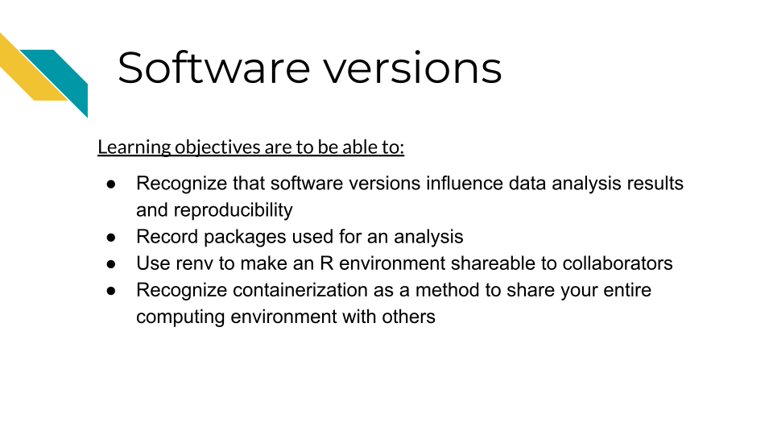

As we discussed, reproducibility is on a continuum, meaning that it can range from being impossible to very easy to reproduce any given results. Some results can be effectively impossible to reproduce if there are too many barriers and set up needed to re-run the analysis. One of the most common barriers is the computing environment used run the analysis.

<div class = "dictionary">
**computing environment** - All the relevant pieces of software and their dependencies that were used on a computer at the time that an analysis or other project was run
</div>

## No two computers are the same

A computing environment not only consists of the direct software that we use to analyze data, but all of the other software that our main pieces of software require to install and run properly.

As we use our computers daily for work, we are constantly installing, updating, and removing software packages. Sometimes our computers do this automatically without us knowing. These software packages interact with and depend on each other, meaning it can be quite frustrating to try update even a single piece of software if it exists in a tangled mess of software dependencies. Computer scientists sometimes call this "[dependency hell](https://en.wikipedia.org/wiki/Dependency_hell)".

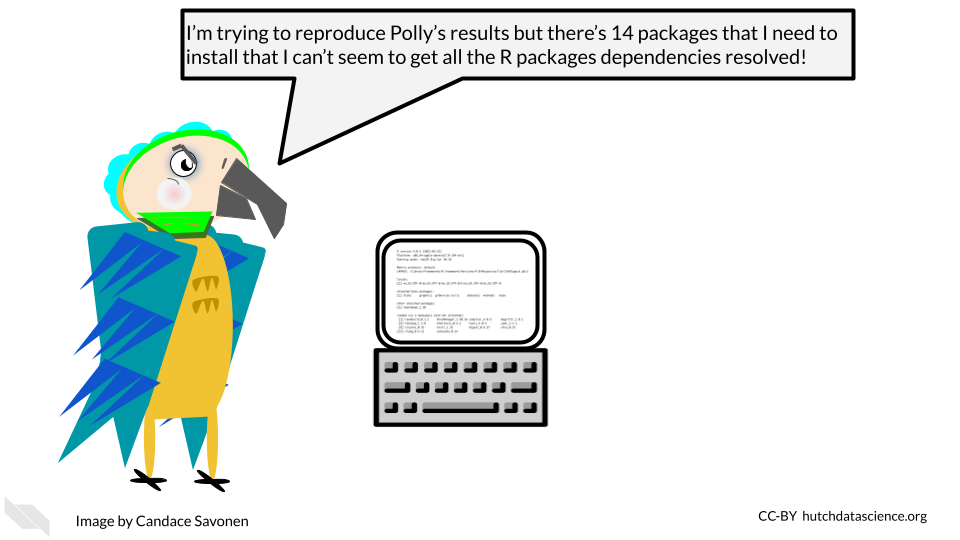

As developers and maintainers of software continue to make updates and fixes to the software, the developers and maintainers of other interdependent software are doing similarly, meaning that software dependencies and the computing environments are not only a complicated mess at times, but also a moving target!

## Software and package versions affect results!

Sometimes if we have generally the same software installed for reproducing an analysis, we may feel that that is "close enough". And given all the other technical aspects of reproducibility, it can be easy to overlook what versions of software packages we are using. However, controlling for software versions is critical for creating reproducible analyses. Software versions can directly affect not only whether an analysis will be able to run, but the results of the analysis [@BeaulieuJones2017].

## Session Info

Perhaps the easiest way to begin to address computing environment variability is to record what the computing environment looks like at the time an analysis is run. In R, this is a fairly straightforward task.

Generally at the end of your R notebook, you will want to print out your session info. You can do this by running the function `sessionInfo()` or the tidyverse version of this function from the devtools package, `devtools::session_info()`.

We can run `sessionInfo` in this book (this book was created using R tools).


``` r
sessionInfo()
```

```
## R version 4.3.2 (2023-10-31)
## Platform: x86_64-pc-linux-gnu (64-bit)
## Running under: Ubuntu 22.04.4 LTS
## 
## Matrix products: default
## BLAS:   /usr/lib/x86_64-linux-gnu/openblas-pthread/libblas.so.3 
## LAPACK: /usr/lib/x86_64-linux-gnu/openblas-pthread/libopenblasp-r0.3.20.so;  LAPACK version 3.10.0
## 
## locale:
##  [1] LC_CTYPE=en_US.UTF-8       LC_NUMERIC=C              
##  [3] LC_TIME=en_US.UTF-8        LC_COLLATE=en_US.UTF-8    
##  [5] LC_MONETARY=en_US.UTF-8    LC_MESSAGES=en_US.UTF-8   
##  [7] LC_PAPER=en_US.UTF-8       LC_NAME=C                 
##  [9] LC_ADDRESS=C               LC_TELEPHONE=C            
## [11] LC_MEASUREMENT=en_US.UTF-8 LC_IDENTIFICATION=C       
## 
## time zone: Etc/UTC
## tzcode source: system (glibc)
## 
## attached base packages:
## [1] stats     graphics  grDevices utils     datasets  methods   base     
## 
## loaded via a namespace (and not attached):
##  [1] sass_0.4.8       utf8_1.2.4       generics_0.1.3   xml2_1.3.6      
##  [5] stringi_1.8.3    hms_1.1.3        digest_0.6.34    magrittr_2.0.3  
##  [9] evaluate_0.23    timechange_0.3.0 bookdown_0.41    fastmap_1.1.1   
## [13] rprojroot_2.0.4  jsonlite_1.8.8   processx_3.8.3   chromote_0.3.1  
## [17] ps_1.7.6         promises_1.2.1   httr_1.4.7       fansi_1.0.6     
## [21] ottrpal_1.3.0    jquerylib_0.1.4  cli_3.6.2        rlang_1.1.4     
## [25] cachem_1.0.8     yaml_2.3.8       tools_4.3.2      tzdb_0.4.0      
## [29] dplyr_1.1.4      curl_5.2.0       vctrs_0.6.5      R6_2.5.1        
## [33] lifecycle_1.0.4  lubridate_1.9.3  snakecase_0.11.1 stringr_1.5.1   
## [37] janitor_2.2.0    pkgconfig_2.0.3  pillar_1.9.0     bslib_0.6.1     
## [41] later_1.3.2      glue_1.7.0       Rcpp_1.0.12      highr_0.11      
## [45] xfun_0.48        tibble_3.2.1     tidyselect_1.2.0 knitr_1.48      
## [49] htmltools_0.5.7  websocket_1.4.2  rmarkdown_2.25   webshot2_0.1.1  
## [53] readr_2.1.5      compiler_4.3.2   askpass_1.2.0    openssl_2.1.1
```

Now we have recorded what some key aspects of our computing environment looked like at the time that this book was rendered last.
This print out may seem like a lot of nonsense at first, but it gives us some useful information in a pinch!


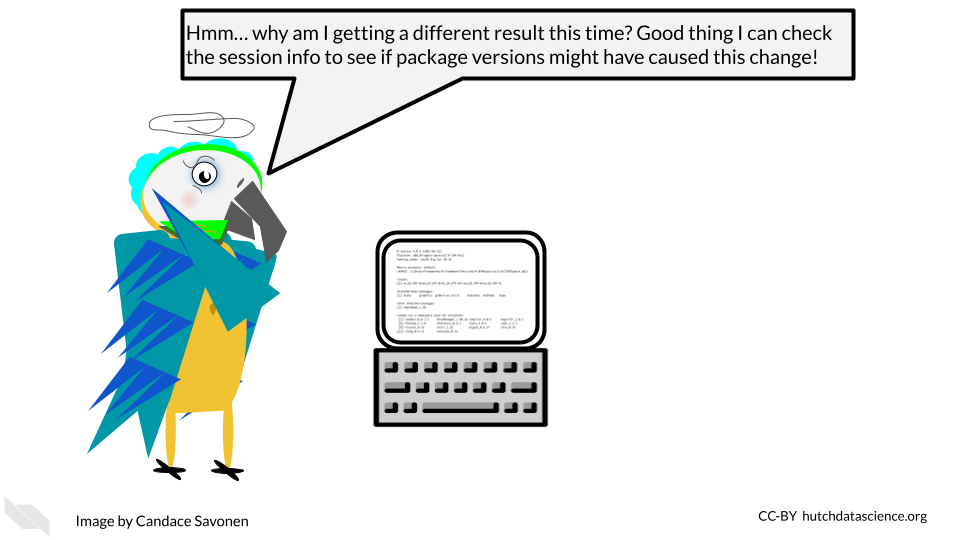

If we take a look at two different session info printouts, we can begin to spot the differences. These differences may give us clues into why an analysis ran differently.


Printing out session info is an easy way to record your computing environment in hopes of increasing the reproducibility of your analysis!

<div class = "dictionary">
**session info** - A printout in R that displays information about the software and packages that were being used at the time the `sessionInfo()` or  `devtools::session_info()` functions were run.
</div>

## Snapshots with `renv`

However, you may realize that while session info is useful for recording this information, it doesn't mitigate the frustration of setting up a computing environment in R. Nor does it help us with being able to directly share our computing environments.

It can be incredibly handy for reproducibility purposes to be able to share the R computing environment you used for completing an analysis. This is not only helpful for others who may be interested in reproducing your analysis, but also for future you! If you come back to this analysis and attempt to re-run it, it is likely you've changed your R computing environment over time by installing or removing packages. `renv` will allow you to return to the environment you used at the time that you ran the analysis.

For that, we need a slightly more involved solution of using [`renv`](https://rstudio.github.io/renv/articles/renv.html). `renv` is an R package that allows you to take 'snapshots' of your R computing environment and use those to track, share, and build R environments.


The `renv` workflow looks like this (as described by their documentation):

> 1. Call `renv::init()` to initialize a new project-local environment with a private R library

> 2. Work in the project as normal, installing and removing new R packages as they are needed in the project

> 3. Call `renv::snapshot()` to save the state of the project library to the lockfile (called renv.lock)

> 4. Continue working on your project, installing and updating R packages as needed

> 5. Call `renv::snapshot()` again to save the state of your project library if your attempts to update R packages were successful, or call `renv::restore()` to revert to the previous state as encoded in the lockfile if your attempts to update packages introduced some new problems

To make this shareable to others, you will need to do two things:

1. Be sure to commit and push the `renv.lock` file to your GitHub repository for your project.
2. Be sure to describe that your project uses `renv` in the README of this project (commit and push this to your GitHub repository also).

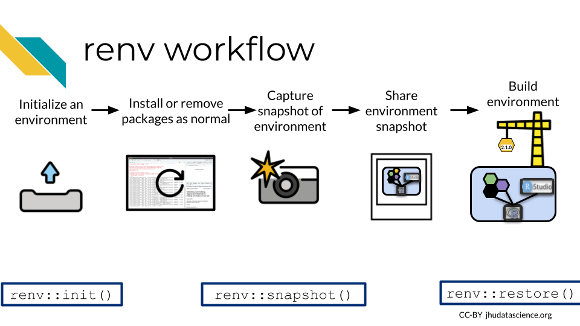

The limitations of this method, [as noted by the `renv` authors](https://rstudio.github.io/renv/articles/renv.html#caveats), is that it really only tracks packages in R and cannot help track or enforce items that may affect the computing environment outside of R. So while it will aid in the reproducibility of your analysis, it will not cover everything.

<div class = "dictionary">
**renv** - An R package that helps you to share and record your R specific computing environment
</div>

## Containerization

In order to truly reproduce a result with an identical computing environment you would need to use a containerized approach. To containerize a computing environment is to truly create an environment that is shippable to others. A container is analogous to a virtual machine. A computer runs a computing environment inside of it that is separate from the rest of the computer (hence why its called a container).

One of the most popular containerization softwares is Docker. Docker allows you to build your computing environment and share it on its online platform in the form of images that you can download and run. In fact, this book is rendered by a Docker container!

<div class = "warning">
If you will be using a container with PHI or PII or other protected information, we recommend you take a look at [this resource](https://www.cleardata.com/resources/hipaa-compliant-containers/) to understand best practices for using Docker with sensitive data.
</div>

<div class = "dictionary">
- **container** - A method for running software in a way that is shareable and Reproducible
- **Docker** - A popular platform for containers
</div>

We will not cover Docker here but if you are interested in using a containerized approach like Docker, here are additional resources for learning:

- [Software Carpentries course on Docker](https://carpentries-incubator.github.io/docker-introduction/)
- [ITCR Training Network chapters about Docker](https://jhudatascience.org/Adv_Reproducibility_in_Cancer_Informatics/launching-a-docker-image.html)
- [Docker documentation about getting started](https://www.docker.com/get-started/)
- [How to ensure your Docker usage is HIPAA-Compliant](https://www.atlantic.net/hipaa-compliant-hosting/best-practices-for-creating-a-hipaa-compliant-docker-host/)
- [HIPAA Compliant Containers](https://www.cleardata.com/resources/hipaa-compliant-containers/)
- [Singularity is a different container platform that does some encryption](https://docs.sylabs.io/guides/latest/user-guide/) -- this can help if you are using data that needs to be protected.

## Conclusion

In summary:

- Software versions affect the reproducibility of an analysis.
- Printing out session info is a great way to record software versions.
- `renv` is an R package that allows you to share your R specific computing environment.
- Containerization softwares like Docker allow you to more completely share a replicate computing environment.

<!--chapter:end:09-software-versions.Rmd-->


# Functions


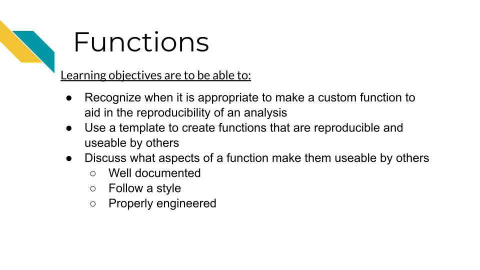

### Recognize when to write a custom function

There's a lot of reasons writing your own custom functions might be a thing you need to do. Here we will discuss two of the major reasons.

#### Cutting down on repetitive code

We've discussed how [DRY code](https://hutchdatascience.org/Tools_for_Reproducible_Workflows_in_R/reproducible-code.html#is-dry-dont-repeat-yourself) is easier to maintain and understand! It is easier to fix code in one place as opposed to three or more places. A general guideline is that if you need two use a same chunk of code more than twice you probably should invest the time to make a custom function for it.

:::dictionary
The word dry in DRY code stands for Do Not Repeat. The idea is that avoiding repeated sections can make it easier to maintain or troubleshoot. If you have an error from something that is repeated, it can be hard to pinpoint exactly where the error is occurring and why!
:::
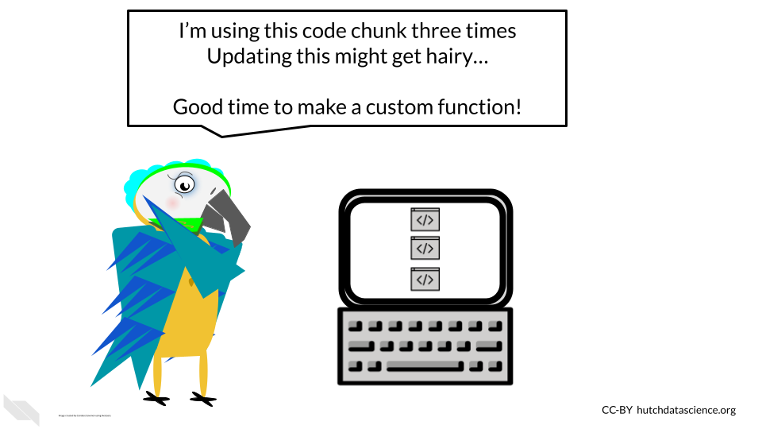

#### More readable code

Custom functions can allow you to organize code into manageable chunks.
By creating custom functions it can be easier to organize our code in a way thats more readable.


### Writing a function

A common way that a custom function might come about is:

1. You've written some initial code that takes some object as input.
2. You now realize you will need to run this series of code more than twice.


#### Starting a new function

To get started with writing a new function, you can follow these steps to make a custom function:

1. Open up a new R script file to copy and paste our basic template we have below.
```
#' Title here
#'
#' @description This is what the function does
#'
#' @param arg1 A first argument
#' @param arg2 A second argument
#'
#' @return What is returned
#' @export
#'
#' @examples
#'
#' function(arg1, arg2)
#'
#'
function_name <- function(arg1, arg2) {

    # Your main code here

    return(output)
}
```
Your basic custom function is going to follow this type of structure.


This top part of the template is the documentation. It's formatted in a way that would allow you to incorporate it into a package later if desired.

2. It's likely you might already have some code drafted that has some of the code you need for your function. Paste this code in the part of this template that says `# Your main code here`.
3. Next, fill out the `@description` field by replacing "This is what the function does". Describe the goal of the function.
4. Next you'll likely want to sculpt your code, carefully thinking about its usage  and what types of options may need to be controlled by those who will use this function. This may require some adjustments to arguments and default values.

### Working example

Below is an example of a working example from [this R package development workshop](https://combine-australia.github.io/r-pkg-dev/functions.html).
```

#' Make shades
#'
#' Given a colour make n lighter or darker shades
#'
#' @param colour The colour to make shades of
#' @param n The number of shades to make
#' @param lighter Whether to make lighter (TRUE) or darker (FALSE) shades
#'
#' @return A vector of n colour hex codes
#' @export
#'
#' @examples
#' # Five lighter shades
#' make_shades("goldenrod", 5)
#' # Five darker shades
#' make_shades("goldenrod", 5, lighter = FALSE)

make_shades <- function(colour, n, lighter = TRUE) {
    # Convert the colour to RGB
    colour_rgb <- grDevices::col2rgb(colour)[, 1]

    # Decide if we are heading towards white or black
    if (lighter) {
        end <- 255
    } else {
        end <- 0
    }

    # Calculate the red, green and blue for the shades
    # we calculate one extra point to avoid pure white/black
    red <- seq(colour_rgb[1], end, length.out = n + 1)[1:n]
    green <- seq(colour_rgb[2], end, length.out = n + 1)[1:n]
    blue <- seq(colour_rgb[3], end, length.out = n + 1)[1:n]

    # Convert the RGB values to hex codes
    shades <- grDevices::rgb(red, green, blue, maxColorValue = 255)

    return(shades)
}
```

#### Using your custom functions

Now that you've created your custom functions there are a few ways you can load it in so it can be used by other notebooks and scripts. Depending on the situation you'll want to pick either `source`ing the script or creating an `R package`.

- `source()` - This is most straightforward option. It just involves you pointing to the script that holds your custom functions: `source(file/path/file_with_functions.R)`   at the top of your notebook or script. This is good if you are going to reuse these custom functions mostly within one project. This may not be ideal if you want to reuse your functions across different projects. 
- `an R package` If you will be using your custom functions in multiple projects you might not want to use a script because it may result in you having to make unwieldy file paths or copies of that script, neither of which are ideal for long term maintenance. Instead you may consider creating an R package for one or more custom functions. Take a look at this resource for [how to get started making a package](https://tinyheero.github.io/jekyll/update/2015/07/26/making-your-first-R-package.html).

Depending on your project you can use these strategies to create custom functions and overall DRY code and reproducible work!

### More resources on writing functions

- [Making your first R package](https://tinyheero.github.io/jekyll/update/2015/07/26/making-your-first-R-package.html).
- [R for Data Science -- writing functions](https://r4ds.had.co.nz/functions.html)
- [R Style guide for functions](https://style.tidyverse.org/functions.html)

<!--chapter:end:11-functions.Rmd-->


# Sharing Data


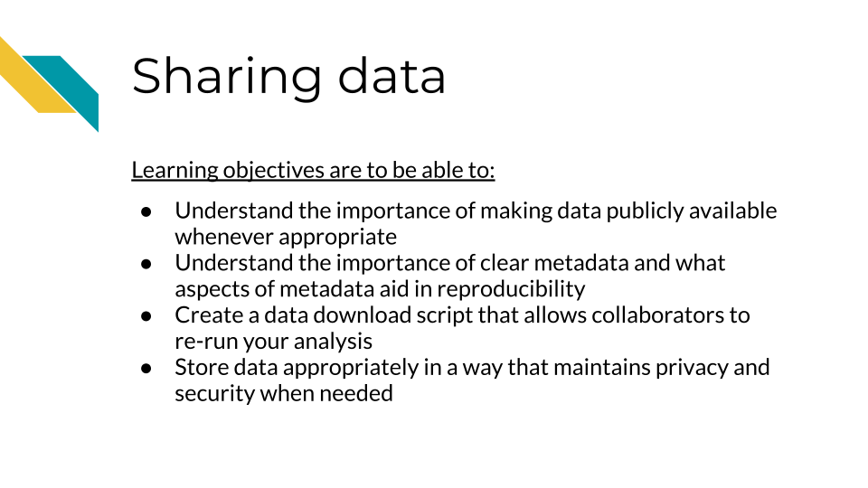


## Data sharing is important!

Sharing data is critical for optimizing the advancement of scientific understanding. Now that labs all over the world are producing massive amounts of data, there are many discoveries that can be made by just using existing data.

There are so many excellent reasons to put your data in a repository whether or not a journal requires it:  

**Sharing your data...**  

1. Makes your project more transparent and thus more likely to be trusted and cited. In fact one study found that articles with links to the data used (in a repository) were cited more than articles without such information or other forms of data sharing [@colavizza_citation_2020].

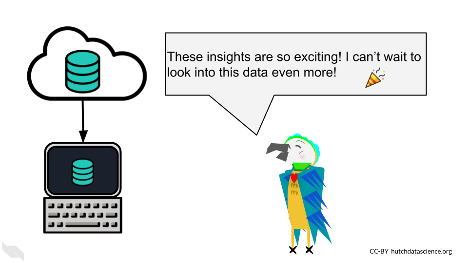

2. Helps your relieve your own workload so your email inbox isn't loaded by requests you probably don't have time to respond to.

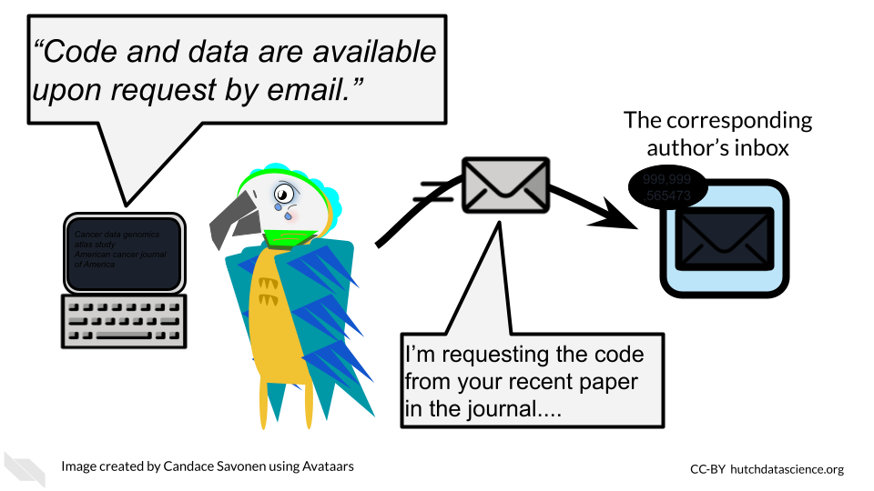

3. Allows others to gain even more insights from your data which shows funders that your data will be used to its maximum potential.

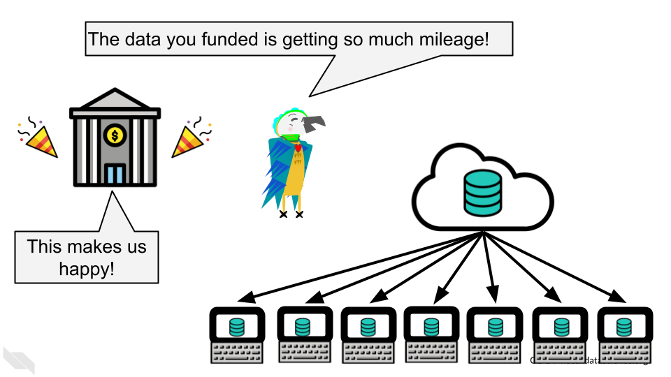

4. It also provides more opportunities for others to replicate your results, which could help advance not only your career, but our understanding of science and medicine.

## Benefits of data sharing

In addition to these benefits to yourself, data sharing has other far reaching benefits. It can help support faster advances in science and medicine, by reducing the need to collect new data, which reduces costs, time and effort, including the effort and burden placed on patients or research participants for data collection.

It also helps support researchers at institutes that do not have as many resources to collect data.

Ultimately it can therefore help patients benefit from research faster, as faster advances can be made through more efficient research.


See [this description of additional reasons why sharing data is helpful for scientific advancement](https://hutchdatascience.org/NIH_Data_Sharing/why-this-new-dms-policy.html). 
## Data repositories

The best way to share your data is by putting it somewhere that others can download it (and it can be kept private when necessary). There are many repositories out there that handle this for you. We recommend checking out our course on the [NIH data sharing policy](https://hutchdatascience.org/NIH_Data_Sharing/data-management-and-storage.html) which describes many important resources for finding appropriate repositories for different types of data. These tools can even be helpful for research that is not related to health.

The repository you choose for sharing data will be highly dependent on the field you work in and the data type that you work with. Do your best to try to understand what the standard practice is for your field.


**For a longer list of repositories, we also advise consulting this [guide on data repositories](https://www.nature.com/sdata/policies/repositories) published by Nature.**

### Repositories for journal articles

If your data doesn't fit a standard recommended repository, such as [GEO](https://www.ncbi.nlm.nih.gov/geo/) for genomic data for example, large datasets can be shared using one of the following repositories.
Note that some journals or funding agencies may have specific requirements.

- [CyVerse Data Commons Repository](https://cyverse.org/data-commons)
- [Data Dryad](https://datadryad.org/stash)
- [FigShare](https://help.figshare.com/article/how-to-upload-and-publish-your-data)
- [Zenodo](https://help.zenodo.org/)
- [GitHub](https://github.com/)

### Small datasets

Datasets that are small and don't have a standardized repository, can be published as supplementary files as a part of a manuscript.

## Data Submission tips

Uploading a dataset to a data repository is a great step toward sharing your data! But, if the dataset uploaded is unclear and unusable it might as well not been uploaded in the first place.

Keep in mind that although you may understand the ins and outs of your dataset and project, it is likely that others who look at your data may not.

To make your data truly shared, you need to take the time to make sure it is well-organized and well-described!
There are two files you should make sure to include to help describe and organize your data project:

- [A main README file](https://hutchdatascience.org/Tools_for_Reproducible_Workflows_in_R/setting-up-your-project.html#readmes) that orients others to what is included in your data.
- A central download script that downloads the data in a way that is ready for re-analysis. [See an example here](https://github.com/AlexsLemonade/OpenPBTA-analysis/blob/master/download-data.sh).
- A metadata file that describes what data are included, and how the data files (if more than one) are connected.

### Use consistent and clear names

- Make sure that sample and data IDs used are consistent across the project - make sure to include a metadata file that describes your samples in a way that is clear to those who might not have any prior knowledge of the project.
- Sample and data IDs should be consistent with any standardized formatting used in the field.
- Features names should avoid using genomic coordinates as these may change with new genome versions.

### Make your project reproducible

Reproducible projects are able to be re-run by others to obtain the same results.

**The main requirements for a reproducible project are:**

- The data can be freely obtained from a repository (this maybe summarized data for the purposes of data privacy).
- The code can be freely obtained from [GitHub](https://github.com/) (or another similar repository).
- The software versions used to obtain the results are made clear by documentation or providing a [Docker](https://www.docker.com/) container (more advanced option).
- The code and data are well described and organized with a system that is consistent.

Check out our [introductory reproducibility course](https://jhudatascience.org/Reproducibility_in_Cancer_Informatics/introduction.html), [advanced reproducibility course](https://jhudatascience.org/Adv_Reproducibility_in_Cancer_Informatics/introduction.html), and [our course on containers](https://hutchdatascience.org/Containers_for_Scientists/) for more information.

### Have someone else review your code and data!

The best way to find out if your data are useable by others is to have someone else look over your code and data!
There are so many little details that go into your data and projects. Those details can easily lead to typos and errors upon data submission that can cause confusion when others (or your future self) are attempting to use that data. The best way to test if your data project is usable is to have someone else (who has not prepared the data) try to make sense of it.

For more details on how to make data and code reproducible tips, see our [Intro to Reproducibility](https://www.itcrtraining.org/courses#h.ugabyqq1bigx) course.

## Why metadata is important

Metadata are critically important descriptive information about your data.

**Without metadata, the data themselves are useless or at best vastly limited.**

Metadata describe how your data came to be, what organism or patient the data are from and include any and every relevant piece of information about the samples in your dataset.

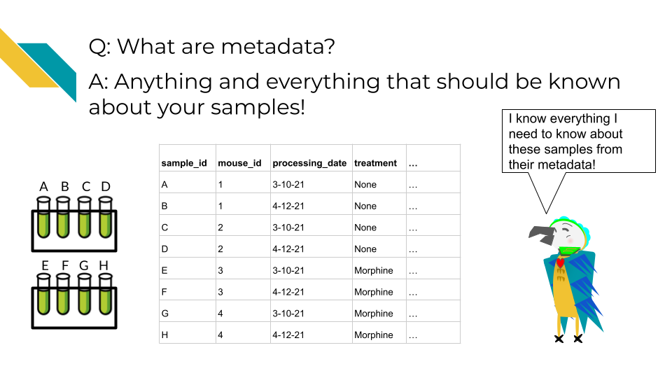

<div class = "warning">
At this time it's important to note that if you work with human data or samples, your metadata will likely contain personal identifiable information (PII) and protected health information (PHI). It's critical that you protect this information! For more details on this, we encourage you to see our [course about data management](https://jhudatascience.org/Ethical_Data_Handling_for_Cancer_Research/data-privacy.html).
</div>

## How to create metadata?

Where do these metadata come from? The notes and experimental design from anyone who played a part in collecting or processing the data and its original samples. If this includes you (meaning you have collected data and need to create metadata) let's discuss how metadata can be made in the most useful and reproducible manner.

### The goals in creating your metadata:

#### Goal A: Make it _crystal clear_ and _easily readable_ by both humans and computers!

Some examples of how to make your data crystal clear:
- Look out for typos and spelling errors!
- Don't use acronyms unless necessary. If necessary,  make sure to explain what the acronym means.
- Don't add extraneous information. For example, perhaps items that are relevant to your lab internally, but not meaningful to people outside of your lab. Either explain the significance of such information or leave it out. It is however, good to keep a record of such information for your lab elsewhere.

- Make your [data tidy](https://cran.r-project.org/web/packages/tidyr/vignettes/tidy-data.html#:~:text=Tidy%20data%20is%20a%20standard,Every%20row%20is%20an%20observation.).
> Tidy data is a standard way of mapping the meaning of a dataset to its structure.  In tidy data:
> - Every column is a variable.
> - Every row is an observation.
> - Every cell is a single value.

#### Goal B: Avoid introducing errors into your metadata in the future!

To help avoid future metadata errors, check out [this excellent article discussing metadata design](https://www.tandfonline.com/doi/full/10.1080/00031305.2017.1375989) by Broman & Woo. We will very briefly cover the major points here but highly suggest you read the original article.

1. _Be Consistent_ - Whatever labels and systems you choose, use it universally. This not only means in your metadata spreadsheet but also anywhere you are discussing your metadata variables.

2. _Choose good names for things_ - avoid spaces, special characters, or unusual and undescribed jargon.

3. _Write Dates as YYYY-MM-DD_ - this is a global standard and less likely to be messed up by Microsoft Excel.

4. _No Empty Cells_ - If a particular field is not applicable to a sample, you can put `NA` but empty cells can lead to formatting errors or just general confusion.

5. _Put Just One Thing in a Cell_ - resist the urge to combine variables into one, you have no limit on the number of metadata variables you can make!

6. _Make it a Rectangle_ - This is the easiest way to read data, for a computer and a human. Have your samples be the rows and variables be columns.

7. _Create a Data Dictionary_ - Have a document where you describe what your metadata means in detailed paragraphs.

8. _No Calculations in the Raw Data Files_ - To avoid mishaps, you should always keep a clean, original, raw version of your metadata that you do not add extra calculations or notes to.

9. _Do Not Use Font Color or Highlighting as Data_ - This only adds to confusion to others if they don't understand your color coding scheme. In addition not all data software and programming languages can interpret color. Instead create a new variable for anything you might be tempted to color code.

10. _Make Backups_ - Metadata are critical, you never want to lose them because of spilled coffee on a computer. Keep the original backed up in a multiple places. If your data does not contain private information, we recommend writing your metadata in something like GoogleSheets because it is both free and also saved online so that it is safe from computer crashes. Check out this [description of strategies for data for keeping data resilient](https://hutchdatascience.org/Ethical_Data_Handling_for_Cancer_Research/data-security.html#data-resiliency) in case you use a server or a cloud option to store your data.

11. _Use Data Validation to Avoid Errors_ - set data types and have unit tests check whether data types are what you expect for a given variable. In an upcoming chapter we will discuss how to set up tests like this using [`testthat` R package](https://testthat.r-lib.org/). 

<!--chapter:end:10-sharing-data.Rmd-->


# Project maintenance and updates


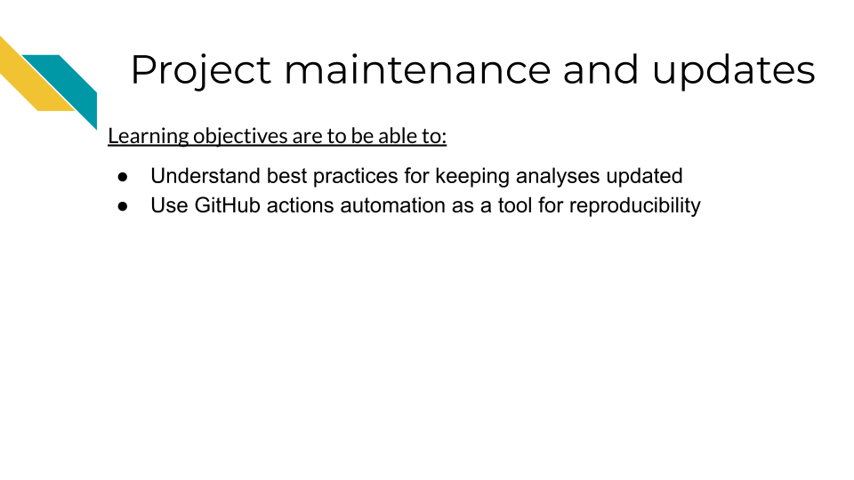

## Understand best practices for maintaining projects

Many R projects are either maintained long term or they deprecate. Many folks have many R projects over time which means keeping all your R projects maintained could easily become a time consuming endeavor!

In order to keep maintenance a priority without it using up all your time, we have a few tips to discuss. These tips will help you ease the burden of maintenance and lead to a healthier R project long term.

Building some of the following infrastructure will take a bit more time upfront, but will save you time overall:

1. Have unit testing with `testthat`
2. Use continuous deployment / continuous integration (CI/CD) principles

## What is Unit Testing?

One of the most comprehensive methods for making sure your code works is building tests. Unit testing can be really straightforward to build using the [`testthat` package](https://testthat.r-lib.org/). `testhat` works with the `usethis` R package so you can start by installing both of those.

```
install.packages(c("usethis", "testthat"))
```

In a previous chapter we talked about making [custom functions](https://hutchdatascience.org/Tools_for_Reproducible_Workflows_in_R/functions.html) and ended up showing an example called `make_shades()`.


To create tests for this function we can create a new file for it. We can do this by calling `use_test` and ideally we will call it something that relates to what function is being tested there.

```
usethis::use_test("make_shades")
```

This will open up a page that looks like this. This is the template test that shows up when you make a new test. It will have an explanation of how one might test `2*2`.

```
test_that("multiplication works", {
  expect_equal(2 * 2, 4)
})
```

Testing tips:

> - A test file holds one or more test_that() tests.
> - Each test describes what it’s testing: e.g. “multiplication works”.
> - Each test has one or more expectations: e.g. expect_equal(2 * 2, 4).

A key to unit testing is having a proper test for *every piece of functionality you have written*.

This may include creating tests that cover:

- Ensuring that all the possible argument options work as expected
- Ensuring the potential outputs are the types of objects as expected
- Ensuring the outputs can work in any associated functions in a workflow

For our `make_shades` function we had the arguments `colour`, `n`, `lighter`. So we ideally would make tests that cover all the possible options for these arguments.

Here's an annotated example for what a start to tests could look like for `make_shades()`.

```
test_that("make_shades tests", {

  # Running the function with varying arguments to make sure they work
  # If errors are thrown this test will fail
  colors_lighter <- make_shades("goldenrod", 5, lighter = TRUE)
  colors_darker <- make_shades("goldenrod", 5, lighter = FALSE)

  # We expect if lighter = TRUE or FALSE should change the output
  expect_false(all.equal(colors_lighter, colors_darker))

  # We expect output to be a vector
  expect_type(colors, "vector")

  # This function works only on colors so if we were worried colors
  # would not be returned we could check this
  real_colors <- col2rgb(colors)

  # The type of returned should be a matrix too
  expect_type(real_colors, "matrix")
})
```
These are just a few examples; you could continue building tests for this function!

To read more about the details of testing we [recommend this book chapter](https://r-pkgs.org/testing-basics.html).

You can run all your tests using `devtools::test()` or by setting up handy automation that will run it for you. We will discuss that now!

## What is Continuous integration / Continuous deployment (CI/CD)?

At the core of CI/CD is using automation to boost the reproducibility of your work!

Robots are much better at repetitive work. In other words, your human collaborator is great at many things but even your most reliable collaborator will not be as punctual as a robot who is programmed to do the job.

Let's bring this into the terms of a very common story for science. Let's say you are a researcher who submitted a manuscript and a reviewer comes back and asks you to rerun the analysis with a minor tweak; perhaps a parameter change.

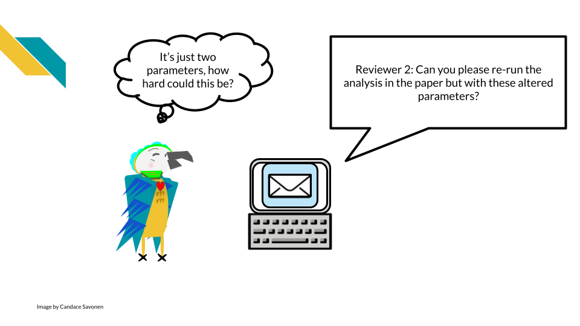

If you developed your analysis without using reproducibility aiding practices and without automation, it is very likely that this seemingly simple task could take a lot of your time and brain power. While you might not think anything on your computer changed since you ran this analysis 6 months ago, your computing environment and the software it uses has been changing the entire time!

This kind of simple "this should be easy" situation can easily devolve into a huge rabbit hole -- when you thought this analysis was basically wrapped up.

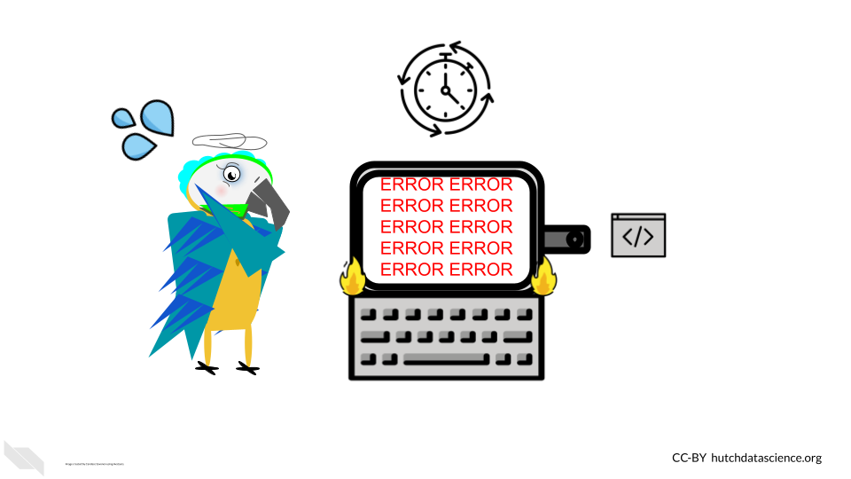

But, if you had been using the principles of CI/CD and reproducibility you may have a better chance that your analysis should still run reliably. If it doesn't rerun reliably, you will have more previous runs and setups to pull from to help you pinpoint where the bug in your analysis rerun is coming from.

:::dictionary
Continuous Integration/Continuous Deployment (CI/CD) is a software practice, now also used by science that automates the process of building, testing, and releasing analyses and code.  CI/CD practices are often implemented by automation 'pipelines'. 
:::

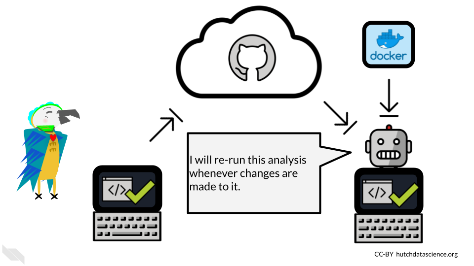

By having automation keep tabs on your development, you will be less likely to be blindsided by bugs in situations where you need to rerun your analysis (or adapt it for a new analysis!)

## CI / CD Benefits

Before we discuss the concept of Continuous integration / Continuous deployment (often abbreviated CI/CD), let's use an analogy.


Obviously what we are getting at here is that generally it is a good idea to check work along the way, instead of waiting until something is completely finished to test it.

CI / CD then is a manner of working that means we will have changes checked as they are being integrated and before the changes are deployed. This allows for continuous monitoring of the project and hopefully earlier catching of bugs!

Bugs/mistakes are an unavoidable part of software development because software developers and researchers are generally humans and humans make mistakes!

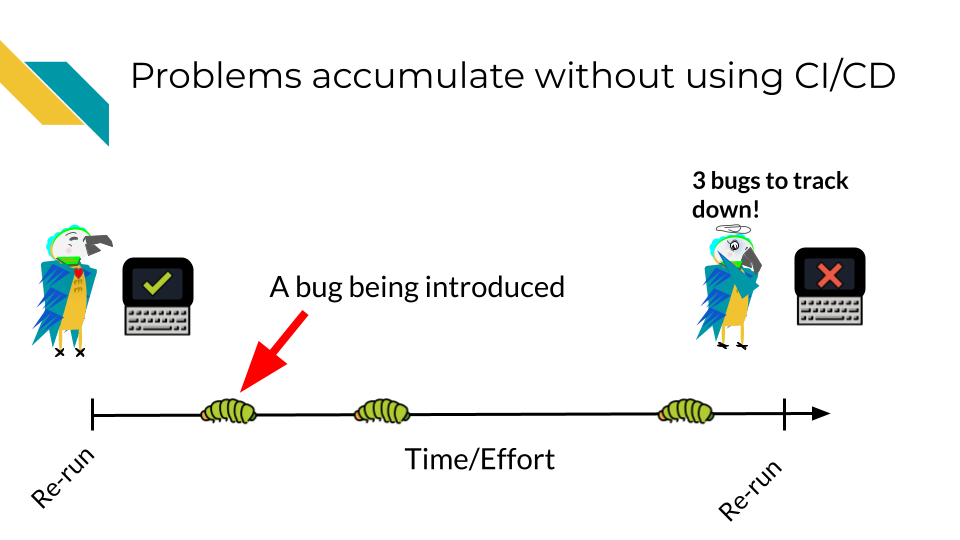

Let's assume over the course of developing a project, bugs are introduced at a certain rate.

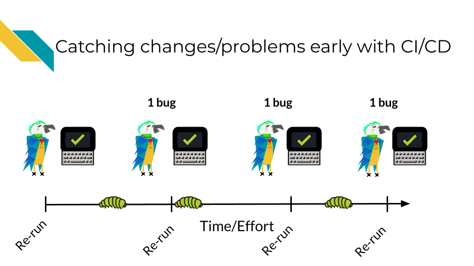

Without using CI/CD you may find yourself trying to fix many bugs at once! This will make the bugs harder to isolate and harder to fix. The amount of time it will take to fix 3 bugs at once may be exponentially higher than if you caught these bugs one at a time. Additionally, the longer amount of time that goes on before you catch a bug, it may be more likely it will get accidentally incorporated into your published results -- this will be a lot more work for you and others to rectify.

However with CI/CD you will likely catch these bugs earlier and have an easier time fixing them before they truly run amock! A good CI/CD pipeline will help you identify these bugs early and save time and stress!

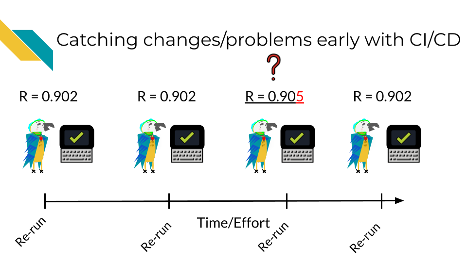

This is not only true for classic "my script won't run" bugs but also "silent" bugs -- bugs where the analysis still ran to completion but perhaps the results were slightly different.

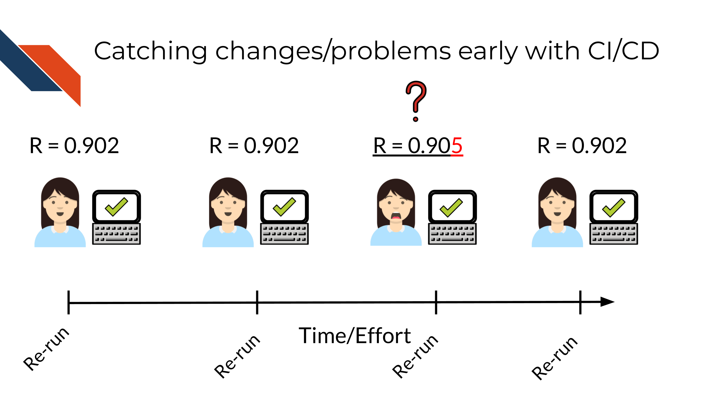

### Getting started with GitHub Actions

GitHub Action is one such program that can automate your CI/CD pipelines. Others are TravisCI and CircleCI. 

:::dictionary
GitHub Action is a GitHub-based automation service that allows you to implement CI/CD pipelines.
::: 

There are lots of ready made GitHub Actions for use with R code and to help you automate various tasks, such as running the code for an analysis periodically with new data. Take a look at the [`usethis` R package library]( [https://usethis.r-lib.org/reference/github_actions.html) for more ways to automate your work in R.

Some packages may need some tweaking to get them to work for your project. To learn more about [GitHub Actions we recommend this course](https://hutchdatascience.org/GitHub_Automation_for_Scientists/).

<!--chapter:end:12-project-maintenance.Rmd-->


# Collaborations through GitHub


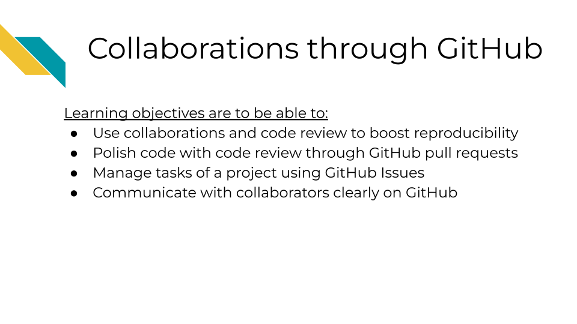

## Components of collaborating on GitHub

As noted previously, GitHub is not only great for sharing and version control but, it is also great for collaborating!

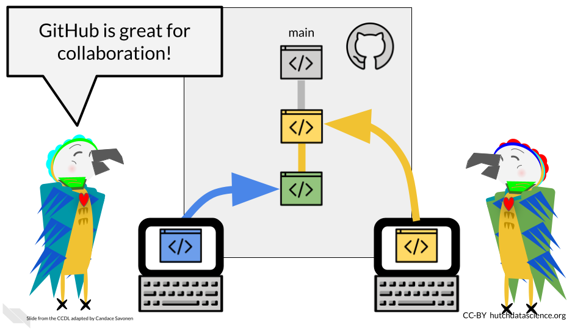

This collaboration can be done through the use of issues and pull requests!

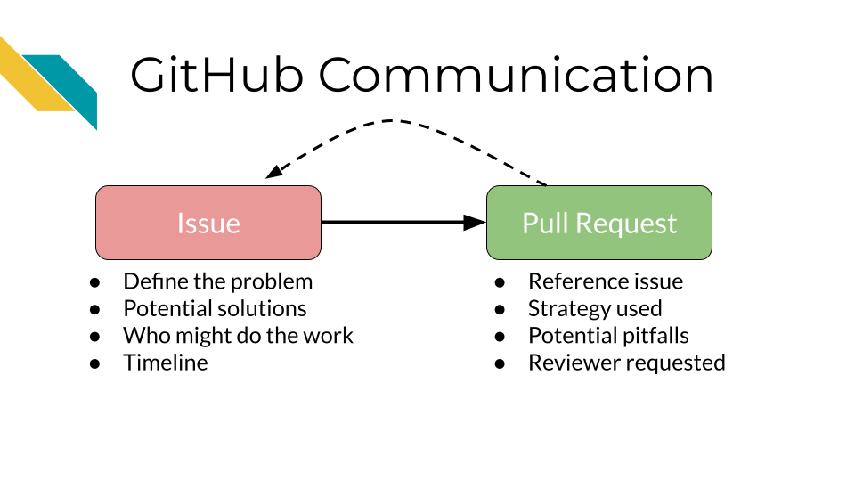
### Step 1. A problem identified/issue created

[GitHub issues](https://docs.github.com/en/issues/tracking-your-work-with-issues/about-issues) are where we can note, plan, and discuss work for a project. It might first be filed by one person but then used for further discussion between multiple people to define a problem or new request. Once the issue is scoped and defined enough it can be assigned to someone to work on it.

### Step 2. Proposing a solution

Creating a [pull request](https://docs.github.com/en/pull-requests/collaborating-with-pull-requests/proposing-changes-to-your-work-with-pull-requests/about-pull-requests) is proposing a solution that addresses the original issue. The author of the pull request creates a new branch with the necessary changes to address the issue. The pull request description should reference the original issue to explain what problem or request the work is addressing. It should also explain how the work addresses it. Finally, a reviewer can be requested for feedback. 

### Step 3. Reviewer looks at proposed solution

Now the reviewer is given a chance to look at the proposed solution and approve and or otherwise improve it in collaboration with the original author.

### Step 4. Refined solution is deployed

Once both the author and the reviewer agree the work is ready, the changes can  be merged and [deployed to the main branch](https://hutchdatascience.org/Tools_for_Reproducible_Workflows_in_R/using-github-in-a-workflow.html#whats-github)! Yay! Time to celebrate.

:::dictionary
The main branch is the ground truth branch where the final product of the code is created from. Development branches on the other hand, propose changes that can be added to the main branch. 
:::

Now the process can be repeated for the next issue!

## Issues should tell us:
- What the problem is - including examples or screenshots to demonstrate the problem.
- What solution(s) could address the problem?
- Who might be assigned to addressing this problem?
- Potentially what timeline or urgency the problem has.

## Pull Requests should tell us:
- What issue is the work addressing?
- How is it addressing the issue?
- What pitfalls exist?
- What should be looked at and reviewed carefully.

## Engaging in Code Review - as an author

The only way to know if your analysis is truly reproducible is to send it to someone else to reproduce! That sentiment is at the heart of code review.

@Parker2017 describes code review:

> Code review will not guarantee an accurate analysis, but it’s one of the most reliable ways of establishing one that is more accurate than before.

Not only does code review help boost the accuracy and reproducibility of the analysis, it also helps everyone involved in the process learn something new!

An effective code review atmosphere is something that individuals and their team have to _commit_ to (pun intended). Effective code review brings so many benefits not only to your project quality but also to your communication skills through fostering a learning atmosphere!

In this chapter we will discuss the two sides of code review. Code review ideally includes at least two people: the author of the pull request and the reviewer of the pull request. Depending on your job context, we realize that sometimes authors have to become their own reviewers. This might happen if your team is small or the authors are the only people with a particular skill set.

## Author responsibilities in code review

The code review process begins with the creation of a pull request (which we practiced in the [previous chapter](https://hutchdatascience.org/Tools_for_Reproducible_Workflows_in_R/using-github-in-a-workflow.html#opening-a-pr)). Successful and efficient code review is born out of quality communication, which is a skill set on its own. You can set your reviewers (and yourself) up for success by knowing what basic information can help get the code review conversation going.

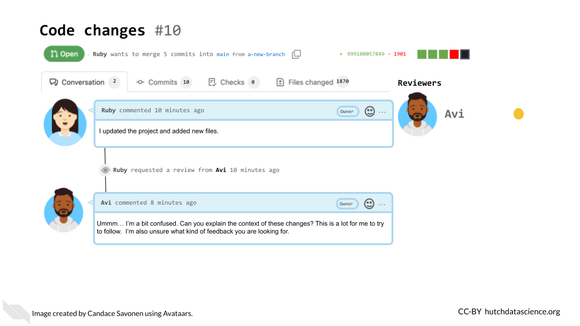

Even if you end up reviewing your own code, writing the following information out is still very helpful and highly recommended. It can help you spot problems you might not have otherwise seen and generally help you document your code better for future you!

## Characteristics of great pull requests and issues

### There's plenty of context!

What's the story behind the changes you are proposing? Sometimes when we are in the thick of a project we can make the mistake of assuming everyone knows what we know. This can unfortunately leave a huge burden on your reviewer to try  to understand what you are doing.

Before sending off a review request, re-read your PR description and think about the perspective of your reviewer. Err on the side that they have no idea what is happening on the project (because sometimes this is the case!)

Tell a short story to explain what lead to you making these changes including attempting to answer these questions:  

- What is the problem that these changes will solve?
- Do you have any URLs, relevant issues, or files you can share?
- What inspired you to take this approach -- are there other things you tried?
- Are there other pull requests related to this change?


:::notice
You can type the world "resolves" and then include the issue number with a `#` and it will close the issue when you merge the pull request
:::


:::notice
You can type the world "resolves" and then include the issue number with a `#` and it will close the issue when you merge the pull request
:::
### Includes an explicit request for what kind of feedback is needed

What would you like your reviewer to do with this pull request? Stating this explicitly can save both of you time in this code review process.

- Are you still in the early stages and looking for a bigger picture review? Let them know that before they waste their time digging into the code line-by-line.
- Are you in the later stages and looking for a detailed nit-picky review?
- Are you looking for feedback on the results or methods?

### Points out questionable areas that need extra attention

Are there specific areas of the code you are having trouble with or are unsure about? Send a link to the [specific lines in GitHub](https://stackoverflow.com/questions/23821235/how-to-link-to-specific-line-number-on-github) you are asking about. Are there results that are surprising, confusing, or [smell wrong](https://github.com/jennybc/code-smells-and-feels#code-smells-and-feels)?  

Be sure to detail what you have dug into and tried at this point for any problematic points.  This can help the reviewer to avoid suggesting potential solutions that the author has already tried. 

### Are relatively small and focused

Try to make sure your pull requests aren't too long! Code reviewing fatigue is very real. If you send a reviewer thousands of lines of code to review it will be very overwhelming to review or understand.

<blockquote class="twitter-tweet"><p lang="en" dir="ltr">10 lines of code = 10 issues.<br><br>500 lines of code = &quot;looks fine.&quot;<br><br>Code reviews.</p>&mdash; I Am Devloper (@iamdevloper) <a href="https://twitter.com/iamdevloper/status/397664295875805184?ref_src=twsrc%5Etfw">November 5, 2013</a></blockquote> <script async src="https://platform.twitter.com/widgets.js" charset="utf-8"></script>

Alternatively, when you create a new branch try to set a very intentional (and relatively small) goal you would like to achieve with your upcoming pull request. Keeping your pull requests small and focused on one task at a time will not only help your reviewers but also will help yourself feel more accomplished and organized.

Also recall that incremental changes are good! Perhaps you do have a very large restructuring of your repository you are trying to accomplish, but finding smaller reasonable sets of changes (which would each have their own pull requests) to reach that goal incrementally can help keep things more manageable. This can also be very valuable if you decide that you want to go back to a previous version. It can be easier to tell when a change was introduced if you have smaller pull requests. 

:::notice
If you have changes that might be interdependent, you can make a pull request based on another existing pull request, using something called [stacked pull requests in GitHub](https://blog.logrocket.com/using-stacked-pull-requests-in-github/).
:::

### Don't ask a reviewer to dig through dirty code

Determining when a pull request is fully cooked and ready for review is a skill in itself. Pull requests that haven't had enough time to be polished can put an unnecessarily large burden on the reviewer. On the other hand, pull requests that have been hashed and rehashed in a silo might have benefitted from big picture feedback at an earlier stage of the code. This balance is something that you and your team can figure out in time using lots of communication!

This being said, the first reviewer of your code should always be yourself! Take time to review your own changes by clicking on the `Files Changed` tab and going over that section carefully.

- Are all the changes included that you were expecting?
- Are there any changes you didn't expect that are showing up? These can be symptomatic of a deeper problem. Definitely dig into anything that is not what you expected.
- Set aside your changes and return them in a few hours, or the next day. Looking at your changes with fresh eyes may also allow you to find things you didn't notice before.

Additional tip, if you don't want others to look at your pull request yet because you are still working on reviewing it, you can change it to [a draft pull request](https://github.blog/2019-02-14-introducing-draft-pull-requests/) so no one reviews it before you are ready. This can also be a handy tactic to use if you just want to ask for big picture feedback from someone but want to make it clear that the pull request is not anywhere near ready for merging to main.


### Pull Request Templates

Add a [pull request template](https://docs.github.com/en/communities/using-templates-to-encourage-useful-issues-and-pull-requests/creating-a-pull-request-template-for-your-repository) to your repository! This will help initiate consistent and clear communication around the pull requests in your repository.

Pull request templates are a way to give yourself and other contributors prompts when starting a new pull request. See below for an example. The comments between `<!--` and `-->` are html comments that will not show up so you don't need to delete them if you don't want to. On the right side, it shows how this template looks when it's rendered. You can see this at any time by clicking `Preview` -- this is true in other places in GitHub.

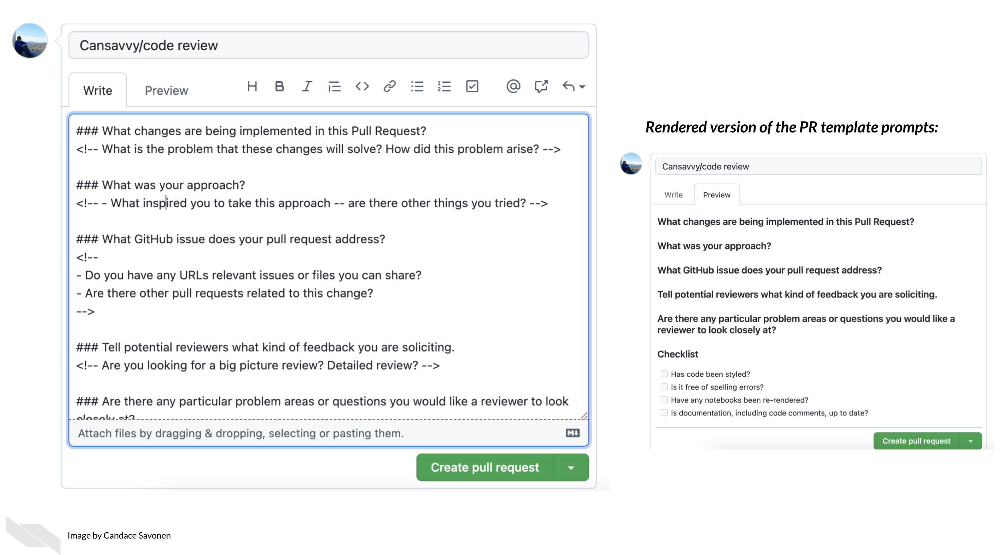


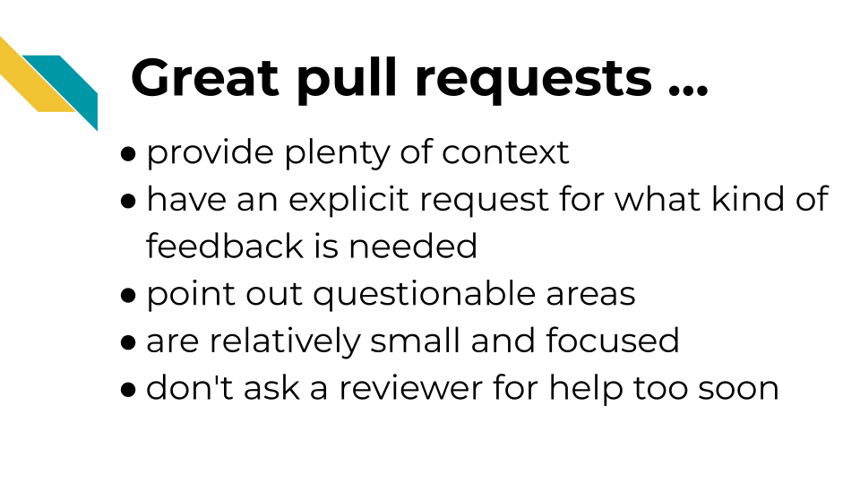

### Preparing for the return of your review

As you wait for your reviewer to get back to you, it can be helpful to remind yourself what the purpose of code review is to get yourself in a positive mindset. You've given your reviewer information to help them help you and now is the time to wait.


First of all, you should pat yourself on the back for engaging in code review. It does require more time and sometimes that can feel scary with looming deadlines, but kudos for being able to prioritize your commitment to creating increasingly more reproducible analyses! Furthermore, it can ultimately save you time over more extensive projects by keeping everyone up-to-date!

Remember that you are not your code and mistakes are all a part of the process! Putting your project out there can feel a tad vulnerable. You may have felt the impulse to keep your code's problems buried under a rug, but you pushed past that and are making your analyses transparent! Remember that hidden problems don't get solved, but known problems are opportunities for reaching an even better end result!

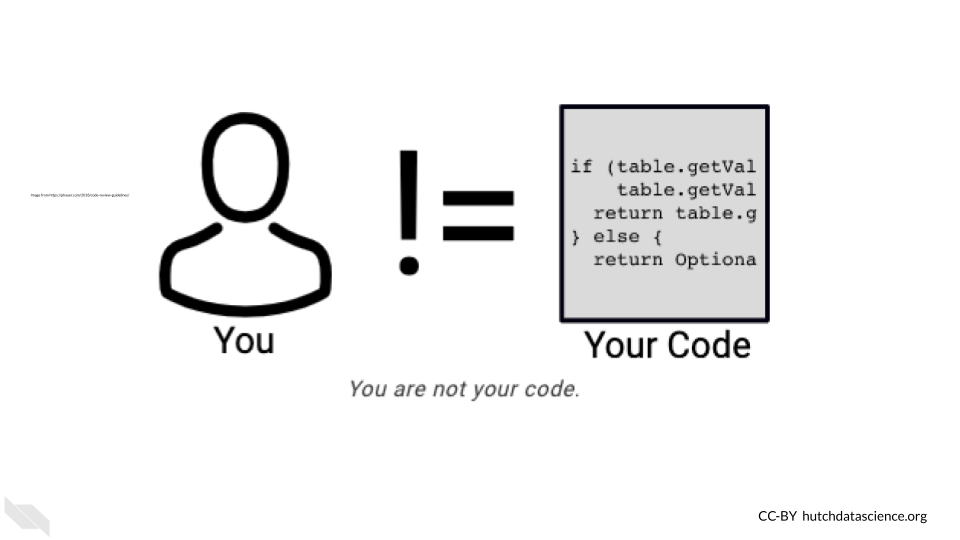

When you receive a review back remember that you and the reviewer are on the same team and both want the best end result feasible for this project! They may suggest ideas that you love and can't wait to implement. They also might suggest ideas you don't agree with. Do your best to take all their comments as positive learning opportunities and look for ways to compromise and determine solutions collaboratively.

## Engaging in Code Review - as a reviewer

When reviewing a pull request, you take on responsibility to ensure that the pull request is getting the project to a better state than before.

There are three aspects to reviewing we will focus on:  

1. Identify areas in the code and documentation that are opportunities for improvement.
2. Communicate your questions and concerns effectively and in a way that creates a positive atmosphere.
3. Determine solutions collaboratively in a way that allows for learning as well as a long-term improved product.

### What to look for!

Depending on the goals of the project, and pull request there can be a lot to keep an eye out for. There are [many articles out there about what to look for in a code review](https://github.com/joho/awesome-code-review#articles).

_Here's some general points:_  

- Does the analysis answer the question it's asking? Are the methods it uses to do so appropriate?
- Is the code clear and readable? Does it contain a healthy amount of comments and documentation for individuals not familiar with the project to understand generally what is going on?
- Is the code efficient with computational resources? (Are there areas that are a bit too greedy with memory usage?)
- Does the code stick to the style and conventions of this project?
- Are there alternate scenarios where the current strategy might fail? (depending on the likelihood, this may be an instance for a new issue and another pull request).

### How to communicate it

The pull request may be the author’s precious bundle. Try to be empathetic to the learning process! You are both working on this project together -- assume you both want the best out of this project. If something seems wrong, work together to find a solution, don't ever waste time on placing blame.

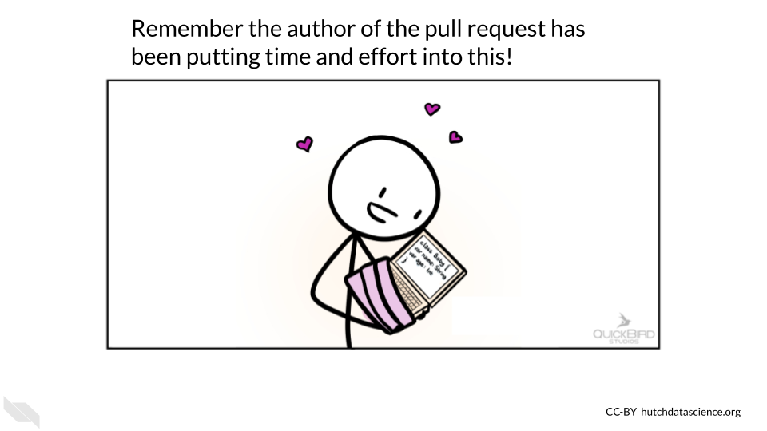

Remember that everything sounds harsher when you don't have in-person cues! In this example, Avi may be stating factual things, but without his pleasant and reassuring disposition, it can feel super harsh.

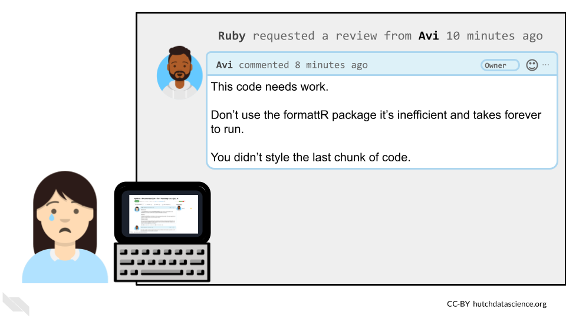

If Avi had reframed his comments, they might be more effective in this collaboration. @Babatunde2018 suggests framing [review comments in three ways to help communication: questions, suggestions, and appreciations](https://medium.com/@otarutunde/comments-during-code-reviews-2cb7791e1ac7).

#### Questions

_For example:_  

> What happens if this doesn’t get saved? Does it throw an exception or fail silently?

The key is to be specific with the questions. Mention exact file names. Put comments on the line you are referring to. Explain what you think is happening and ask them to explain if that is correct.  

#### Suggestions

_For example:_  

> I suggest you use an ArrayHelper getValue method here because of its error handling capability instead of accessing the value directly
You could even go further by giving an example:
$a = $b[‘key’]; would raise an error if key is not set but $a = ArrayHelper::getValue($b, ‘key’); would return a null value if key is not set.

Giving suggestions and explaining not only how to implement them but why they might be preferred in this scenario is a great learning process both for the author and yourself.

#### Appreciations

Start every review comment with appreciation for the hard work completed! This goes a long way for creating a positive atmosphere.

_For example:_  

> Nice Job! Alice. I suggest we create an interface for this service so other substitute services can implement the interface as well, this would enable us change to a different service with very minimal efforts when the need arises. What do you think?

Let's see how Avi's message could have been reworked to give a more effective review:  


This interaction reminds us that effective code review is steeped in empathy from both sides. Authors need to appreciate the time and effort the reviewer is spending to help them; while reviewers need to be sensitive to the amount of effort put in by the author already.

#### Recommended reading about code review

- [Why code reviews matter (and actually save time!)](https://www.atlassian.com/agile/software-development/code-reviews) by @Radigan2021.
- [Pull request descriptions](https://www.pullrequest.com/blog/writing-a-great-pull-request-description/) by @Banuelos2020.
- [A zen manifesto for effective code reviews](https://www.freecodecamp.org/news/a-zen-manifesto-for-effective-code-reviews-e30b5c95204a/) by @Fabre2019.
- [Best practices for Code Review](https://smartbear.com/en/learn/code-review/best-practices-for-peer-code-review/) by @Smartbear2021.
- [Comments during Code Reviews](https://medium.com/@otarutunde/comments-during-code-reviews-2cb7791e1ac7) by @Babatunde2018
- [On Empathy and Pull Requests](https://slack.engineering/on-empathy-pull-requests/) by @Hirpa2016.
- [Code Review Guidelines for Humans](https://phauer.com/2018/code-review-guidelines/) by @Hauer2018.
- [Your Code Sucks! – Code Review Best Practices](https://quickbirdstudios.com/blog/code-review-best-practices-guidelines/) by @Hildebr2020.
- An even longer list of [readings about code review](https://github.com/joho/awesome-code-review)

<!--chapter:end:13-collabs.Rmd-->


# About the Authors {-}

These credits are based on our [course contributors table guidelines](https://www.ottrproject.org/more_features.html#giving-credits-to-contributors).

&nbsp;
&nbsp;

|Credits|Names|
|-------|-----|
|**Pedagogy**||
|Lead Content Instructor(s)|[Carrie Wright], [Candace Savonen]|
|Content Author(s)| [Candace Savonen], [Carrie Wright]|
|Content Director(s)| [Roger Peng]|
|Acknowledgments| Some of this material was repurposed from the [ITCR Training Network](https://www.itcrtraining.org/)|
|**Production**||
|Content Publisher(s)| [Candace Savonen], [Carrie Wright]|
|**Technical**||
|Course Publishing Engineer(s)| [Candace Savonen], [Carrie Wright]|
|Template Publishing Engineers|[Candace Savonen], [Carrie Wright]|
|Publishing Maintenance Engineer|[Candace Savonen]|
|Technical Publishing Stylists|[Carrie Wright], [Candace Savonen]|
|Package Developers ([ottrpal]) [Candace Savonen], [John Muschelli], [Carrie Wright]|
|**Art and Design**||
|Illustrator(s)| [Carrie Wright][Candace Savonen]|
|**Funding**||
|Funder(s)| This work was funded by the NIH, grant number [5R25GM141505](https://reporter.nih.gov/search/k_pXzn8wfUeEvaWpnzIToA/project-details/10663171)|
|Funding Staff| [Maleah O'Connor](https://www.linkedin.com/in/maleah-o-connor)|

&nbsp;


```
## ─ Session info ───────────────────────────────────────────────────────────────
##  setting  value
##  version  R version 4.3.2 (2023-10-31)
##  os       Ubuntu 22.04.4 LTS
##  system   x86_64, linux-gnu
##  ui       X11
##  language (EN)
##  collate  en_US.UTF-8
##  ctype    en_US.UTF-8
##  tz       Etc/UTC
##  date     2025-06-06
##  pandoc   3.1.1 @ /usr/local/bin/ (via rmarkdown)
## 
## ─ Packages ───────────────────────────────────────────────────────────────────
##  package     * version date (UTC) lib source
##  bookdown      0.41    2024-10-16 [1] CRAN (R 4.3.2)
##  bslib         0.6.1   2023-11-28 [1] RSPM (R 4.3.0)
##  cachem        1.0.8   2023-05-01 [1] RSPM (R 4.3.0)
##  cli           3.6.2   2023-12-11 [1] RSPM (R 4.3.0)
##  devtools      2.4.5   2022-10-11 [1] RSPM (R 4.3.0)
##  digest        0.6.34  2024-01-11 [1] RSPM (R 4.3.0)
##  ellipsis      0.3.2   2021-04-29 [1] RSPM (R 4.3.0)
##  evaluate      0.23    2023-11-01 [1] RSPM (R 4.3.0)
##  fastmap       1.1.1   2023-02-24 [1] RSPM (R 4.3.0)
##  fs            1.6.3   2023-07-20 [1] RSPM (R 4.3.0)
##  glue          1.7.0   2024-01-09 [1] RSPM (R 4.3.0)
##  htmltools     0.5.7   2023-11-03 [1] RSPM (R 4.3.0)
##  htmlwidgets   1.6.4   2023-12-06 [1] RSPM (R 4.3.0)
##  httpuv        1.6.14  2024-01-26 [1] RSPM (R 4.3.0)
##  jquerylib     0.1.4   2021-04-26 [1] RSPM (R 4.3.0)
##  jsonlite      1.8.8   2023-12-04 [1] RSPM (R 4.3.0)
##  knitr         1.48    2024-07-07 [1] CRAN (R 4.3.2)
##  later         1.3.2   2023-12-06 [1] RSPM (R 4.3.0)
##  lifecycle     1.0.4   2023-11-07 [1] RSPM (R 4.3.0)
##  magrittr      2.0.3   2022-03-30 [1] RSPM (R 4.3.0)
##  memoise       2.0.1   2021-11-26 [1] RSPM (R 4.3.0)
##  mime          0.12    2021-09-28 [1] RSPM (R 4.3.0)
##  miniUI        0.1.1.1 2018-05-18 [1] RSPM (R 4.3.0)
##  pkgbuild      1.4.3   2023-12-10 [1] RSPM (R 4.3.0)
##  pkgload       1.3.4   2024-01-16 [1] RSPM (R 4.3.0)
##  profvis       0.3.8   2023-05-02 [1] RSPM (R 4.3.0)
##  promises      1.2.1   2023-08-10 [1] RSPM (R 4.3.0)
##  purrr         1.0.2   2023-08-10 [1] RSPM (R 4.3.0)
##  R6            2.5.1   2021-08-19 [1] RSPM (R 4.3.0)
##  Rcpp          1.0.12  2024-01-09 [1] RSPM (R 4.3.0)
##  remotes       2.4.2.1 2023-07-18 [1] RSPM (R 4.3.0)
##  rlang         1.1.4   2024-06-04 [1] CRAN (R 4.3.2)
##  rmarkdown     2.25    2023-09-18 [1] RSPM (R 4.3.0)
##  sass          0.4.8   2023-12-06 [1] RSPM (R 4.3.0)
##  sessioninfo   1.2.2   2021-12-06 [1] RSPM (R 4.3.0)
##  shiny         1.8.0   2023-11-17 [1] RSPM (R 4.3.0)
##  stringi       1.8.3   2023-12-11 [1] RSPM (R 4.3.0)
##  stringr       1.5.1   2023-11-14 [1] RSPM (R 4.3.0)
##  urlchecker    1.0.1   2021-11-30 [1] RSPM (R 4.3.0)
##  usethis       2.2.3   2024-02-19 [1] RSPM (R 4.3.0)
##  vctrs         0.6.5   2023-12-01 [1] RSPM (R 4.3.0)
##  xfun          0.48    2024-10-03 [1] CRAN (R 4.3.2)
##  xtable        1.8-4   2019-04-21 [1] RSPM (R 4.3.0)
##  yaml          2.3.8   2023-12-11 [1] RSPM (R 4.3.0)
## 
##  [1] /usr/local/lib/R/site-library
##  [2] /usr/local/lib/R/library
## 
## ──────────────────────────────────────────────────────────────────────────────
```

<!-- Author information -->

[FirstName LastName]: link to personal website
[John Muschelli]: https://johnmuschelli.com/
[Candace Savonen]: https://www.cansavvy.com/
[Carrie Wright]: https://carriewright11.github.io/
[Roger Peng]: https://rdpeng.org/
<!-- Links -->

[ottrpal]: https://github.com/jhudsl/ottrpal

<!-- Fill out this table using these instructions: https://github.com/jhudsl/OTTR_Template/wiki/How-to-give-credits

For JHU courses, You will need to add Ira as a credit:

|Content Publisher|[Ira Gooding]|
...
[Ira Gooding]: https://publichealth.jhu.edu/faculty/4130/ira-gooding
-->

<!--chapter:end:About.Rmd-->


# References 

<!--chapter:end:References.Rmd-->

