# Using GitHub in a workflow


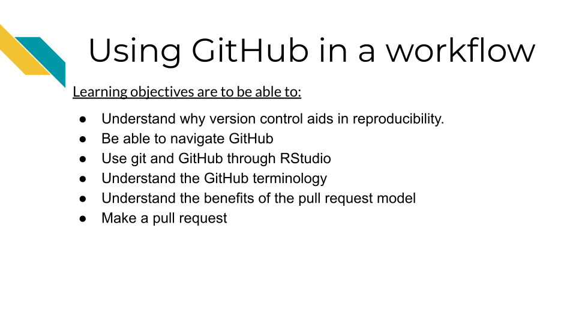

## What is version control

Version control is system that allows you to track your files over time as you work on them.
Whether you've written a lot of code or written other documents, you've likely encountered the need for version control. As this comic from Piled Higher and Deeper describes, files can go through a lot of edits and revisions (this is true of code too)! And it doesn't take long for it to be difficult or even impossible to track the various revisions of even one file, let alone the dozens or hundreds of files that may be a part of a data science project.


This problem is what Git, a version control system, can address. It is a system that allows you to track your files, keep a history of them, and otherwise handle changes through the history of your project.

## What's GitHub?

Git is most commonly used is in conjunction with an online platform called GitHub.
[GitHub](https://github.com/) is an online platform for sharing code.

<div class = "dictionary">
- **version control** a method of tracking files as they are changed throughout a project.
- **GitHub** an online platform for sharing code in a version controlled manner.
</div>

GitHub aids reproducibility by being online in a way that easily makes code shareable to others in a version controlled way. GitHub allows anyone at anytime to take a look at and obtain your code.

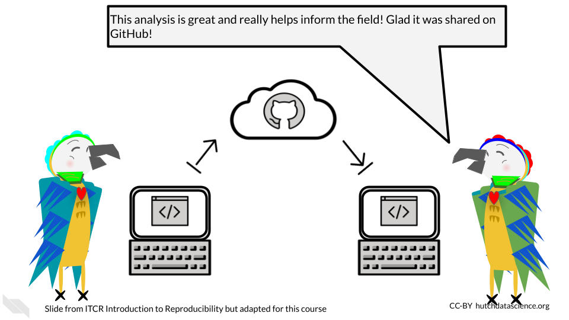

Because code on GitHub is version controlled, it allows you to track your code and project files as you and others continue to work on them. This can be really useful for documenting not only the changes to your analysis, but the rationale and communications that led to those changes.

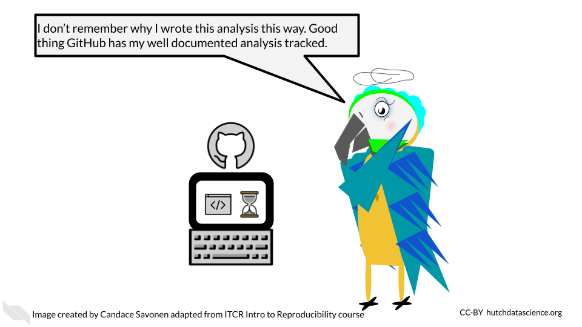

GitHub and Git also allow you to take the side journeys that often pop up with data science projects, but in a way that allows you to ensure that the main files stay safe as you experiment.


GitHub is also handy for collaborating with others on your code, not only because it is online, but the version controlled nature of it allows you and any team members to work on the same files simultaneously without fear that the changes will be impossible to merge together. Git and GitHub have systems to do just this.

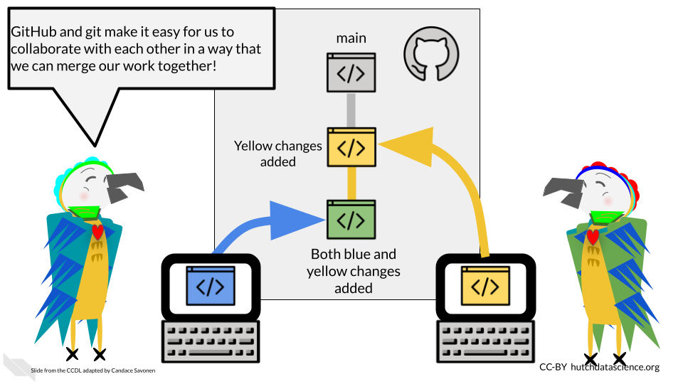

## GitHub Workflow

Git can feel overwhelming to a lot of folks and it has a really deep and complicated system. However, truthfully for most instances you will only need the same few commands in the same series of steps which we will cover here.


One reason that Git and GitHub can feel overwhelming to folks is that there are a number of terms that are used to describe the different commands. We will walk through the typical workflow steps, and define these terms as we use them.

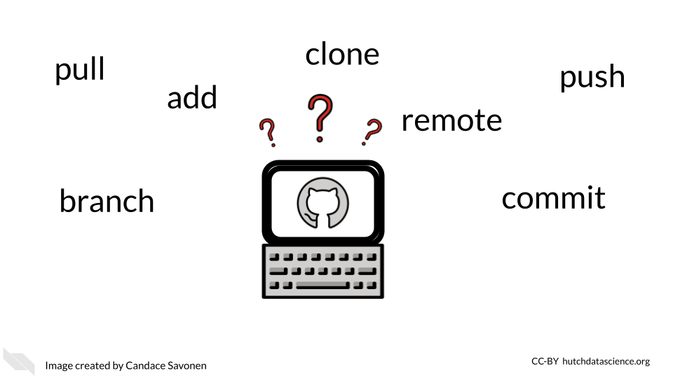

### Create your GitHub account

Before we get started with GitHub, if you do not have a GitHub account, [go here to make one.](https://github.com/)

### Creating a new repository

Whenever you are starting a new project you will want to start by creating a new repository on GitHub. You can generally do this by going to GitHub and [choosing "New repository" from the menu](https://github.com/new).

<div class = "dictionary">
- **repository** - a group of project files
</div>

On this new repository page, you will want to create a description that summarizes what this project will be (you can always change this later).

Also choose the "Add a README file" option because every project should have a README.

For the `Add .gitignore` option, it would be handy to choose the `R` gitignore template. These [gitignore files are handy](https://git-scm.com/docs/gitignore#:~:text=A%20gitignore%20file%20specifies%20intentionally,gitignore%20file%20specifies%20a%20pattern.). They are a way to tell GitHub that you don't want a particular file tracked. It's just important for us to track the important files as it is for us to declutter our project by not adding unnecessary files.  

You may want to choose a license. We recommend choosing something that allows others to freely use your code but with attribution like a Creative Commons license.

Then you are ready to click "Create repository". Keep in mind what the location and name of this repository is. In GitHub repositories are named like this: `username/repository_name`.

### Setting up your repository locally

\*This section is adapted from the [DataTrail course](https://datatrail-jhu.github.io/DataTrail/cloning-a-repository.html#step-3-set-up-github-credentials).

In order to be able to access everything in your GitHub repository from RStudio cloud, you will need to set up GitHub credentials. You should only need to do this once per project.

1. In your RStudio interface, make sure that you are in the `Console` tab.

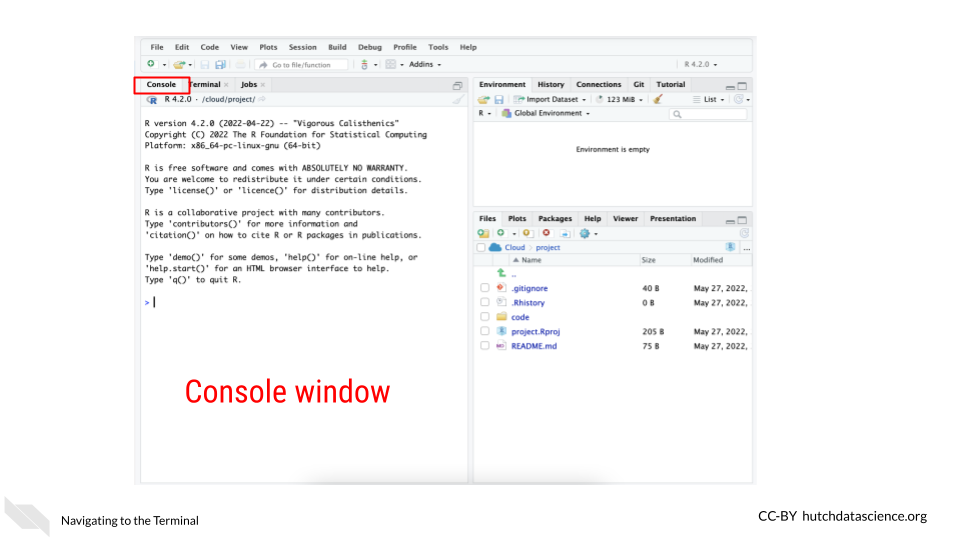

2. Now use the command below to install the package `usethis`. Copy and paste it in the Console window and click Enter on your keyboard. This package will help us manage our GitHub credentials from RStudio more easily.

```
install.packages("usethis")
```
This will take a minute or so to install. Remember that red text doesn't mean an error necessarily.

3. Now to use this package, we need to attach its library using the following command:

```
library("usethis")
```

4. RStudio and GitHub require you make a special fancy password to use as credentials called a **GitHub Personal Access Token** (sometimes abbreviated as a "PAT").

To create a 'PAT' from RStudio we can run this handy command:

```
usethis::create_github_token()
```
Running this command will open up a window in your GitHub that will ask you for your password. Login to GitHub as you normally would.

This will open up a page in GitHub for creating a `New personal access token`.

Underneath the `Note` put something that reminds you what this PAT is for. Something like `RStudioCloud Access`. (Note that each PAT you make needs its own unique `Note` though).

Underneath the `Select scopes` section **you don't need to do anything**. The `usethis` package already chose the permissions we need.

Scroll all the way down on this page and click `Generate Token`. You've created your first PAT! **Do not close this window**, keep it handy for now. Note that in the image below we blocked out our PAT, but yours will show a jumble of letters and numbers

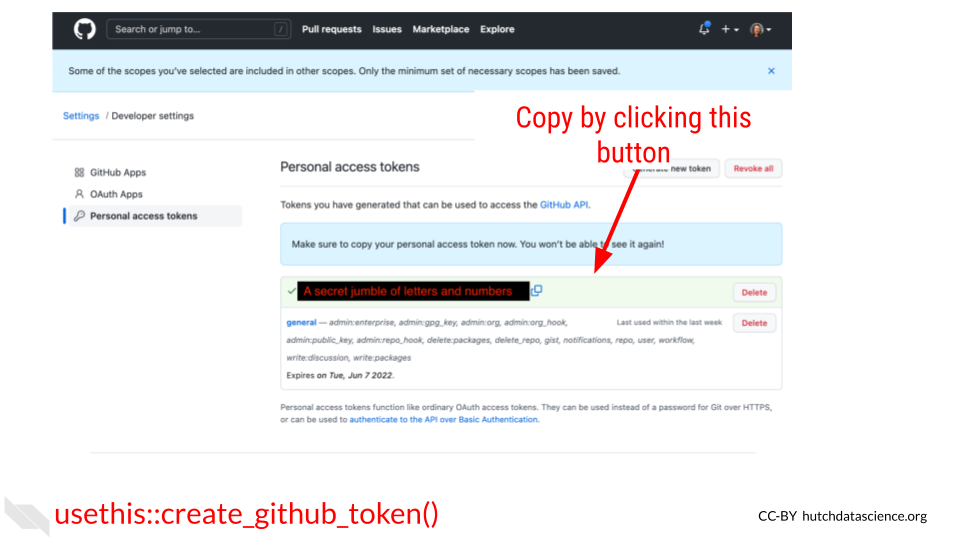

5. Return back to your RStudio while keeping your PAT handy.
In the `Console` window, run this command:

```r
gitcreds::gitcreds_set()
```

It will ask you to `? Enter password or token`. Copy your PAT and paste it into the command window and press Enter.


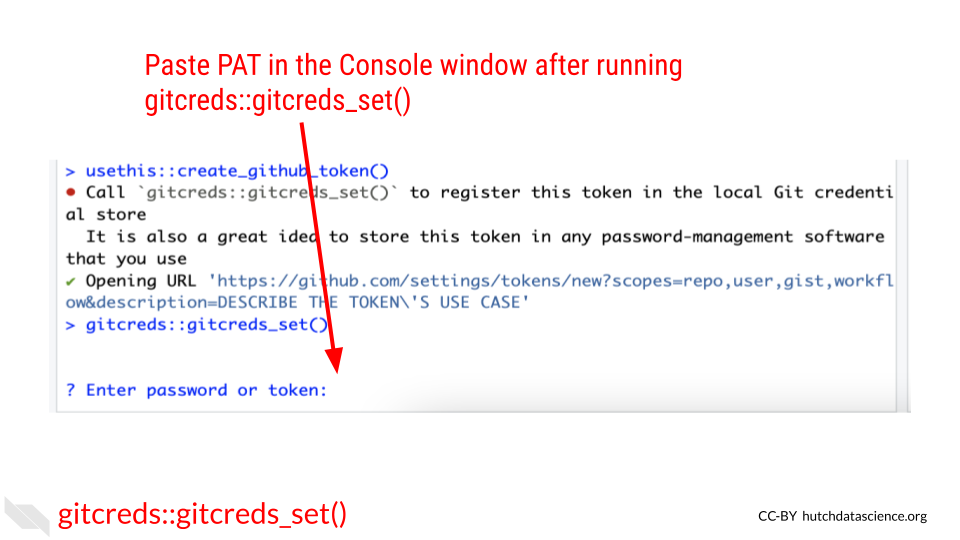

After you enter your PAT here you should get a message like:
```
-> Adding new credentials...
-> Removing credetials from cache...
-> Done.
```

You are now free to close that GitHub PAT window. Note that you will want to be very careful with your PAT. **Do not share it or put it anywhere that others could see it or access it!**

7. Now we also need to add your username and email to the RStudio GitHub credentials by running a command like below.
Be sure to replace the example **username** and **email** with what corresponds to your GitHub account.

```
use_git_config(user.name = "Jane", user.email = "jane@example.org")
```

Run this in the `Console` tab as well and click Enter.

8. Now to double check that everything is set, we can run this command to have the `usethis` package echo back our credentials:

```
git_sitrep()
```
It will give you output that looks similar to this: (but note it will have your own user name, and repository name and etc.)

```
Git config (global)
• Name: 'Jane'
• Email: 'jane@example.org'
• Global (user-level) gitignore file: <unset>
• Vaccinated: FALSE
ℹ See `?git_vaccinate` to learn more
• Default Git protocol: 'https'
• Default initial branch name: <unset>
GitHub
• Default GitHub host: 'https://github.com'
• Personal access token for 'https://github.com': '<discovered>'
• GitHub user: 'Jane'
• Token scopes: 'gist, repo, user, workflow'
• Email(s): 'jane@example.org (primary)'
✖ Local Git user's email ('jane@example.org') doesn't appear to be registered with GitHub.
Git repo for current project
• Active usethis project: '/cloud/project'
• Default branch: 'master'
• Current local branch -> remote tracking branch:
  'master' -> 'origin/master'
GitHub remote configuration
• Type = 'theirs'
• Host = 'https://github.com'
• Config supports a pull request = FALSE
• origin = 'JaneEverydayDoe/first_project' (can not push)
• upstream = <not configured>
• Desc = The only configured GitHub remote is 'origin', which
  you cannot push to.
  If your goal is to make a pull request, you must fork-and-clone.
  `usethis::create_from_github()` can do this.

  Read more about the GitHub remote configurations that usethis supports at:
  'https://happygitwithr.com/common-remote-setups.html'

```

You should see that `Name`, `email` have your credentials set as well as a `Personal access token for 'https://github.com': '<discovered>'`

You can run `git_sitrep()` at anytime to see what your credentials and settings are.

Yay! Now you should be able to use GitHub from RStudio!

### Cloning your repository

In Git, to `clone` something means to get a copy of your project onto your computer to work on.

<div class = "dictionary">
- **clone** - making a copy of a code base on your computer.
</div>

In RStudio we can do this using the `usethis` package again. In GitHub repositories are named like this: `username/repository_name`. Sometimes instead of a `username` it may be a github organization.

```
create_from_github("username/repository_name")
```

If this happens successfully, you should see this kind of message:

```
ℹ Defaulting to 'https' Git protocol
✔ Setting `fork = FALSE`
✔ Creating 'some-file-path-on-your-computer/repository_name'
✔ Cloning repo from 'https://github.com/username/repository_name.git' into  'some-file-path-on-your-computer/repository_name'
✔ Setting active project to 'some-file-path-on-your-computer/repository_name'
ℹ Default branch is 'main'
✔ Opening 'some-file-path-on-your-computer/repository_name' in new RStudio session
✔ Setting active project to '<no active project>'
```

This will also open up a new RStudio window. Now you are ready to get to work!

### Opening a PR

A pull request (sometimes abbreviated PR) is a way of being able to review changes before you incorporate them into your main, more polished product. It is a highly effective system for doing code review and otherwise communicating about your data analysis to increase its reproducibility.


Pull requests are based on copies of the project repository that are called `branches`.
When we do work on a project we will want to do it somewhere that is separate from our main set of code. Branches are yet another copy of the code that is used for developing purposes.

<div class = "dictionary">
- **pull request** - a method of working on and incorporating file changes in a way that allow things to be reviewed and discussed on GitHub.
- **branch** - another copy and version of your project that you can work from and create a pull request.
</div>

#### Creating a new branch

A `main` branch is where you will keep your best, most vetted version of the project. Your `main` branch will already exist on your project when you create it. When others come to look at your project, they will see the `main` branch first.

Other branches are generally made with the purpose of eventually having them reviewed and polished to the point that they are to add their changes to the `main` branch.

```
pr_init(branch = "new_branch_name")
```

This branch will be called "new_branch_name" but you should call your branch whatever would be representative of the work you will be doing on this. For example, if you are adding documentation, you could call your branch "adding-docs".

This brings us to another point. For keeping yourself organized as well as making it easier for others to follow, it's best to keep a branch and subsequent pull request focused on one task. If one pull request tries to do too many things, it will be more difficult for it to be communicated and reviewed properly.

Now that you have created a branch, you are ready to make changes to your files.

Now make any change to a file for the purposes of this tutorial. For example, you could add a sentence to your README file to explain what this project will be. Then save the file change.

In RStudio, if we go to the `Git` tab (typically located in the lower right pane) we should see that the file we changed has an `M` next to it to signify it has been modified. In order to officially add these changes that we've made to our branch, we need to `commit` them.  

<div class = "dictionary">
- **commit** - the action of officially adding a file change to a branch.
</div>

To do this, we first need to check the box(es) next to the files we'd like to commit then we click the commit button.

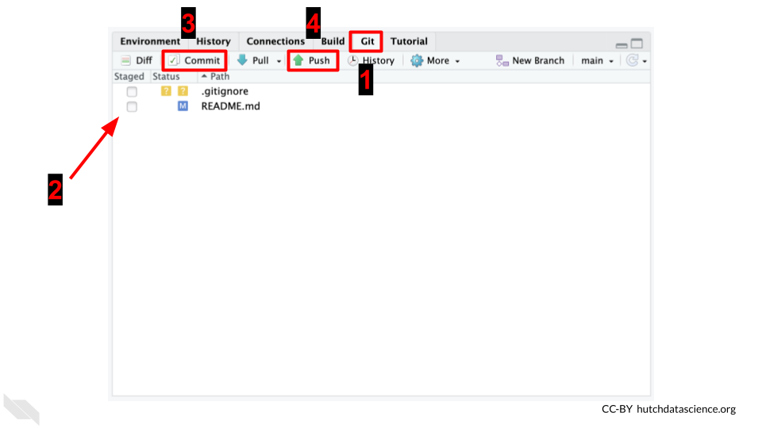

After clicking the commit button, a new window will pop up that shows us the changes we are committing. Sections in green are new additions or modifications. Sections in red are the old sections that got changed or removed. In this window, we will need to add a commit message. Again, we should try to write something informative about what we were doing to these files we are committing. Then after we've written this commit message, we need to click `Commit` in this window.


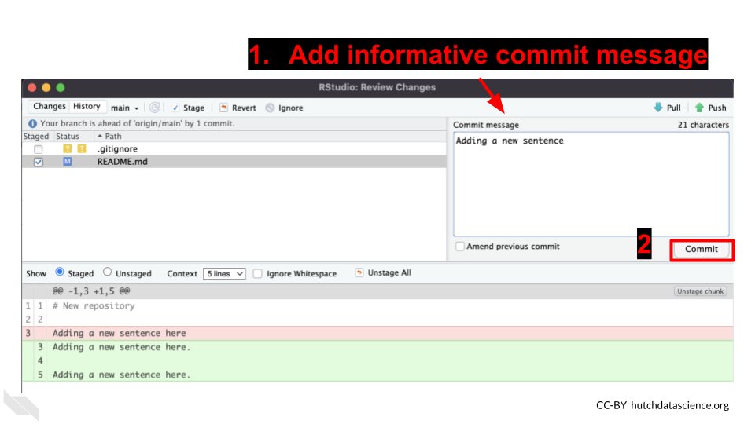

Now our files are on our branch!

When we'd like these changes to be online on GitHub for others to see, we can `push` these changes. To push changes means to send them online to GitHub.

<div class = "dictionary">
- **push** - the action of sending a branch and its file changes to GitHub so it is online where others can see it.  
</div>

With the `usethis` package, we can use the `pr_push()` function.

```
pr_push()
```

This should open a new window on GitHub that will look like this:


It will also print out some messages like this:
```
✔ Pushing local 'branch_name' branch to 'origin' remote.
• Create PR at link given below
✔ Opening URL 'https://github.com/username/repository_name/compare/branch_name'
```

On this window, click create pull request. This will bring you to another page on GitHub where you can create your pull request. On this page you will want to describe the changes you are making with this pull request.

You should include information like:

1) The background behind the changes you are making. What is the problem you are solving? Link to any relevant conversations.
2) What changes are you making specifically and how do these address the problem?
3) What work is left to be done?
4) What help could you use from others? Is there something in particular you would like to be looked at? Is there something not yet added that should be added?

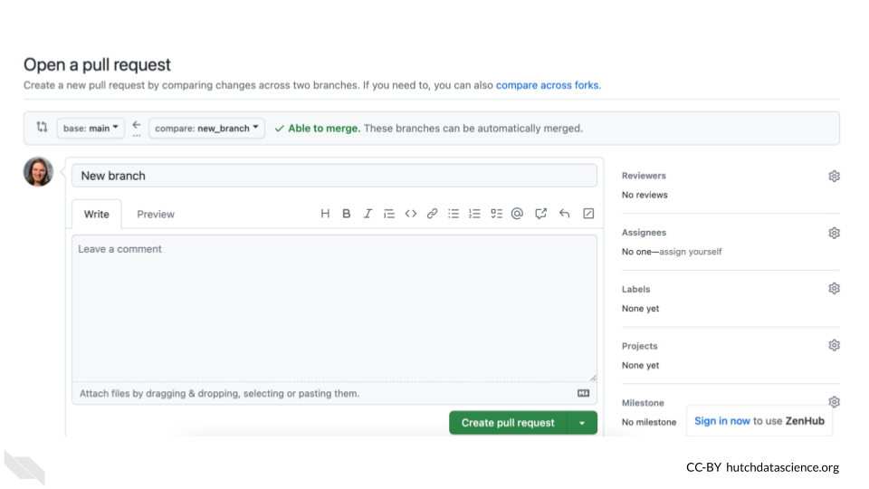

Now if you continue to work with your files, you can go through the same steps of:

1) Making a file change
2) Check the box(es) next to the file changes you'd like to add
3) Commit the file
4) Add a commit message
5) Commit the changes
6) Push the changes by running `pr_push()` (You can also click the green arrow to push if you prefer).


You can repeat these steps as many times as you need until you feel the file changes on your PR page are ready for someone else to review. If you don't have someone else on your team to review the changes, you can alternatively let them sit for a day or two and let "future You" review your file changes. Future you or others on your project might have a fresh take on these files. We will talk more about code review in a later chapter.

Code review is perhaps the most powerful tool for making reproducible analyses. And now that you know how to make pull requests on GitHub, you have an excellent platform and system for version controlling and tracking, and reviewing your files! Congrats!

### Merging a pull request

In the `Files changed` tab, you or others can leave comments about your file changes. This is an excellent way to document the rationale of these file changes as well as discuss any alternatives.

After some back and forth discussion (whether this discussion be between you and yourself or someone else) you may decide that the code on this pull request is ready for primetime! In other words, it is ready to be incorporated into the `main` branch.

Recall that we said the `main` branch is the most polished and readily viewable version of your project. To bring the changes in your pull request into the main branch, we will need to perform an action called a `merge`.

 This step of incorporating changes into a branch and combining two branches together is called `merging`. The goal of a merge is to combine two branches in such a way that keeps your desired changes from both copies.

<div class = "dictionary">
- **main** - the branch name that is typically used for the main, most polished and live version of your project that others will be brought to first.
- **merge** - combining the files from two branches into one.
</div>

On your pull request page, scroll to the bottom to the big green button where it says `Merge pull request`. Be careful to not press this button before you are sure that everyone on your team is ready.

After you've clicked it, hooray! You've completed your first merge of a pull request.

It may feel like we've described a lot of steps, but getting into the GitHub workflow and utilizing its benefits is all about habits! We promise it will increase the reproducibility of your analyses if you are able to stick with this process!

## Conclusion

We also discussed in this chapter how version control and GitHub are great tools for reproducibility and we walked through the GitHub workflow process as completed in RStudio.

To summarize, the Github workflow process looks like this:

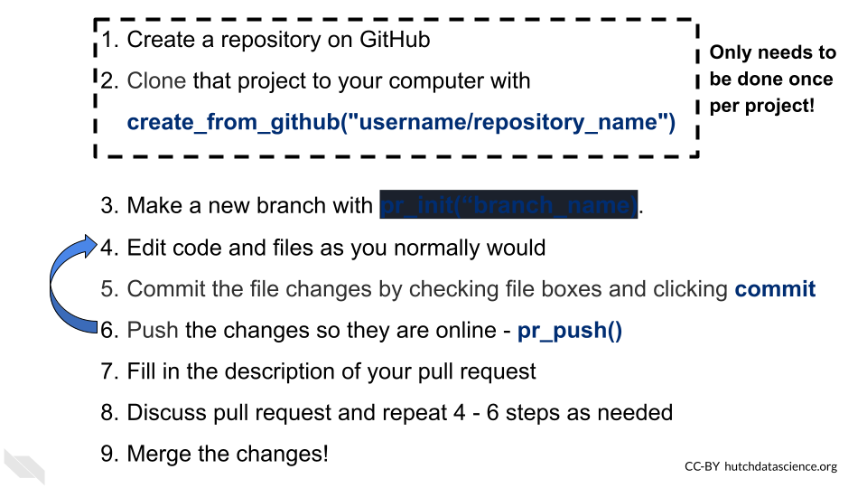
