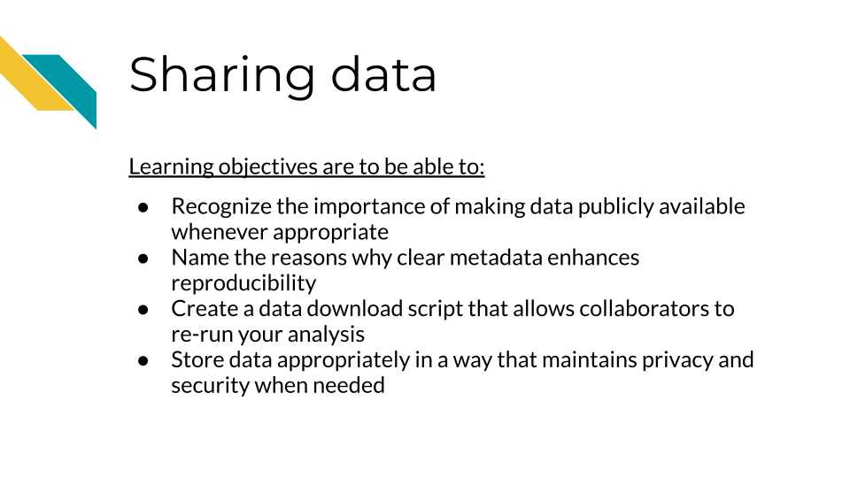

# Sharing Data

## Data sharing is important!

Sharing data is critical for optimizing the advancement of scientific understanding. Now that labs all over the world are producing massive amounts of data, there are many discoveries that can be made by just using existing data.

There are so many excellent reasons to put your data in a repository whether or not a journal requires it:  

**Sharing your data...**  

1. Makes your project more transparent and thus more likely to be trusted and cited. In fact one study found that articles with links to the data used (in a repository) were cited more than articles without such information or other forms of data sharing [@colavizza_citation_2020].

2. Helps your relieve your own workload so your email inbox isn't loaded by requests you probably don't have time to respond to.

3. Allows others to gain even more insights from your data which shows funders that your data will be used to its maximum potential.

4. It also provides more opportunities for others to replicate your results, which could help advance not only your career, but our understanding of science and medicine.

## Benefits of data sharing

In addition to these benefits to yourself, data sharing has other far reaching benefits. It can help support faster advances in science and medicine, by reducing the need to collect new data, which reduces costs, time and effort, including the effort and burden placed on patients or research participants for data collection.

It also helps support researchers at institutes that do not have as many resources to collect data.

Ultimately it can therefore help patients benefit from research faster, as faster advances can be made through more efficient research.

See [this description of additional reasons why sharing data is helpful for scientific advancement](https://hutchdatascience.org/NIH_Data_Sharing/why-this-new-dms-policy.html). 
## Data repositories

The best way to share your data is by putting it somewhere that others can download it (and it can be kept private when necessary). There are many repositories out there that handle this for you. We recommend checking out our course on the [NIH data sharing policy](https://hutchdatascience.org/NIH_Data_Sharing/data-management-and-storage.html) which describes many important resources for finding appropriate repositories for different types of data. These tools can even be helpful for research that is not related to health.

The repository you choose for sharing data will be highly dependent on the field you work in and the data type that you work with. Do your best to try to understand what the standard practice is for your field.

**For a longer list of repositories, we also advise consulting this [guide on data repositories](https://www.nature.com/sdata/policies/repositories) published by Nature.**

### Repositories for journal articles

If your data doesn't fit a standard recommended repository, such as [GEO](https://www.ncbi.nlm.nih.gov/geo/) for genomic data for example, large datasets can be shared using one of the following repositories.
Note that some journals or funding agencies may have specific requirements.

- [CyVerse Data Commons Repository](https://cyverse.org/data-commons)
- [Data Dryad](https://datadryad.org/stash)
- [FigShare](https://help.figshare.com/article/how-to-upload-and-publish-your-data)
- [Zenodo](https://help.zenodo.org/)
- [GitHub](https://github.com/)

### Small datasets

Datasets that are small and don't have a standardized repository, can be published as supplementary files as a part of a manuscript.

## Data Submission tips

Uploading a dataset to a data repository is a great step toward sharing your data! But, if the dataset uploaded is unclear and unusable it might as well not been uploaded in the first place.

Keep in mind that although you may understand the ins and outs of your dataset and project, it is likely that others who look at your data may not.

To make your data truly shared, you need to take the time to make sure it is well-organized and well-described!
There are two files you should make sure to include to help describe and organize your data project:

- [A main README file](https://hutchdatascience.org/Tools_for_Reproducible_Workflows_in_R/setting-up-your-project.html#readmes) that orients others to what is included in your data.
- A central download script that downloads the data in a way that is ready for re-analysis. [See an example here](https://github.com/AlexsLemonade/OpenPBTA-analysis/blob/master/download-data.sh).
- A metadata file that describes what data are included, and how the data files (if more than one) are connected.

### Use consistent and clear names

- Make sure that sample and data IDs used are consistent across the project - make sure to include a metadata file that describes your samples in a way that is clear to those who might not have any prior knowledge of the project.
- Sample and data IDs should be consistent with any standardized formatting used in the field.
- Features names should avoid using genomic coordinates as these may change with new genome versions.

### Make your project reproducible

Reproducible projects are able to be re-run by others to obtain the same results.

**The main requirements for a reproducible project are:**

- The data can be freely obtained from a repository (this maybe summarized data for the purposes of data privacy).
- The code can be freely obtained from [GitHub](https://github.com/) (or another similar repository).
- The software versions used to obtain the results are made clear by documentation or providing a [Docker](https://www.docker.com/) container (more advanced option).
- The code and data are well described and organized with a system that is consistent.

Check out our [introductory reproducibility course](https://jhudatascience.org/Reproducibility_in_Cancer_Informatics/introduction.html), [advanced reproducibility course](https://jhudatascience.org/Adv_Reproducibility_in_Cancer_Informatics/introduction.html), and [our course on containers](https://hutchdatascience.org/Containers_for_Scientists/) for more information.

### Have someone else review your code and data!

The best way to find out if your data are useable by others is to have someone else look over your code and data!
There are so many little details that go into your data and projects. Those details can easily lead to typos and errors upon data submission that can cause confusion when others (or your future self) are attempting to use that data. The best way to test if your data project is usable is to have someone else (who has not prepared the data) try to make sense of it.

For more details on how to make data and code reproducible tips, see our [Intro to Reproducibility](https://www.itcrtraining.org/courses#h.ugabyqq1bigx) course.

## Why metadata is important

Metadata are critically important descriptive information about your data.

**Without metadata, the data themselves are useless or at best vastly limited.**

Metadata describe how your data came to be, what organism or patient the data are from and include any and every relevant piece of information about the samples in your dataset.

At this time it's important to note that if you work with human data or samples, your metadata will likely contain personal identifiable information (PII) and protected health information (PHI). It's critical that you protect this information! For more details on this, we encourage you to see our [course about data management](https://jhudatascience.org/Ethical_Data_Handling_for_Cancer_Research/data-privacy.html).

## How to create metadata?

Where do these metadata come from? The notes and experimental design from anyone who played a part in collecting or processing the data and its original samples. If this includes you (meaning you have collected data and need to create metadata) let's discuss how metadata can be made in the most useful and reproducible manner.

### The goals in creating your metadata:

#### Goal A: Make it _crystal clear_ and _easily readable_ by both humans and computers!

Some examples of how to make your data crystal clear:
- Look out for typos and spelling errors!
- Don't use acronyms unless necessary. If necessary,  make sure to explain what the acronym means.
- Don't add extraneous information. For example, perhaps items that are relevant to your lab internally, but not meaningful to people outside of your lab. Either explain the significance of such information or leave it out. It is however, good to keep a record of such information for your lab elsewhere.

- Make your [data tidy](https://cran.r-project.org/web/packages/tidyr/vignettes/tidy-data.html#:~:text=Tidy%20data%20is%20a%20standard,Every%20row%20is%20an%20observation.).
> Tidy data is a standard way of mapping the meaning of a dataset to its structure.  In tidy data:
> - Every column is a variable.
> - Every row is an observation.
> - Every cell is a single value.

#### Goal B: Avoid introducing errors into your metadata in the future!

To help avoid future metadata errors, check out [this excellent article discussing metadata design](https://www.tandfonline.com/doi/full/10.1080/00031305.2017.1375989) by Broman & Woo. We will very briefly cover the major points here but highly suggest you read the original article.

1. _Be Consistent_ - Whatever labels and systems you choose, use it universally. This not only means in your metadata spreadsheet but also anywhere you are discussing your metadata variables.

2. _Choose good names for things_ - avoid spaces, special characters, or unusual and undescribed jargon.

3. _Write Dates as YYYY-MM-DD_ - this is a global standard and less likely to be messed up by Microsoft Excel.

4. _No Empty Cells_ - If a particular field is not applicable to a sample, you can put `NA` but empty cells can lead to formatting errors or just general confusion.

5. _Put Just One Thing in a Cell_ - resist the urge to combine variables into one, you have no limit on the number of metadata variables you can make!

6. _Make it a Rectangle_ - This is the easiest way to read data, for a computer and a human. Have your samples be the rows and variables be columns.

7. _Create a Data Dictionary_ - Have a document where you describe what your metadata means in detailed paragraphs.

8. _No Calculations in the Raw Data Files_ - To avoid mishaps, you should always keep a clean, original, raw version of your metadata that you do not add extra calculations or notes to.

9. _Do Not Use Font Color or Highlighting as Data_ - This only adds to confusion to others if they don't understand your color coding scheme. In addition not all data software and programming languages can interpret color. Instead create a new variable for anything you might be tempted to color code.

10. _Make Backups_ - Metadata are critical, you never want to lose them because of spilled coffee on a computer. Keep the original backed up in a multiple places. If your data does not contain private information, we recommend writing your metadata in something like GoogleSheets because it is both free and also saved online so that it is safe from computer crashes. Check out this [description of strategies for data for keeping data resilient](https://hutchdatascience.org/Ethical_Data_Handling_for_Cancer_Research/data-security.html#data-resiliency) in case you use a server or a cloud option to store your data.

11. _Use Data Validation to Avoid Errors_ - set data types and have unit tests check whether data types are what you expect for a given variable. In an upcoming chapter we will discuss how to set up tests like this using [`testthat` R package](https://testthat.r-lib.org/). 
